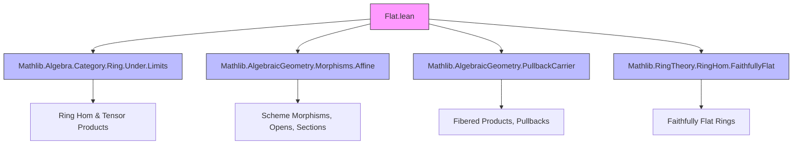

Here is the **technical metadata extraction** for the `Flat.lean` file, following your requested format.

---

### 1. KEY DEFINITIONS & THEOREMS

| Name | Type / Class | Purpose |
|------|--------------|---------|
| `Flat` | `class (f : X ⟶ Y) : Prop` | Defines a scheme morphism `f : X ⟶ Y` as *flat* if all induced ring maps on affine opens are flat. |
| `flat_appLE` | `∀ {U V e}, (f.appLE U V e).hom.Flat` | Explicit condition: for all affine opens `U ⊆ Y`, `V ⊆ f⁻¹(U)`, the induced ring homomorphism is flat. |
| `iff_flat_stalkMap` | `Flat f ↔ ∀ x, (f.stalkMap x).hom.Flat` | Equivalence between the open-affine definition and stalk-wise flatness. |
| `of_stalkMap` | `(∀ x, (f.stalkMap x).hom.Flat) → Flat f` | Proves flatness from stalk-level flatness. |
| `stalkMap` | `Flat f → ∀ x, (f.stalkMap x).hom.Flat` | Converse direction: flat morphism ⇒ flat stalk maps. |
| `isQuotientMap_of_surjective` | `[Flat f] → [QuasiCompact f] → [Surjective f] → Topology.IsQuotientMap f` | A surjective, quasi-compact, flat morphism is a quotient map (Stacks Project 02JY). |
| `epi_of_flat_of_surjective` | `[Flat f] → [Surjective f] → Epi f` | A flat surjective morphism is an epimorphism in `Scheme`. |
| `flat_and_surjective_iff_faithfullyFlat_of_isAffine` | `[IsAffine X] → [IsAffine Y] → (Flat f ∧ Surjective f ↔ f.appTop.hom.FaithfullyFlat)` | For affine schemes, flat + surjective ⇔ faithfully flat ring map. |
| `pushoutSection` | `pushout (iX.appLE US UX hUSX) (f.appLE US UT hUST) ⟶ Γ(Y, UY)` | Canonical map from the pushout of rings to sections over the fibered product intersection. |
| `isIso_pushoutSection_of_isAffineOpen` | `[IsAffineOpen US] → [IsAffineOpen UT] → [IsAffineOpen UX] → IsIso (pushoutSection …)` | Isomorphism when all opens are affine. |
| `mono_pushoutSection_of_isCompact_of_flat_right` | `[Flat f] → [IsAffineOpen US] → [IsAffineOpen UT] → [IsCompact UX] → Mono (pushoutSection …)` | Injectivity under flatness of `f`, affine base, and compact target open. |
| `isIso_pushoutSection_of_isQuasiSeparated_of_flat_right` | `[Flat f] → [IsAffineOpen US] → [IsAffineOpen UT] → [IsCompact UX] → [IsQuasiSeparated UX] → IsIso (pushoutSection …)` | Bijectivity under qcqs + flatness. |
| `flat_and_surjective_SpecMap_iff` | `Flat (Spec.map f) ∧ Surjective (Spec.map f) ↔ f.hom.FaithfullyFlat` | Affine case: flat + surjective ⇔ faithfully flat ring homomorphism. |

---

### 2. NAMING CONVENTIONS

- **Prefixes**:
  - `flat_`: for properties/instances related to flat morphisms (`flat_appLE`, `flat_and_surjective_…`, `flat_of_affine_subset`).
  - `isIso_`, `mono_`: for properties of `pushoutSection` maps (`isIso_pushoutSection_…`, `mono_pushoutSection_…`).
  - `stalkMap`: for stalk-related constructions (`stalkMap`, `of_stalkMap`, `iff_flat_stalkMap`).
  - `pushoutSection`: canonical maps in fibered product diagrams.
- **Suffixes**:
  - `_of_isAffineOpen`, `_of_isCompact`, `_of_flat_right`, `_of_ringHomFlat`: classify assumptions on opens or morphisms.
  - `_iff_`: for equivalences (`iff_flat_stalkMap`, `flat_and_surjective_iff_faithfullyFlat_of_isAffine`).
- **Pattern**: `isIso_pushoutSection_of_…_of_…` encodes *sufficient conditions* for the canonical pushout-section map to be an isomorphism.

---

### 3. TACTIC STACK

| Tactic | Frequency | Purpose |
|--------|-----------|---------|
| `aesop` | High | Automated simplification, especially for open inclusion proofs (`hUST`, `hUSX`, etc.). |
| `simp` / `simp only` | Very High | Simplification of open maps, preimages, stalks, and ring homomorphisms. |
| `algebraize` | Medium | Converts scheme-level maps to ring-level maps via `Γ`. |
| `rw`, `rwa` | High | Rewriting using equivalences, definitions, and lemmas (e.g., `flat_iff`, `affineLocally_iff_forall_isAffineOpen`). |
| `dsimp`, `eta_expand` | Medium | Deep simplification for definitional equalities. |
| `convert`, `ext1`, `congr` | Medium | Equality proofs via extensionality, congruence, and conversion. |
| `infer_instance` | High | Automatic typeclass resolution (e.g., `Flat`, `Mono`, `IsIso`). |
| `cases`, `obtain`, `refine` | Medium | Structural decomposition and proof construction. |
| `have`, `suffices`, `by_cases` | Medium | Intermediate lemma introduction and case analysis. |
| `exact`, `assumption` | Low | Direct proof steps. |

---

### 4. PROOF LOGIC

- **Structure**:
  - **Definition-first**: `Flat` is defined via affine opens, then shown equivalent to stalk-wise flatness.
  - **Local-to-global**: Many proofs reduce to affine cases via:
    - Affine coverings (`affineCover`, `finiteSubcover`)
    - Sheaf axioms (e.g., `isSheaf_iff_isSheafPreservesLimitPairwiseIntersections`)
    - Faithful flatness criteria (`RingHom.FaithfullyFlat.iff_flat_and_comap_surjective`)
  - **Diagram chasing**: For `pushoutSection` lemmas:
    - Use sheaf exactness to get injectivity/surjectivity.
    - Tensor with flat modules preserves monos.
    - Use finite covers (`isCompact_iff_finite_and_eq_biUnion_affineOpens`) to reduce to finite diagrams.
    - Apply `isIso_pushoutSection_iff` to reduce to pushout verification.
  - **Inductive/finite diagrams**: For `isIso_pushoutSection_of_iSup_eq`, use pairwise intersections and finite covers to build exact sequences.

- **Typical flow**:
  1. Reduce to affine case using covering arguments.
  2. Translate scheme maps to ring maps via global sections.
  3. Use module-theoretic properties (flat ⇒ tensor preserves mono).
  4. Apply sheaf axioms to lift local isomorphisms/monos to global ones.
  5. Use diagram lemmas (`isIso_pushoutSection_iff`, `mono_comp_iff_of_isIso`, etc.) to conclude.

---

### 5. IMPORTS

| Module | Role |
|--------|------|
| `Mathlib.Algebra.Category.Ring.Under.Limits` | Limits in comma category `Ringₐ`, used for pushouts/tensor products. |
| `Mathlib.AlgebraicGeometry.Morphisms.Affine` | Affine morphisms, `Spec`, `appLE`, `resLE`, etc. |
| `Mathlib.AlgebraicGeometry.PullbackCarrier` | Fibered products of schemes, `pullback.fst`, `pullback.snd`, `IsPullback`. |
| `Mathlib.RingTheory.RingHom.FaithfullyFlat` | Faithfully flat ring homomorphisms, `RingHom.FaithfullyFlat`. |

---

### 6. DEPENDENCY & THEORY OVERVIEW (Mermaid Diagrams)

#### 📦 Module Dependency Graph



#### 🧠 Theory Flow (Flat Morphisms)

```mermaid
flowchart LR
  A[Scheme Morphism f: X → Y] --> B[Flat?]
  B -->|Definition| C[∀ affine U⊆Y, V⊆f⁻¹U: Γ(Y,U)→Γ(X,V) flat]
  B -->|Equivalence| D[∀ x∈X: stalkMap f x flat]
  C --> E[Local properties: composition, base change, restriction]
  D --> F[Applications: epimorphisms, quotient maps]
  C --> G[Pushout section maps: Γ(X,Uₓ)⊗Γ(S,Uₛ)Γ(T,Uₜ) → Γ(X×ₛT, …)]
  G --> H[Isomorphism/Monomorphism criteria: affine, compact, qcqs, flat]

  style A fill:#f9f,stroke:#333
  style B fill:#bfb,stroke:#333
  style C fill:#ddf,stroke:#333
  style D fill:#ddf,stroke:#333
  style E fill:#ddf,stroke:#333
  style F fill:#ddf,stroke:#333
  style G fill:#ddf,stroke:#333
  style H fill:#ddf,stroke:#333
```

---

Let me know if you'd like a **dependency graph of lemmas** (e.g., which lemmas depend on `iff_flat_stalkMap`) or a **proof automation profile** (e.g., which lemmas use `algebraize` heavily).
