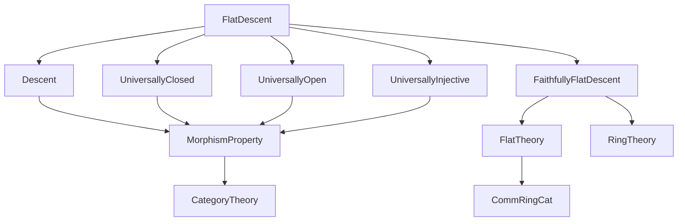
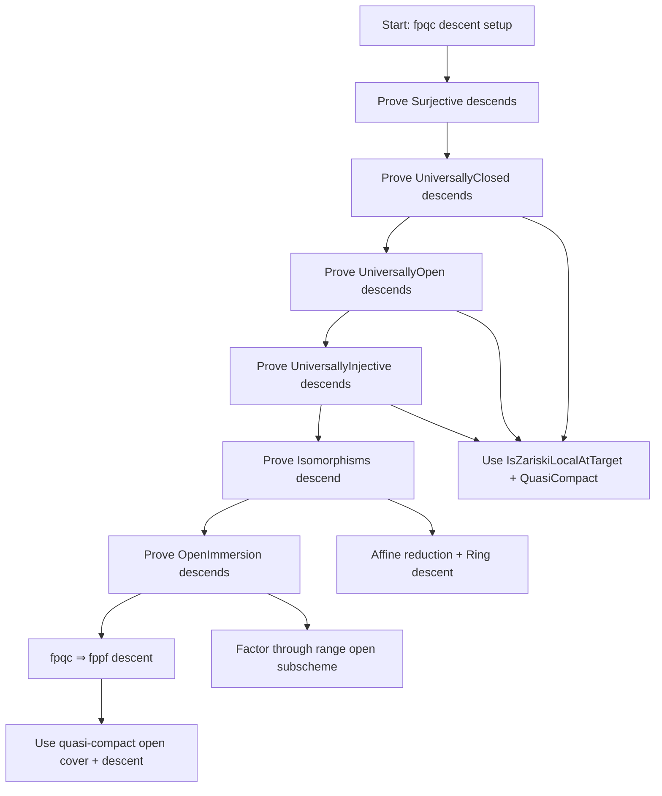

Here is the structured technical metadata extracted from `FlatDescent.lean`:

---

### **1. Key Definitions & Theorems**

| Name | Type | Purpose |
|------|------|---------|
| `Surjective` | `MorphismProperty Scheme` | Property of being surjective on underlying topological spaces. |
| `Flat` | `MorphismProperty Scheme` | Property of being flat (as a morphism of schemes). |
| `QuasiCompact` | `MorphismProperty Scheme` | Property of being quasi-compact. |
| `UniversallyClosed` | `MorphismProperty Scheme` | Property of being universally closed (stable under base change). |
| `UniversallyOpen` | `MorphismProperty Scheme` | Property of being universally open. |
| `UniversallyInjective` | `MorphismProperty Scheme` | Property of being universally injective; defined via diagonal being a closed immersion (`universallyInjective_eq_diagonal`). |
| `isomorphisms Scheme` | `MorphismProperty Scheme` | Property of being an isomorphism. |
| `IsOpenImmersion` | `MorphismProperty Scheme` | Property of being an open immersion. |
| `DescendsAlong` | `(P Q : MorphismProperty Scheme) → Prop` | `P` descends along `Q`-morphisms (i.e., if base change along a `Q`-morphism makes `P` hold, then `P` held originally). |
| `IsZariskiLocalAtTarget` | `MorphismProperty Scheme → Prop` | Property is Zariski-local on the target. |
| `descendsAlong_universallyClosed_surjective_inf_flat_inf_quasicompact` | `DescendsAlong UniversallyClosed (Surjective ⊓ Flat ⊓ QuasiCompact)` | Universally closed descends along surjective, flat, quasi-compact morphisms (Stacks Project 02KS). |
| `descendsAlong_universallyOpen_surjective_inf_flat_inf_quasicompact` | `DescendsAlong UniversallyOpen (Surjective ⊓ Flat ⊓ QuasiCompact)` | Universally open descends along same (Stacks 02KT). |
| `descendsAlong_universallyInjective_surjective_inf_flat_inf_quasicompact` | `DescendsAlong UniversallyInjective (Surjective ⊓ Flat ⊓ QuasiCompact)` | Universally injective descends along same (Stacks 02KW). |
| `descendsAlong_isomorphisms_surjective_inf_flat_inf_quasicompact` | `(isomorphisms Scheme).DescendsAlong (Surjective ⊓ Flat ⊓ QuasiCompact)` | Isomorphisms descend along same (Stacks 02L4). |
| `descendsAlong_isOpenImmersion_surjective_inf_flat_inf_quasicompact'` | `IsOpenImmersion.DescendsAlong (Surjective ⊓ Flat ⊓ QuasiCompact)` | Open immersions descend along same (Stacks 02L3). |
| `Flat.surjective_descendsAlong_surjective_inf_flat_inf_quasicompact` | `DescendsAlong Surjective (Surjective ⊓ Flat ⊓ QuasiCompact)` | Surjectivity descends along same. |

---

### **2. Naming Conventions**

- **Prefixes**:
  - `descendsAlong_`: for instances proving a property descends along a composite condition.
  - `is_`: e.g., `isIso`, `isClosed`, `isOpen`, `isAffine`, `isHomeomorph`, `isAffineHom`, `isInducing`, `isClosedEmbedding`.
  - `of_`: e.g., `of_pullback_fst_of_descendsAlong`, `of_isPullback_of_descendsAlong`, `of_hasPullback`, `of_comp`.
  - `le_`: e.g., `le_of_inf_eq'`.
  - `cancel_left_of_respectsIso`: used for manipulating isomorphism properties.

- **Suffixes**:
  - `_surjective_inf_flat_inf_quasicompact`: composite condition `Surjective ⊓ Flat ⊓ QuasiCompact`.
  - `_inf_`: infix notation for meet (infimum) of properties.

- **Notation**:
  - `⊓` for meet (intersection) of properties.
  - `⁻¹'` for preimage of sets under continuous maps.
  - `''` for image of sets.

---

### **3. Tactic Stack**

| Tactic | Frequency | Purpose |
|--------|-----------|---------|
| `refine` | High | Construct proofs stepwise, especially in `instance` proofs. |
| `rw` | Very High | Rewriting using lemmas, definitions, and equalities (e.g., `universallyInjective_eq_diagonal`, `isIso_SpecMap_iff`). |
| `infer_instance` | High | Solve typeclass goals automatically (e.g., `DescendsAlong`, `IsZariskiLocalAtTarget`). |
| `simp_rw` | Medium | Simplify with rewriting (e.g., `simp_rw [← isIso_SpecMap_iff, isomorphisms.iff, implies_true]`). |
| `rwa` | Medium | Rewrite + assume new goal (used in `rw` + `assumption` combo). |
| `have` / `suffices` | High | Introduce intermediate claims. |
| `wlog` | Medium | Without loss of generality (used for reducing to affine case). |
| `cases` / `obtain` | Medium | Extract structure (e.g., `obtain ⟨T, rfl⟩ := hY`). |
| `grind` | Low | Custom tactic (likely from `Mathlib.Tactic`), used in `instance` proof for surjectivity. |
| `aesop` | Not present | Not used in this file. |
| `ring` | Not present | Not used. |

---

### **4. Proof Logic**

- **General Strategy**:
  - Prove descent for each property by verifying the definition of `DescendsAlong P Q`, i.e., for any pullback square with `g` a `Q`-morphism, if the pullback of `f` satisfies `P`, then `f` satisfies `P`.
  - Use `IsZariskiLocalAtTarget.descendsAlong_inf_quasiCompact` for properties that are Zariski-local on the target and stable under quasi-compact base change.
  - For `UniversallyClosed`, `UniversallyOpen`, and `IsOpenImmersion`, reduce to checking behavior on open/closed subsets via pullback diagrams and use properties of flat surjective maps (e.g., `Flat.isQuotientMap_of_surjective`).
  - For `UniversallyInjective`, reduce to diagonal being a closed immersion via `universallyInjective_eq_diagonal`.
  - For `Isomorphisms`, reduce to affine case (`wlog hY : ∃ T, Y = Spec T`) and use ring-theoretic descent (`RingHom.FaithfullyFlat.codescendsAlong_bijective`).
  - For `IsOpenImmersion`, factor through the open subscheme `U = range(g)` and descend isomorphism property on the pullback.

- **Common Subproof Pattern**:
  ```lean
  refine fun {R} S Y φ g ⟨_, _⟩ hfst ↦ ⟨universally_mk' _ _ fun {T} f _ s hs ↦ ?_⟩
  ```
  This is used to construct the required morphism in the descent data.

- **Key Lemmas Used**:
  - `IsZariskiLocalAtTarget.descendsAlong_inf_quasiCompact`
  - `of_pullback_fst_of_descendsAlong`
  - `universally_mk'`
  - `isIso_iff_isOpenImmersion_and_surjective`
  - `isAffine_of_isAffineHom`
  - `flat_and_surjective_SpecMap_iff`
  - `Spec.map_surjective`

---

### **5. Imports**

| Module | Role |
|--------|------|
| `Mathlib.AlgebraicGeometry.Morphisms.Descent` | Core descent theory (definitions, lemmas). |
| `Mathlib.AlgebraicGeometry.Morphisms.UniversallyClosed` | Universally closed morphisms. |
| `Mathlib.AlgebraicGeometry.Morphisms.UniversallyOpen` | Universally open morphisms. |
| `Mathlib.AlgebraicGeometry.Morphisms.UniversallyInjective` | Universally injective morphisms. |
| `Mathlib.RingTheory.Flat.FaithfullyFlat.Descent` | Ring-theoretic faithfully flat descent (used for isomorphisms). |

---

### **6. Mermaid Diagrams**

#### **Dependency Graph (Module-Level)**



#### **Overview of File Logic Flow**



---

Let me know if you'd like a formalized summary in Lean syntax or a theory map for the `Mathlib` ecosystem.
