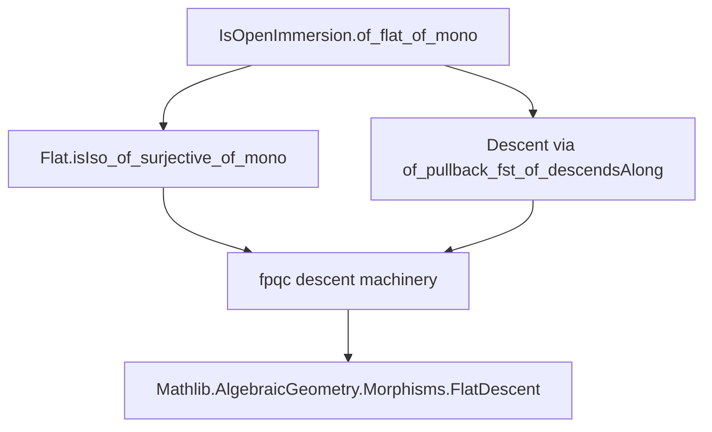
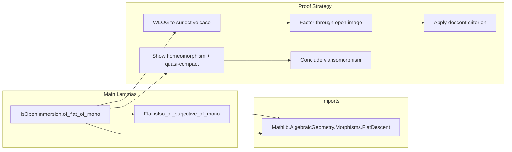

**Technical Brief: `FlatMono.lean`**

---

### 1. **Key Definitions & Theorems**

| Name | Type | Purpose |
|------|------|---------|
| `Flat.isIso_of_surjective_of_mono` | `{X Y : Scheme} → (f : X ⟶ Y) → [Flat f] → [QuasiCompact f] → [Surjective f] → [Mono f] → IsIso f` | Shows that a flat, surjective, quasi-compact monomorphism of schemes is an isomorphism. Used as a descent step. |
| `IsOpenImmersion.of_flat_of_mono` | `{X Y : Scheme} → (f : X ⟶ Y) → [Flat f] → [LocallyOfFinitePresentation f] → [Mono f] → IsOpenImmersion f` | Main theorem: a flat monomorphism of finite presentation is an open immersion. Proven via fpqc descent (using the previous lemma). |

---

### 2. **Naming Conventions**

- **Prefixes**:
  - `isIso_`, `isHomeomorph_`, `isOpenImmersion_`: property-based naming (`IsIso`, `IsHomeomorph`, `IsOpenImmersion`).
  - `of_`: used for implication-style theorems (e.g., `of_flat_of_mono`, `of_isIso`).
  - `mono_`, `flat_`, `surjective_`, `quasiCompact_`: property qualifiers.
- **Suffixes**:
  - `_of_descendsAlong`, `_of_pullback_fst`: descent-theoretic construction naming.
  - `_fac`: factorization-related (e.g., `mono_of_mono_fac`).
- **Helper lemmas**:
  - `of_postcomp`, `of_precomp`: used to transfer properties along factorizations.

---

### 3. **Tactic Stack**

| Tactic | Frequency | Role |
|--------|-----------|------|
| `wlog` | 1 (main proof) | WLOG reduction to surjective case; uses `hf : Surjective f` as hypothesis. |
| `simp` / `simp_rw` | Frequent | Simplify hom-composition, lifts, and universal properties (e.g., `simp [U]`, `rwa [← heq]`). |
| `tauto` | 1 | In `Flat.isIso_of_surjective_of_mono`, to discharge trivial logical goals. |
| `inferInstance` | 2 | To synthesize instances (e.g., `IsOpenImmersion U.ι`, `QuasiCompact f`). |
| `apply ... of_pullback_fst_of_descendsAlong` | 1 | Core descent argument: apply a general descent criterion. |
| `exact` / `intro` / `cases` | Implicit | Standard proof structure; not explicitly shown but implied by Lean style. |
| `ring` / `linarith` | None | Not used — algebraic geometry context avoids arithmetic simplifications. |

---

### 4. **Proof Logic**

The proof of `IsOpenImmersion.of_flat_of_mono` proceeds as follows:

1. **WLOG Reduction**:
   - Reduce to the case where `f` is surjective by factoring through the open image `U = range(f)`.
   - Use `U.instIsOpenImmersionι` to get that the inclusion `U.ι : U ⟶ Y` is an open immersion.
   - Lift `f` to `f' : X ⟶ U` such that `f = f' ≫ U.ι`.
   - Show `f'` inherits flatness, finite presentation, and monomorphism properties.

2. **Apply Inductive Hypothesis**:
   - Apply the theorem *to* `f'` (which is surjective), using the reduced case.

3. **Surjective Case**:
   - Show `f` is a homeomorphism on underlying topological spaces (`IsHomeomorph f.base`).
   - Deduce `QuasiCompact f` from compactness preservation under homeomorphisms.
   - Apply `Flat.isIso_of_surjective_of_mono` to conclude `f` is an isomorphism.
   - Conclude `IsOpenImmersion f` via `.of_isIso`, since isomorphisms are open immersions.

**Descent Mechanism**:
- The key tool is `MorphismProperty.of_pullback_fst_of_descendsAlong`, which implements fpqc descent for morphism properties.
- The property `P := isomorphisms` descends along `Q := Surjective ⊓ Flat ⊓ QuasiCompact`.

---

### 5. **Imports**

| Import | Role |
|--------|------|
| `Mathlib.AlgebraicGeometry.Morphisms.FlatDescent` | Core descent machinery: `of_pullback_fst_of_descendsAlong`, descent of properties like `Flat`, `Mono`, etc. |
| `CategoryTheory.Limits` | Pullbacks, finite limits, universal properties. |
| `MorphismProperty` | Typeclass-based morphism properties (`Flat`, `Mono`, `Surjective`, `QuasiCompact`, etc.). |

---

### 6. **Mermaid Diagrams**

#### **Dependency Graph (Theorem → Lemmas)**

#### **Overview of File Structure**

---

### 7. **Theory Context**

- **Location in Mathlib**: Part of the `AlgebraicGeometry.Morphisms` hierarchy, specifically in the `FlatDescent` module.
- **Related Stacks Project Tags**: 
  - `06NC` (tag assigned via `@[stacks 06NC]`) — *Flat monomorphisms of finite presentation are open immersions*.
- **Broader Implications**:
  - Generalizes the classical result that smooth monomorphisms are open immersions.
  - Demonstrates power of fpqc descent in algebraic geometry: reduces global properties (open immersion) to local ones (isomorphism after base change).

--- 

Let me know if you'd like a formalized dependency graph (e.g., `.lean`-level imports) or a comparison with the Stacks Project proof.
