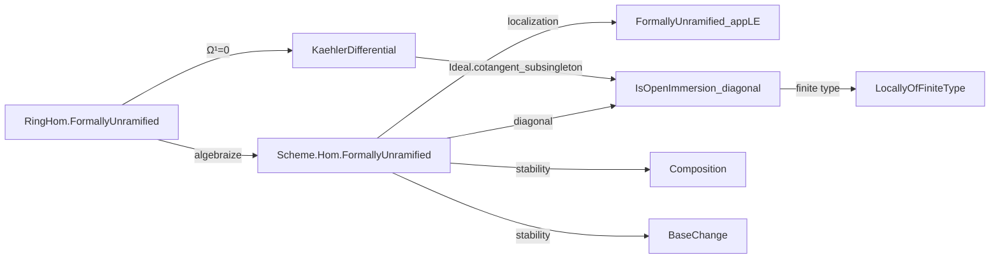

Here is the structured technical metadata extracted from `FormallyUnramified.lean`:

---

### **1. Key Definitions & Theorems**

| Name | Type / Signature | Purpose |
|------|------------------|---------|
| `FormallyUnramified` | `class FormallyUnramified (f : X ⟶ Y) : Prop` | Defines a scheme morphism `f` to be *formally unramified* if all induced ring maps on affine opens are formally unramified. |
| `Algebra.FormallyUnramified.isOpenImmersion_SpecMap_lmul` | `instance` | If `S` is a formally unramified, essentially finite type `R`-algebra, then the diagonal map `Spec S → Spec(R ⊗_R S) ≅ Spec S` (via `lmul'`) is an open immersion. |
| `isOpenImmersion_diagonal` | `instance [FormallyUnramified f] [LocallyOfFiniteType f] : IsOpenImmersion (pullback.diagonal f)` | For a formally unramified morphism of finite type, its diagonal is an open immersion. |
| `of_comp` | `theorem of_comp {f : X ⟶ Y} {g : Y ⟶ Z} [FormallyUnramified (f ≫ g)] : FormallyUnramified f` | If `f ≫ g` is formally unramified, then `f` is. |
| `instance : MorphismProperty.IsStableUnderComposition` | `instance` | Stability of formally unramified morphisms under composition. |
| `instance : MorphismProperty.IsStableUnderBaseChange` | `instance` | Stability under base change. |
| `instance : MorphismProperty.IsMultiplicative` | `instance` | Contains identity morphisms (i.e., `id : X ⟶ X` is formally unramified). |

---

### **2. Naming Conventions**

- **Prefixes / Suffixes**:
  - `formallyUnramified_`: for definitions/properties related to the class.
  - `is*Immersion`: e.g., `isOpenImmersion_`, `isClosedImmersion_`, `isImmersion_`.
  - `mul_`, `lmul_`, `lmul'`: tensor multiplication maps.
  - `diagonal_`: for diagonal morphisms (e.g., `diagonal_SpecMap`, `pullback.diagonal`).
  - `Spec.map`, `Spec.homEquiv`, `Spec_iff`: for Spec-level characterizations.
  - `algebraize`: tactic/lemma for reducing to algebraic statements.

- **Suffixes**:
  - `_appLE`: for localizations on affine opens (`U ⊆ Y`, `V ⊆ f⁻¹U`).
  - `_iff`: for equivalence lemmas (e.g., `formallyUnramified_iff`).
  - `_fg`, `_subsingleton`, `_cotangent`: referencing properties of Kähler differentials.

---

### **3. Tactic Stack**

Frequently used tactics in proofs:

| Tactic | Usage |
|--------|-------|
| `rw` | Rewriting definitions, equivalences, and isomorphisms. |
| `algebraize` | Reducing scheme-theoretic statements to commutative algebra (via `Spec`). |
| `obtain ⟨⟨x, hx⟩, rfl⟩` | Case analysis on existential/identity types. |
| `wlog` | WLOG reductions to affine cases (common in Zariski-local arguments). |
| `rwa` | `rw` + `assumption` (often after `←` isomorphisms). |
| `infer_instance` | Solving typeclass goals (e.g., `FormallyUnramified`, `IsOpenImmersion`). |
| `simp` / `simp_rw` | Simplifying tensor products, ring maps, and pullbacks. |
| `exact`, `refine`, `apply` | Constructing proofs using lemmas/instances. |
| `cancel_right_of_respectsIso` | Cancelling isomorphisms on the right in morphism properties. |
| `subsingleton_of_forall_eq` | Proving equality in subsingleton types (e.g., ideals in cotangent space). |

---

### **4. Proof Logic**

- **General Strategy**:
  - **Affine reduction**: Most proofs reduce to the affine case via Zariski-local properties (`IsZariskiLocalAtSource`, `IsZariskiLocalAtTarget`), often using `wlog` to assume `X = Spec S`, `Y = Spec R`.
  - **Algebraization**: Use `algebraize` to translate scheme morphisms to ring maps, then work in `CommRing`.
  - **Kähler differentials**: Central tool: formal unramifiedness ⇔ Ω¹ = 0 (via `Ideal.cotangent_subsingleton_iff`).
  - **Diagonal criterion**: Prove diagonal is open immersion using surjectivity of `lmul'` and properties of the cotangent ideal.
  - **Stability properties**: Proven via `MorphismProperty` infrastructure, leveraging ring-level stability (e.g., `RingHom.FormallyUnramified.stableUnderComposition`).

- **Typical Flow**:
  1. Reduce to affine case.
  2. Translate to ring maps.
  3. Use algebraic characterizations (e.g., Ω¹ = 0, idempotent ideals).
  4. Apply known algebraic lemmas (e.g., `Ideal.isIdempotentElem_iff_of_fg`, `isOpenImmersion_SpecMap_iff_of_surjective`).
  5. Lift back to schemes.

---

### **5. Imports & Dependencies**

| Module | Purpose |
|--------|---------|
| `Mathlib.AlgebraicGeometry.Morphisms.Separated` | Provides background on separated morphisms, pullbacks, diagonals. |
| `Mathlib.RingTheory.Ideal.IdempotentFG` | Used for characterizing open immersions via idempotent ideals (e.g., `Ideal.isIdempotentElem_iff_of_fg`). |
| `Mathlib.RingTheory.RingHom.Unramified` | Defines and proves properties of formally unramified ring homomorphisms (e.g., stability, localness, Ω¹ = 0). |

---

### **6. Mermaid Diagrams**

#### **Dependency Graph (Module-Level)**

```mermaid
graph TD
  FormallyUnramified --> Separated
  FormallyUnramified --> IdempotentFG
  FormallyUnramified --> Unramified
  Unramified -->[RingTheory] Ideal.IdempotentFG
  Unramified -->[RingTheory] KaehlerDifferential
  Separated --> Pullbacks
  Pullbacks -->[CategoryTheory] Limits
```

#### **Overview of Theory Flow**



---

Let me know if you'd like a formalized summary of the *diagonal criterion* or a proof sketch of `isOpenImmersion_diagonal`.
