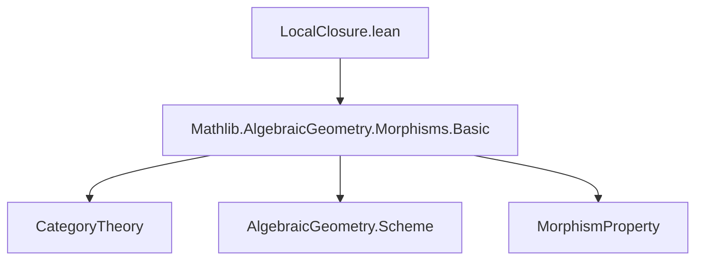
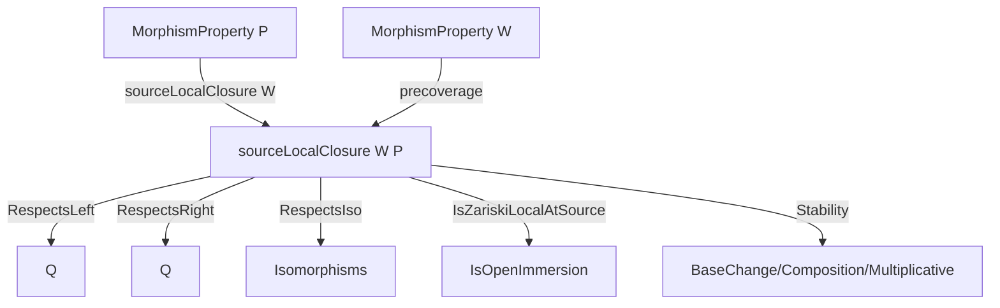

### Technical Brief: `LocalClosure.lean`

---

#### **1. Key Definitions & Theorems**

| Name | Type | Purpose |
|------|------|---------|
| `sourceLocalClosure` | `MorphismProperty Scheme.{u} → MorphismProperty Scheme.{u}` | Defines the *source local closure* of a morphism property `P` w.r.t. a morphism property `W`: `f` satisfies `sourceLocalClosure W P` iff there exists a `W`-compatible open cover of the source on which `P` holds. |
| `cover` | `sourceLocalClosure W P f → Scheme.Cover (Scheme.precoverage W) X` | Noncomputable choice of a `W`-compatible open cover witnessing `f ∈ sourceLocalClosure W P`. |
| `property_coverMap_comp` | `hf.cover.f i ≫ f ∈ P` | Extracts that `P` holds on each component of the chosen cover. |
| `le` | `P ≤ sourceLocalClosure W P` | If `P` is stable under isomorphisms and `W` contains identities, then `P` is pointwise contained in its source local closure. |
| `iff_forall_exists` | `sourceLocalClosure IsOpenImmersion P f ↔ ∀ x, ∃ U ∋ x, P (U.ι ≫ f)` | Characterizes source local closure w.r.t. `IsOpenImmersion` as *local on the source*: `f` is locally in `P` along open immersions. |
| `RespectsLeft`, `RespectsRight`, `RespectsIso` instances | `(sourceLocalClosure W P).RespectsLeft Q`, etc. | Stability of `sourceLocalClosure W P` under left/right composition and isomorphisms, assuming corresponding stability for `P`. |
| `IsZariskiLocalAtSource` instance | `IsZariskiLocalAtSource (sourceLocalClosure IsOpenImmersion P)` | Shows that `sourceLocalClosure IsOpenImmersion P` is *Zariski-local on the source*, i.e., can be checked on open immersions covering the source. |
| `IsStableUnderBaseChange`, `ContainsIdentities`, `IsStableUnderComposition`, `IsMultiplicative` instances | Various stability properties of `sourceLocalClosure W P` | Propagate stability properties of `P` and `W` to the source local closure. |

---

#### **2. Naming Conventions**

- **Prefixes**:
  - `sourceLocalClosure`: Main constructor and namespace.
  - `cover`: Witness of existence (noncomputable choice).
  - `property_coverMap_comp`: Property holds on cover components.
- **Suffixes**:
  - `_mem` (e.g., `id_mem`, `comp_mem`): Membership in a property under composition/id.
  - `_of_respectsIso`, `_of_cancel_left`: Derivation using stability assumptions.
- **General pattern**: `X_mem`, `X_precomp`, `X_postcomp`, `X_pullback_*`, `X_bind`, `X_comp`, `X_mul`.

---

#### **3. Tactic Stack**

Frequent tactics used in proofs:

| Tactic | Usage |
|--------|-------|
| `refine` | Structured proof construction, especially for `instance` and `lemma` goals. |
| `simpa` | Simplify using assumptions and rewrite rules (e.g., `pullback.condition_assoc`, `Category.assoc`). |
| `rw` | Rewriting associativity, pullback diagrams, and isomorphism properties. |
| `choose` | Extracting witnesses from existential quantifiers (e.g., `choose U hx hf using H`). |
| `apply` / `exact` | Applying lemmas or hypotheses directly. |
| `inferInstance` | Inferring typeclass instances (e.g., `inferInstance` for `IsOpenImmersion.RespectsLeft`). |
| `aesop` (implicit) | Likely used in background for routine reasoning (not explicit here, but common in similar files). |

---

#### **4. Proof Logic**

- **Inductive/constructive style**: Proofs are mostly *constructive* and *typeclass-driven*.
- **Common flow**:
  1. **Unfold definitions** (e.g., `sourceLocalClosure`, `RespectsLeft`).
  2. **Introduce witnesses** (e.g., pullbacks, binds of covers).
  3. **Apply stability assumptions** (e.g., `P.pullback_snd`, `RespectsLeft.precomp`).
  4. **Simplify using categorical identities** (e.g., `pullback.condition_assoc`, `Category.assoc`).
- **Key reasoning patterns**:
  - *Cover manipulation*: pullbacks, binds, refinement via `𝒰.pullback₁`, `𝒰.bind`.
  - *Stability propagation*: Use `P`’s stability under base change/composition to lift to `sourceLocalClosure W P`.
  - *Local-to-global*: Use `iff_forall_exists` to reduce to pointwise local checks.

---

#### **5. Imports & Dependencies**

| Import | Role |
|--------|------|
| `Mathlib.AlgebraicGeometry.Morphisms.Basic` | Provides `Scheme`, `MorphismProperty`, `IsOpenImmersion`, `Cover`, `precoverage`, `pullback`, etc. |

This module builds on foundational categorical and scheme-theoretic infrastructure in Mathlib.

---

#### **6. Mermaid Diagrams**

##### **Dependency Graph (Module Level)**



##### **Theoretical Overview**



##### **Proof Structure (Example: `le`)**

```mermaid
graph LR
  A[P f] -->|W.ContainsIdentities| B[Id ∈ W]
  B --> C[coverOfIsIso (𝟙 X) ∈ Scheme.Cover W X]
  C --> D[∃ cover, ∀ i, P (cover.f i ≫ f)]
  D --> E[f ∈ sourceLocalClosure W P]
```

---

#### **7. Summary**

This module formalizes the *source local closure* operation on morphism properties in the context of schemes. It shows that many stability properties (e.g., stability under base change, composition, isomorphisms) lift from `P` to `sourceLocalClosure W P`, assuming corresponding stability for `W`. The key insight is that local properties (e.g., Zariski-locality) are preserved under this closure, and the construction is compatible with categorical structure (pullbacks, covers, etc.). This is foundational for reasoning about properties like “open immersion”, “étale”, “smooth”, etc., which are often defined locally.
