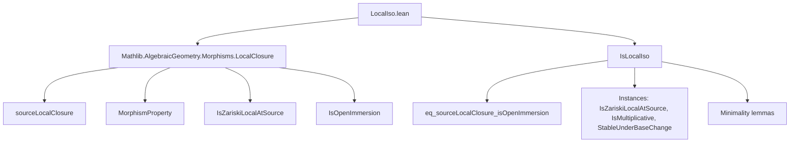

**Technical Brief: `LocalIso.lean`**

---

### 1. **Key Definitions & Theorems**

| Name | Type | Purpose |
|------|------|---------|
| `IsLocalIso (f : X ⟶ Y)` | `Prop` | Defines a *local isomorphism* of schemes: a morphism that is source-locally an open immersion. |
| `exists_isOpenImmersion` | `∀ x : X, ∃ U : X.Opens, x ∈ U ∧ IsOpenImmersion (U.ι ≫ f)` | Witness property for `IsLocalIso`: for each point, there exists an open neighborhood where the morphism factors through an open immersion. |
| `eq_sourceLocalClosure_isOpenImmersion` | `@IsLocalIso = sourceLocalClosure IsOpenImmersion IsOpenImmersion` | Identifies `IsLocalIso` as the *source-local closure* of the property `IsOpenImmersion`. |
| `instance IsZariskiLocalAtSource` | `IsZariskiLocalAtSource @IsLocalIso` | Shows `IsLocalIso` is source-Zariski-local. |
| `instance IsMultiplicative` | `IsMultiplicative @IsLocalIso` | Shows `IsLocalIso` is stable under composition (multiplicative). |
| `instance IsStableUnderBaseChange` | `IsStableUnderBaseChange @IsLocalIso` | Shows `IsLocalIso` is stable under base change. |
| `le_of_isZariskiLocalAtSource` | `@IsLocalIso ≤ P` under assumptions on `P` | Proves `IsLocalIso` is *weakest* source-Zariski-local property containing identities. |
| `eq_iInf` | `@IsLocalIso = ⨅_{P : MorphismProperty, …} P` | Characterizes `IsLocalIso` as the *infimum* (meet) of all source-Zariski-local properties containing identities. |

---

### 2. **Naming Conventions**

- **Prefixes**:
  - `is_` in `IsLocalIso`, `IsOpenImmersion`, `IsZariskiLocalAtSource`, `ContainsIdentities`, `IsMultiplicative`, `IsStableUnderBaseChange` — standard for properties/relations.
- **Suffixes**:
  - `_iff` in `isLocalIso_iff` (used via `@[mk_iff]`).
  - `_source` in `sourceLocalClosure`.
- **Abbreviations**:
  - `𝒰` for open covers (Greek script).
  - `U.ι` for the inclusion morphism $U \hookrightarrow X$.

---

### 3. **Tactic Stack**

- `ext` — extensionality for equality of predicates.
- `rw [eq_sourceLocalClosure_isOpenImmersion]` — rewriting using the key equivalence.
- `rw [isLocalIso_iff]`, `rw [sourceLocalClosure.iff_forall_exists]` — unfolding definitions.
- `infer_instance` — typeclass inference for instances.
- `exact fun _ ↦ …` — lambda abstraction for function extensionality.
- `simp only [le_iInf_iff]` — simplification for lattice order on morphism properties.
- `refine` / `apply` — constructing proofs stepwise.
- `le_antisymm` — proving equality via two inequalities.

No heavy automation (e.g., `aesop`, `ring`, `norm_num`) is used — the proofs are mostly *definition unfolding + typeclass inference*.

---

### 4. **Proof Logic**

- **Structure**: Proofs follow a *property-theoretic* pattern:
  1. **Characterization**: Show `IsLocalIso` equals `sourceLocalClosure IsOpenImmersion`.
  2. **Inheritance**: Use that `sourceLocalClosure` inherits properties (`IsZariskiLocalAtSource`, `IsMultiplicative`, `Stability under base change`) from the base property (`IsOpenImmersion`).
  3. **Minimality**: Prove `IsLocalIso` is the *least* such property by:
     - Showing it is source-Zariski-local and contains identities.
     - Showing any other such property $P$ must dominate it (`le_of_isZariskiLocalAtSource`).
     - Concluding equality with the infimum over all such $P$ (`eq_iInf`).

- **Induction**: Not used.
- **Cases**: Not used.
- **Main reasoning**: Lattice-theoretic (infimum over properties), categorical (source-local closure), and pointwise open cover arguments.

---

### 5. **Imports**

- `Mathlib.AlgebraicGeometry.Morphisms.LocalClosure`  
  → Provides `sourceLocalClosure`, `IsZariskiLocalAtSource`, `IsMultiplicative`, `IsStableUnderBaseChange`, and the general theory of local closure of morphism properties.

No other imports are present — the module is self-contained within this theory.

---

### 6. **Mermaid Diagrams**

#### **Dependency Graph**



#### **Overview of Theory Flow**

```mermaid
flowchart LR
  A[IsOpenImmersion] -->|sourceLocalClosure| B[IsLocalIso]
  B -->|definition| C[Pointwise local factorization through open immersion]
  B -->|properties| D[IsZariskiLocalAtSource]
  B -->|properties| E[IsMultiplicative]
  B -->|properties| F[StableUnderBaseChange]
  D & E & F --> G[Minimality]
  G --> H[IsLocalIso = ⨅_{P : MorphismProperty, P.ContainsId, IsZariskiLocalAtSource} P]
```

---

### 7. **Summary**

This module formalizes *local isomorphisms of schemes* as the smallest source-Zariski-local property containing identities — equivalently, the source-local closure of open immersions. It leverages the general `LocalClosure` framework to derive stability properties and minimality, without ad-hoc constructions. The formalization is clean, modular, and aligns with the “property-theoretic” approach to morphism classes in `Mathlib`.
