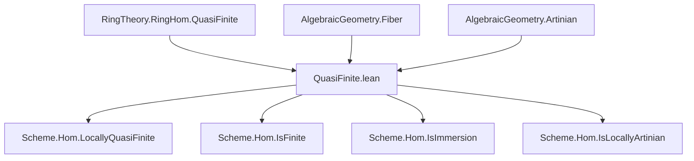

Here is a structured technical brief extracted from `QuasiFinite.lean`, focusing on formalization metadata for building a Domain-Specific AI Agent.

---

### **1. Key Definitions & Theorems**

| Name | Type / Signature | Purpose |
|------|------------------|---------|
| `LocallyQuasiFinite` | `class LocallyQuasiFinite : Prop` | Defines a morphism `f : X ⟶ Y` as *locally quasi-finite* if for all affine opens `U ⊆ Y`, `V ⊆ X` with `f(V) ⊆ U`, the induced ring map `𝒪(Y, U) → 𝒪(X, V)` is quasi-finite (in the algebraic sense). |
| `Scheme.Hom.isDiscrete_preimage_singleton` | `[LocallyQuasiFinite f] → ∀ y, IsDiscrete (f ⁻¹' {y})` | Shows fibers over points are discrete topological spaces. |
| `Scheme.Hom.finite_preimage_singleton` | `[LocallyQuasiFinite f][QuasiCompact f] → ∀ y, (f ⁻¹' {y}).Finite` | Shows fibers over points are finite sets (under quasi-compactness). |
| `locallyQuasiFinite_iff_isFinite_fiber` | `[QuasiCompact f] → LocallyQuasiFinite f ↔ ∀ x, IsFinite (f.fiberToSpecResidueField x)` | Equivalence between local quasi-finiteness and all fibers over residue fields being finite schemes (requires quasi-compactness). |
| `locallyQuasiFinite_iff_isDiscrete_preimage_singleton` | `[LocallyOfFiniteType f] → LocallyQuasiFinite f ↔ ∀ x, IsDiscrete (f ⁻¹' {x})` | Equivalence under locally finite type: quasi-finite ⇔ discrete fibers. |
| `locallyQuasiFinite_iff_finite_preimage_singleton` | `[LocallyOfFiniteType f][QuasiCompact f] → LocallyQuasiFinite f ↔ ∀ x, (f ⁻¹' {x}).Finite` | Equivalence under finite type: quasi-finite ⇔ finite fibers. |
| `IsLocallyArtinian.of_locallyQuasiFinite` | `[LocallyQuasiFinite f][IsLocallyArtinian Y] → IsLocallyArtinian X` | Stability of locally Artinian property under locally quasi-finite maps. |
| `IsFinite.of_locallyQuasiFinite` | `[LocallyQuasiFinite f][QuasiCompact f][IsLocallyArtinian Y] → IsFinite f` | If base is locally Artinian and map is quasi-compact + locally quasi-finite, then it's finite. |
| `LocallyQuasiFinite.of_isFinite_fiberToSpecResidueField` | `(∀ x, IsFinite (f.fiberToSpecResidueField x)) → LocallyQuasiFinite f` | Converse direction of `locallyQuasiFinite_iff_isFinite_fiber`. |

---

### **2. Naming Conventions**

- **Prefixes**:
  - `locallyQuasiFinite_...`: for lemmas about the class `LocallyQuasiFinite`.
  - `isDiscrete_preimage_...`, `finite_preimage_...`: for fiber-related properties.
  - `of_...`: for implication lemmas (e.g., `of_locallyQuasiFinite`, `of_isFinite_fiberToSpecResidueField`).
- **Suffixes**:
  - `_singleton`: for singleton fibers `{x}`.
  - `_residueField`: for maps to `Spec κ(x)`.
  - `_preimage`: for preimage sets.
- **Class names**:
  - `LocallyQuasiFinite`: main class.
  - `IsFinite`, `IsImmersion`, `IsLocallyArtinian`, etc.: standard morphism properties.

---

### **3. Tactic Stack**

Frequent tactics used in proofs:

| Tactic | Purpose |
|--------|---------|
| `wlog` | “Without loss of generality” reductions to affine cases. |
| `obtain ⟨..., rfl⟩ := hY` | Eliminate existential hypotheses to get concrete representations (e.g., `Y = Spec R`). |
| `algebraize` | Translate scheme-theoretic statements into algebraic ones (via `Spec`). |
| `simp only [...] at *` | Simplify goals using explicit lemmas (often `Spec`-related). |
| `convert ... using 1` | Partial unification to reduce to known instances. |
| `refine`, `exact`, `infer_instance` | Typeclass inference and proof construction. |
| `ext`, `funext`, `ext x` | Extensionality for functions/sets. |
| `change id _` | Avoid typeclass inference stuck on `id _` goals. |
| `algebraize [φ.hom]` | Reduce to ring homomorphism level. |
| `have := ...; infer_instance` | Derive instances via ring-theoretic properties. |

---

### **4. Proof Logic**

The logical flow across most proofs follows this pattern:

1. **Reduction to affine case**:
   - Use `wlog` to assume `Y = Spec R`, `X = Spec S`.
   - Apply Zariski-local criteria (`IsZariskiLocalAtTarget`, `IsZariskiLocalAtSource`) when needed.

2. **Algebraization**:
   - Use `Spec.map_surjective` to get a ring map `φ : R → S`.
   - Translate scheme-theoretic properties (e.g., `LocallyQuasiFinite f`) into algebraic ones (e.g., `RingHom.QuasiFinite φ`).

3. **Algebraic equivalence**:
   - Apply known algebraic characterizations (e.g., `Algebra.QuasiFinite.iff_finite_comap_preimage_singleton`).
   - Use module-finiteness, fiber products, residue fields.

4. **Gluing back**:
   - Use `IsZariskiLocalAtTarget.iff_of_openCover` or `IsZariskiLocalAtSource.iff_of_openCover` to lift local results to global.

5. **Fiber analysis**:
   - Use fiber diagrams (`pullback.fst`, `pullback.snd`) and properties of `fiberι`, `fiberToSpecResidueField`.
   - Apply `isDiscrete_univ_iff`, `finite_univ.image`, etc.

---

### **5. Imports & Dependencies**

| Module | Role |
|--------|------|
| `Mathlib.AlgebraicGeometry.Artinian` | Defines `IsLocallyArtinian`, `IsArtinianScheme`. |
| `Mathlib.AlgebraicGeometry.Fiber` | Fiber constructions: `fiber`, `fiberι`, `fiberToSpecResidueField`. |
| `Mathlib.RingTheory.RingHom.QuasiFinite` | Algebraic notion of quasi-finite ring maps. |

Also uses:
- `CategoryTheory`, `Limits`, `Scheme`, `RingHom`, `Module.Finite`, `IsFinite`, `IsImmersion`, etc.

---

### **6. Mermaid Diagrams**

#### **Dependency Graph (High-Level)**



#### **Overview of Theory Flow**

```mermaid
flowchart LR
  A[Ring map φ: R → S] -->|QuasiFinite| B[LocallyQuasiFinite f]
  B --> C[Fibers are discrete]
  B --> D[Fibers are finite (if quasi-compact)]
  C --> E[LocallyQuasiFinite ⇔ discrete fibers (loc. finite type)]
  D --> F[LocallyQuasiFinite ⇔ finite fibers (finite type)]
  B --> G[Stable under composition, base change]
  B --> H[Stable under restriction]
  G --> I[Stable under pullbacks]
  H --> J[Restrictions & resLE]
```

---

### **7. Summary for AI Agent**

- **Core concept**: A morphism is *locally quasi-finite* if all induced ring maps on affine opens are quasi-finite.
- **Key equivalences**:
  - Under finite type: ⇔ discrete fibers ⇔ finite fibers.
  - Under quasi-compact: ⇔ all fibers over residue fields are finite schemes.
- **Stability properties**: Composition, base change, restriction, right-cancellation.
- **Fiber consequences**: Discrete (always), finite (if quasi-compact).
- **Algorithmic proof strategy**:
  - Reduce to affine case.
  - Translate to algebra.
  - Apply algebraic characterizations.
  - Glue back using Zariski-locality.

Let me know if you'd like a **proof automation strategy** or **Lean tactic sketch** for a specific lemma.
