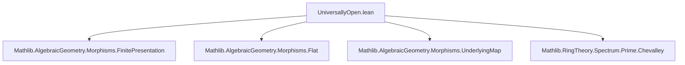
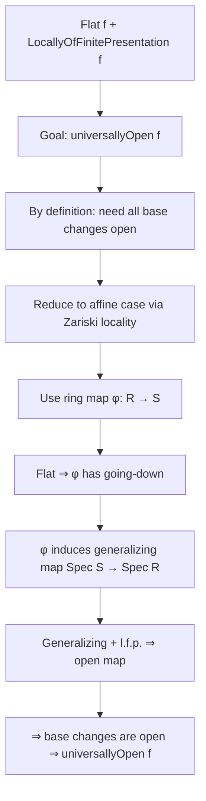

### Technical Brief: `UniversallyOpen.lean`

---

#### **1. Key Definitions & Theorems**

| Name | Type / Class | Purpose |
|------|--------------|---------|
| `UniversallyOpen` | `class (f : X ⟶ Y) : Prop` | Defines a scheme morphism `f` as *universally open*: all base changes `X ×[Y] Y' → Y'` are topologically open maps. |
| `isOpenMap_of_generalizingMap` | `lemma` | If `f` is *locally of finite presentation* and *generalizing*, then `f` is an open map. (Stacks Tag [01U1](https://stacks.math.columbia.edu/tag/01U1)) |
| `Flat.generalizingMap` | `lemma` | Any *flat* morphism is *generalizing*. |
| `UniversallyOpen.of_flat` | `instance` | A flat morphism that is locally of finite presentation is universally open. (Stacks Tag [01UA](https://stacks.math.columbia.edu/tag/01UA)) |

---

#### **2. Naming Conventions**

- **Prefixes**:
  - `universally_`: for properties defined via universal quantification over base changes (e.g., `universally_isOpenMap`).
  - `is_`: for morphism properties (e.g., `IsOpenMap`, `GeneralizingMap`).
  - `of_`: for constructing instances from hypotheses (e.g., `of_flat`, `of_generalizingMap`).
- **Suffixes**:
  - `_iff`: for equivalence lemmas (e.g., `universallyOpen_iff` via `@[mk_iff]`).
  - `_mem`: for membership in a morphism property (e.g., `comp_mem`).
- **Other**:
  - `fst`, `snd`: for projections from pullbacks.
  - `appLE`: for localizations over open embeddings.

---

#### **3. Tactic Stack**

| Tactic | Usage |
|--------|-------|
| `rw [eq]` | Rewriting definitions (e.g., `eq` = `UniversallyOpen ↔ universally (topologically IsOpenMap)`). |
| `intro` / `intro h` | Introducing hypotheses or witnesses (e.g., `hY : ∃ R, Y = Spec R`). |
| `obtain ⟨…⟩ := h` | Destructing existential or product hypotheses. |
| `convert` | Matching goals up to definitional equality, especially after algebraization. |
| `algebraize` | Translating between scheme-level and ring-level statements (via `Spec`). |
| `rwa` | Rewriting and then applying an instance/assumption. |
| `simp_rw` | Simplifying with rewrite rules (e.g., simplifying `morphismRestrict_base`). |
| `wlog` | “Without loss of generality” for reducing to affine cases. |
| `infer_instance` / `inferInstance` | Automatically inferring typeclass instances. |
| `change` | Changing the goal to a definitionally equal form (e.g., `change topologically IsOpenMap f`). |

---

#### **4. Proof Logic**

The proofs follow a **two-tiered strategy**:

1. **Reduction to affine schemes**:
   - Use `IsZariskiLocalAtTarget` / `IsZariskiLocalAtSource` to reduce to the case where source and target are affine (`Y = Spec R`, `X = Spec S`).
   - This is justified by stability under Zariski localization.

2. **Translation to commutative algebra**:
   - Use `Spec.map_surjective` to get a ring map `φ : R → S`.
   - Apply known algebraic results:
     - `PrimeSpectrum.isOpenMap_comap_of_hasGoingDown_of_finitePresentation`
     - `Algebra.HasGoingDown.iff_generalizingMap_primeSpectrumComap`
     - `Algebra.HasGoingDown.of_flat`

The structure is:
- **Induction on structure of schemes** (via affine covers),
- **Cases on existence of affine models** (via `wlog`),
- **Algebraization** of scheme-theoretic properties,
- **Application of known algebraic theorems** (e.g., going-down for flat maps).

---

#### **5. Imports**

| Module | Role |
|--------|------|
| `Mathlib.AlgebraicGeometry.Morphisms.FinitePresentation` | Defines `LocallyOfFinitePresentation`. |
| `Mathlib.AlgebraicGeometry.Morphisms.Flat` | Defines `Flat` morphisms. |
| `Mathlib.AlgebraicGeometry.Morphisms.UnderlyingMap` | Provides `topologically`, `IsOpenMap`, etc. |
| `Mathlib.RingTheory.Spectrum.Prime.Chevalley` | Contains Chevalley’s theorem and going-down results (e.g., `isOpenMap_comap_of_hasGoingDown`). |

---

#### **6. Dependency & Theory Overview (Mermaid Diagrams)**

##### **Dependency Graph (Module-Level)**



##### **Theory Flow (Conceptual)**

```mermaid
graph TD
  A[Scheme Morphism f: X → Y] --> B{Is f universally open?}
  B -->|Definition| C[All base changes X×[Y]Y' → Y' are open]
  
  C --> D[Stability properties]
  D --> D1[Stable under composition]
  D --> D2[Stable under base change]
  D --> D3[Zariski-local at source & target]

  C --> E[Key sufficient conditions]
  E --> E1[Flat + locally finite presentation]
  E1 --> F[Flat ⇒ generalizing]
  E1 --> G[Generalizing + l.f.p. ⇒ open]
  G --> H[⇒ universally open]

  style E1 fill:#f9f,stroke:#333
  style H fill:#bbf,stroke:#333
```

##### **Proof Strategy Flow (for `UniversallyOpen.of_flat`)**


---

#### **7. Key Lemmas & Instances Summary**

| Lemma / Instance | Type | Significance |
|------------------|------|--------------|
| `UniversallyOpen.universally_isOpenMap` | `f` universally open ⇒ all base changes are open | Core definition. |
| `isOpenMap_of_generalizingMap` | `[l.f.p. f] → [generalizing f] → isOpenMap f` | Bridge from geometry to algebra (Stacks 01U1). |
| `Flat.generalizingMap` | `[flat f] → generalizing f` | Flatness implies going-down. |
| `UniversallyOpen.of_flat` | `[flat f] → [l.f.p. f] → universallyOpen f` | Main application: flat + l.f.p. ⇒ universally open (Stacks 01UA). |
| `instance fst`, `instance snd` | Pullback projections are universally open | Stability under pullbacks. |

---

#### **8. Stacks Project Tags Referenced**

- [01U1](https://stacks.math.columbia.edu/tag/01U1): *Generalizing + l.f.p. ⇒ open*.
- [01UA](https://stacks.math.columbia.edu/tag/01UA): *Flat + l.f.p. ⇒ universally open*.

--- 

Let me know if you'd like a formalized dependency graph (e.g., for `leanproject`), or a visualization of the `MorphismProperty` hierarchy used here.
