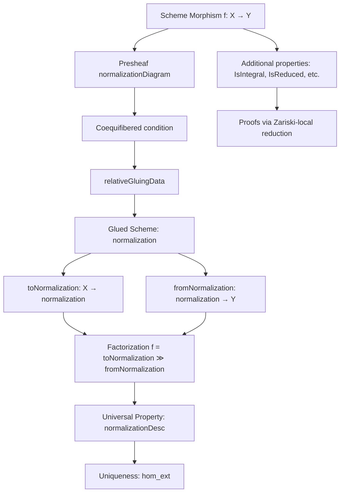
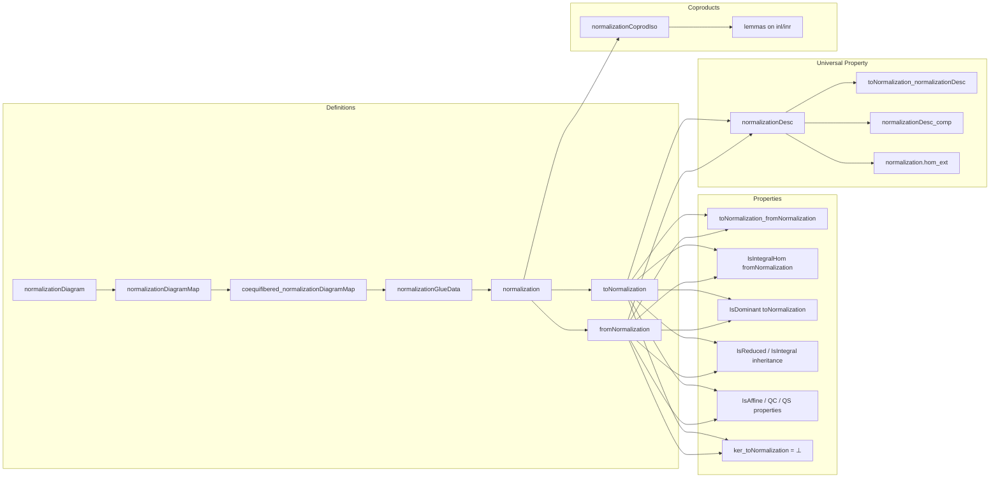

### Technical Brief: Normalization in Lean 4 (AlgebraicGeometry.Scheme.Hom)

---

#### **1. Key Definitions & Theorems**

| Name | Type / Signature | Purpose |
|------|------------------|---------|
| `normalizationDiagram` | `Y.Opensᵒᵖ ⥤ CommRingCat` | Presheaf on $Y$ sending $U \mapsto \overline{\Gamma(Y,U)}^{\Gamma(X,f^{-1}U)}$, the integral closure of $\Gamma(Y,U)$ in $\Gamma(X,f^{-1}U)$. |
| `normalizationDiagramMap` | `Y.presheaf ⟶ f.normalizationDiagram` | Structural map from structure sheaf to its integral closure. |
| `coequifibered_normalizationDiagramMap` | `Coequifibered ...` | Ensures the presheaf descends to a sheaf on the Zariski site; key for gluing. |
| `normalizationGlueData` | `relativeGluingData ...` | Gluing data for constructing the relative normalization as a glued scheme. |
| `normalization` | `Scheme` | The relative normalization of $f : X \to Y$, defined as `f.normalizationGlueData.glued`. |
| `toNormalization` | `X ⟶ f.normalization` | Dominant morphism factoring $f$ through its normalization. |
| `fromNormalization` | `f.normalization ⟶ Y` | Integral morphism completing the factorization $X \xrightarrow{\text{dom}} \widetilde{Y} \xrightarrow{\text{int}} Y$. |
| `normalizationDesc` | `f.normalization ⟶ T` | Mediating map in universal property: given $X \to T \to Y$ with $T \to Y$ integral, produces unique $ \widetilde{Y} \to T $. |
| `normalization.hom_ext` | `f₁ = f₂` | Uniqueness in universal property: two maps to an *affine* $T$ over $Y$ are equal if they agree after precomposing with `toNormalization`. |
| `normalizationCoprodIso` | `(iU ≫ f).normalization ⨿ (iV ≫ f).normalization ≅ f.normalization` | Normalization commutes with coproducts under suitable hypotheses. |

**Key Lemmas**:
- `toNormalization_fromNormalization`: $f = \text{toNormalization} \circ \text{fromNormalization}$
- `fromNormalization_preimage`: Describes preimage of affine opens under `fromNormalization`.
- `ι_toNormalization`, `ι_fromNormalization`: Explicit descriptions on affine opens.
- `ker_toNormalization`: Kernel of `toNormalization` is zero ⇒ dominant.
- `instance [IsIntegral f] : IsIso f.toNormalization`: If $f$ is integral, normalization is iso.
- `instance [IsReduced X] : IsReduced f.normalization`: Normalization inherits reducedness.
- `instance [IsAffineHom f] : IsAffineHom f.toNormalization`: Normalization of affine morphism is affine.

---

#### **2. Naming Conventions**

- **Prefixes**:
  - `normalization...`: Core objects (e.g., `normalization`, `normalizationDiagram`, `normalizationDesc`).
  - `toNormalization`, `fromNormalization`: Canonical maps in factorization.
  - `normalizationCoprod...`: Coproduct compatibility.
- **Suffixes**:
  - `_hom`, `_inv`: For morphism components in isomorphisms.
  - `_app`, `_preimage`: For sheaf-level or topological data.
  - `_assoc`, `_unop`: For coherence with opposite categories.
- **Pattern**:
  - `f.normalization`, `f.toNormalization`, `f.fromNormalization`, `f.normalizationDesc ... H`
  - `ι_toNormalization`, `ι_fromNormalization`: Use `ι` for canonical inclusions in colimits/open covers.

---

#### **3. Tactic Stack**

| Tactic | Usage Frequency | Purpose |
|--------|-----------------|---------|
| `simp` / `simp_rw` | Very High | Simplify sheaf morphisms, algebra maps, preimages, colimits. |
| `rw` / `rw [assoc]` / `reassoc_of%` | High | Rewrite using associativity, coherence lemmas, and custom reassociation rules. |
| `ext` | High | Extensionality for morphisms (sheaves, rings, schemes). |
| `congr` | Medium | Congruence closure for equality proofs (e.g., `congr($(H).support)`). |
| `dsimp` | Medium | Simplify definitions (especially for `normalizationDesc`, `normalizationDiagram`). |
| `exact`, `convert`, `apply` | Medium | Direct proof steps, especially for integral/closed/embedded properties. |
| `have`, `suffices`, `trans` | Medium | Intermediate lemma introduction and chaining. |
| `cases`, `obtain` | Low | Extract witnesses (e.g., `obtain ⟨U, rfl⟩ := Opposite.op_surjective U`). |
| `aesop`, `tauto` | Rare | Not used significantly in this file. |
| `ring`, `abel` | Rare | Not used; algebraic manipulations are done via `algebraize`, `simp`, etc. |

---

#### **4. Proof Logic**

- **Gluing Construction**:
  - Define a presheaf `normalizationDiagram` on the opposite of the affine Zariski site.
  - Prove it satisfies the *coequifibered* condition (i.e., localizes correctly under basic opens).
  - Use `relativeGluingData` to produce glueing data.
  - Glue to get `normalization : Scheme`.

- **Factorization**:
  - Construct `toNormalization` via `Scheme.OpenCover.glueMorphismsOfLocallyDirected`, using explicit maps on each affine patch.
  - Construct `fromNormalization` as the canonical map from the glued scheme to base.

- **Universal Property**:
  - Given $X \xrightarrow{f_1} T \xrightarrow{f_2} Y$ with $f_2$ integral, define `normalizationDesc` using colimit universal property.
  - Use `colimit.desc` with components on each affine $U \subseteq Y$: map $\Gamma(T, f_2^{-1}U)$ to the integral closure via integrality of $f_2$.
  - Prove commutativity and uniqueness:
    - `toNormalization_normalizationDesc`: Commutes with $f_1$.
    - `normalizationDesc_comp`: Commutes with $f_2$.
    - `normalization.hom_ext`: Uniqueness under affineness of $T \to Y$.

- **Properties**:
  - Use *Zariski-local* criteria (`IsZariskiLocalAtTarget.iff_of_openCover`, etc.) to reduce to affine case.
  - In affine case, reduce to commutative algebra facts:
    - `integralClosure_eq_top_iff`, `algebraMap_isIntegral_iff`, `isReduced_of_injective`, etc.
  - For coproducts: Use universal property of coproducts and uniqueness of mediating maps.

---

#### **5. Imports & Dependencies**

| Module | Role |
|--------|------|
| `Mathlib.AlgebraicGeometry.Sites.SmallAffineZariski` | Zariski site, affine opens, localization, sheaves. |
| `Mathlib.Tactic.DepRewrite` | Dependent rewriting for coherence. |
| `Mathlib.AlgebraicGeometry.Morphisms.Integral` | Integral morphisms, properties like `IsIntegralHom`, `isIntegral_app`. |
| `Mathlib.CategoryTheory.Limits` | Colimits, cones, cocones, coproducts. |
| `Mathlib.AlgebraicGeometry.Scheme.Basic` (implicit) | Scheme category, sheaf of rings, morphisms. |
| `Mathlib.AlgebraicGeometry.Scheme.OpenCover` | Gluing morphisms, open covers. |

---

#### **6. Mermaid Diagrams**

##### **Dependency Graph (High-Level)**

##### **Overview of File Structure**

---

#### **7. Theory Context**

- **Location in Mathlib**: Part of `AlgebraicGeometry.Scheme.Hom`, following `Morphisms.Integral`.
- **Related Stacks Project Tags**:
  - [`035H`](https://stacks.math.columbia.edu/tag/035H): Definition of normalization.
  - [`03GP`](https://stacks.math.columbia.edu/tag/03GP): Normalization of integral morphism is iso.
  - [`0AXN`](https://stacks.math.columbia.edu/tag/0AXN): Normalization preserves reducedness.
- **Mathematical Scope**:
  - Relative normalization for qcqs morphisms.
  - Universal property in category of schemes over $Y$.
  - Compatibility with coproducts (gluing).
  - Stability under base change (not explicitly formalized here, but likely follows from universal property).

---

#### **8. Summary**

This file formalizes the **relative normalization** of a qcqs morphism $f : X \to Y$ in the category of schemes. It constructs the factorization $X \to \widetilde{Y} \to Y$, proves it satisfies the expected universal property, and verifies key properties (dominance, integrality, reducedness, affineness, etc.). The formalization is highly structured, leveraging:
- Sheaf-theoretic gluing via Zariski site,
- Colimit universal properties,
- Zariski-local criteria for morphism properties,
- Concrete algebraic characterizations in the affine case.

The naming and proof strategy reflect Lean’s emphasis on *explicit coherence* and *modular decomposition*, with heavy use of `simp`-based automation and careful handling of opposite categories and sheaf restrictions.
