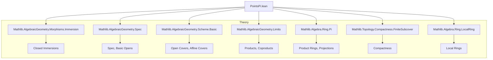

**Technical Brief: `PointsPi.lean`**

---

### 1. KEY DEFINITIONS & THEOREMS

| Name | Type / Signature | Purpose |
|------|------------------|---------|
| `Ideal.span_eq_top_of_span_image_evalRingHom` | `lemma` | Shows that if the image of a finite set `s ⊆ Π Rᵢ` spans the unit ideal under each projection `Pi.evalRingHom i`, then `s` itself spans the unit ideal. Used to detect when a basic open cover of `Spec(Π Rᵢ)` covers the whole space. |
| `eq_top_of_sigmaSpec_subset_of_isCompact` | `lemma` | Proves that any open subset `U ⊆ Spec(Π Rᵢ)` containing the image of `∐ Spec Rᵢ` (via `sigmaSpec R`) and being compact must be the whole space. Core technical tool for proving surjectivity in the compact case. |
| `eq_bot_of_comp_quotientMk_eq_sigmaSpec` | `lemma` | Shows that if a quotient map `Spec(Π Rᵢ / I) → Spec(Π Rᵢ)` factors through `∐ Spec Rᵢ`, then `I = ⊥`. Used to eliminate nontrivial closed immersions in the proof of `isIso_of_comp_eq_sigmaSpec`. |
| `isIso_of_comp_eq_sigmaSpec` | `lemma` | If a locally closed immersion `g : V → Spec(Π Rᵢ)` (with `V` compact) contains the image of `∐ Spec Rᵢ`, then `g` is an isomorphism. Key structural result about `Spec(Π Rᵢ)`. |
| `pointsPi` | `def` | Canonical map `(Spec(Π Rᵢ) ⟶ X) → Π i, (Spec(Rᵢ) ⟶ X)`, induced by universal property of product in `CommRingCat`. |
| `pointsPi_injective` | `lemma` | `pointsPi R X` is injective if `X` is quasi-separated. Proof uses equalizers and `isIso_of_comp_eq_sigmaSpec`. |
| `pointsPi_surjective_of_isAffine` | `lemma` | `pointsPi R X` is surjective if `X` is affine. Constructed via base change along `X.isoSpec`. |
| `pointsPi_surjective` | `lemma` | `pointsPi R X` is surjective if `X` is compact and each `Rᵢ` is local. Uses finite subcover of affine opens and local ring properties (specialization to closed point). |

---

### 2. NAMING CONVENTIONS

- **Prefixes**:
  - `pointsPi_`: for results about the canonical map `X(Π Rᵢ) → Π X(Rᵢ)`.
  - `eq_top_of_`, `eq_bot_of_`: for lemmas equating ideals or opens to top/bottom.
  - `isIso_of_`: for lemmas proving a morphism is an isomorphism under geometric conditions.
- **Suffixes**:
  - `_of_`: often indicates a condition or hypothesis (e.g., `surjective_of_isAffine`).
  - `_comp_`: indicates composition with a canonical map (e.g., `comp_quotientMk_eq_sigmaSpec`).
- **`sigmaSpec`**: standard notation for the canonical map `∐ Spec Rᵢ → Spec(Π Rᵢ)`.

---

### 3. TACTIC STACK

- **Core proof automation**:
  - `simp` / `simp_rw`: heavy use for rewriting definitions (e.g., `pointsPi`, `Spec.map`, `zeroLocus`, `basicOpen`).
  - `ext`: extensionality for functions/ideals/morphisms.
  - `congr`: for congruence of morphisms.
- **Algebraic geometry-specific**:
  - `rw [← Spec.map_comp_assoc]`, `rw [Category.assoc]`, `rw [Iso.comp_inv_eq]`: manipulation of morphism compositions.
  - `apply eq_top_iff_one.mpr`, `apply le_bot_iff.mp`: ideal-theoretic reasoning.
  - `exact`, `refine`, `convert_to`: structured proof construction.
- **Topological/compactness**:
  - `elim_finite_subcover`: from `IsCompact`, used to extract finite subcovers.
  - `fintype`, `Finset.finite_toSet`: finite type machinery for compactness arguments.
- **Ring-theoretic**:
  - `ring`, `aesop`: for ring equalities (especially in `Ideal.span_eq_top_of_span_image_evalRingHom`).
  - `simpa [Finsupp.sum_fintype]`: handling finite support functions.

---

### 4. PROOF LOGIC

- **Structure of main results**:
  - **Injectivity** (`pointsPi_injective`):
    - Assume two points `f, g : Spec(Π Rᵢ) → X` map to same family under `pointsPi`.
    - Show `f = g` by factoring through the equalizer `e : E → Spec(Π Rᵢ)`.
    - Use `isIso_of_comp_eq_sigmaSpec` on `e` to deduce `e` is iso ⇒ `f = g`.
  - **Surjectivity (affine case)**:
    - Lift a family of points `fᵢ : Spec Rᵢ → X` through `X.isoSpec : X ≅ Spec A`.
    - Use universal property of product in `CommRingCat` to get a ring map `A → Π Rᵢ`.
  - **Surjectivity (compact + local case)**:
    - Cover `X` by finitely many affines `𝒰`.
    - For each `i`, pick an affine `𝒰.j` containing the image of `fᵢ` (uses `IsLocalRing.closedPoint`).
    - Partition index set by `j`, apply affine surjectivity on each piece.
    - Glue using universal property of product over partition and `sigmaSpec`.

- **Common pattern**:
  - Reduce to affine case via finite covers or isomorphisms.
  - Use compactness to reduce to finite index sets.
  - Leverage local ring structure to control image of points.

---

### 5. IMPORTS

- `Mathlib.AlgebraicGeometry.Morphisms.Immersion`: provides `IsImmersion`, `IsClosedImmersion`, `coborderRange`, etc.
- Implicitly relies on:
  - `Mathlib.AlgebraicGeometry.Spec` (for `Spec`, `sigmaSpec`, `basicOpen`, `zeroLocus`)
  - `Mathlib.AlgebraicGeometry.Scheme.Basic` (for `Scheme`, `OpenCover`, `affineCover`)
  - `Mathlib.AlgebraicGeometry.Limits` (for products, coproducts, equalizers)
  - `Mathlib.Algebra.Ring.Pi` (for `Pi.evalRingHom`, `Pi.ringHom`)
  - `Mathlib.Topology.Compactness.FiniteSubcover` (for `elim_finite_subcover`)
  - `Mathlib.Algebra.Ring.LocalRing` (for `IsLocalRing.closedPoint`, `specializes_closedPoint`)

---

### 6. MERMAID DIAGRAMS

#### Dependency Graph (High-Level)



#### Overview of `PointsPi.lean`

```mermaid
flowchart LR
  A[Spec(Π Rᵢ)] -->|sigmaSpec| B[∐ Spec Rᵢ]
  A -->|f| X
  B -->|fᵢ| X
  A -.->|pointsPi| B
  X[Scheme X] -->|Quasi-separated| pointsPi_injective
  X -->|Affine| pointsPi_surjective_of_isAffine
  X -->|Compact + Local Rᵢ| pointsPi_surjective
  B -->|isIso_of_comp_eq_sigmaSpec| A
```

---

### 7. SUMMARY

This file formalizes the **representability of the functor of points** for products of rings:  
$$
X\left(\prod_i R_i\right) \to \prod_i X(R_i)
$$  
is injective under quasi-separatedness and surjective under affineness or compactness + localness.  
It leverages deep structural properties of `Spec(Π Rᵢ)` — notably that it is the *initial* object among schemes receiving maps from all `Spec Rᵢ` — and uses compactness and local ring theory to control global sections.  
The proofs are highly categorical and algebraic, combining scheme-theoretic gluing, ideal theory, and topological compactness arguments.
