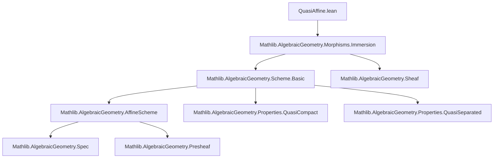

### Technical Brief: `QuasiAffine.lean`

---

#### **1. Key Definitions & Theorems**

| Name | Type | Purpose |
|------|------|---------|
| `IsQuasiAffine` | `Scheme.{u} → Prop` | Defines a scheme `X` as *quasi-affine* if it is quasi-compact and the canonical map `X ⟶ Spec Γ(X, ⊤)` is an immersion (which turns out to be an open immersion). |
| `IsQuasiAffine.of_isImmersion` | `[Y.IsQuasiAffine] → [IsImmersion f] → [CompactSpace X] → X.IsQuasiAffine` | Shows that any quasi-compact *locally closed* subscheme of a quasi-affine scheme is quasi-affine. |
| `IsQuasiAffine.isBasis_basicOpen` | `[X.IsQuasiAffine] → Opens.IsBasis { X.basicOpen r | IsAffineOpen (X.basicOpen r) }` | Proves that affine basic opens (w.r.t. global sections) form a basis for the topology of a quasi-affine scheme. |
| `IsQuasiAffine.of_forall_exists_mem_basicOpen` | `[CompactSpace X] → (∀ x, ∃ r, IsAffineOpen (X.basicOpen r) ∧ x ∈ X.basicOpen r) → X.IsQuasiAffine` | Gives a criterion: if every point lies in an affine basic open, then `X` is quasi-affine. |
| `IsQuasiAffine.of_isAffineHom` | `[IsAffineHom f] → [Y.IsQuasiAffine] → X.IsQuasiAffine` | If `f : X → Y` is affine and `Y` is quasi-affine, then `X` is quasi-affine. |
| `openCoverBasicOpenTop` | `[X.IsQuasiAffine] → X.OpenCover` | Constructs an open cover of `X` by affine basic opens `X.basicOpen r`. |
| `isPullback_toSpecΓ_toSpecΓ` | `[IsAffineHom f] → [Y.IsQuasiAffine] → IsPullback f X.toSpecΓ Y.toSpecΓ (Spec.map f.appTop)` | Shows that an affine morphism between quasi-affine schemes is the pullback of the induced map on global sections. |
| `preimage_opensRange_toSpecΓ` | `[IsAffineHom f] → [X.IsQuasiAffine] → [Y.IsQuasiAffine] → Spec.map f.appTop ⁻¹ᵁ Y.toSpecΓ.opensRange = X.toSpecΓ.opensRange` | Describes how the open immersion `X → Spec Γ(X, ⊤)` interacts with pullbacks along affine morphisms. |

---

#### **2. Naming Conventions**

- **Prefixes**:
  - `IsQuasiAffine.`: Class and lemmas about the property.
  - `toSpecΓ`: Canonical morphism `X ⟶ Spec Γ(X, ⊤)`.
  - `appTop`: Application of a sheaf morphism at the top element (global sections).
  - `basicOpen r`: Standard open subset defined by a global section `r`.

- **Suffixes**:
  - `isBasis_basicOpen`: Basis property for basic opens.
  - `of_…`: Lemmas constructing the property from other conditions.
  - `preimage_…`: Statements about preimages under morphisms.

- **Notable abbreviations**:
  - `Spec.map f.appTop`: Induced map on spectra from the global section map.
  - `X.toSpecΓ`: Canonical morphism to the spectrum of global sections.

---

#### **3. Tactic Stack**

| Tactic | Usage Frequency | Purpose |
|--------|------------------|---------|
| `rw` | Very High | Rewriting definitions (e.g., naturality, preimage of basic opens). |
| `simp_rw` | High | Simplifying with rewrite rules (especially for preimages and images). |
| `infer_instance` | High | Automatically inferring class instances (e.g., `IsImmersion`, `CompactSpace`). |
| `convert` | Medium | Matching goals up to definitional equality (e.g., in `of_forall_exists_mem_basicOpen`). |
| `dsimp`, `simp` | Medium | Simplifying definitions and simplifiable expressions. |
| `exact`, `refine`, `have` | High | Constructing proofs step-by-step, especially in induction-like reasoning. |
| `cancel_mono` | Low | Cancellation of monomorphisms in commutative diagrams. |
| `congr` | Low | Congruence reasoning for equality of morphisms. |

---

#### **4. Proof Logic**

- **Structure of proofs**:
  - **Induction-free**: Most proofs are *local-to-global* or *cover-based*.
  - **Cover arguments**: Use basis properties (`isBasis_basicOpen`) to reduce to affine opens.
  - **Localization & pushouts**: Key for proving affine morphisms between quasi-affine schemes are pullbacks.
  - **Diagram chasing**: Heavy use of naturality squares, pullbacks, and immersions.

- **Typical flow**:
  1. Reduce to affine case using basis or open cover.
  2. Use localization properties (`isLocalization_basicOpen_of_qcqs`) to handle sheaf maps.
  3. Apply categorical properties (e.g., `IsOpenImmersion.of_comp`, `IsPullback.of_openCover`).
  4. Conclude via instance inference or simplification.

---

#### **5. Imports & Dependencies**

| Module | Role |
|--------|------|
| `Mathlib.AlgebraicGeometry.Morphisms.Immersion` | Provides definitions and lemmas about immersions, open immersions, and related properties. |
| `CategoryTheory`, `Limits`, `TopologicalSpace` | General categorical and topological infrastructure. |
| Implicit: `Mathlib.AlgebraicGeometry.Scheme.Basic`, `Sheaf`, `AffineScheme`, `QuasiCompact`, `QuasiSeparated` | Required for `Scheme`, `Γ(X, ⊤)`, `basicOpen`, and compactness assumptions. |

---

#### **8. Mermaid Diagrams**

##### **Dependency Graph (Module Level)**



##### **Overview of Theory Flow**

```mermaid
flowchart LR
  A[Scheme X] -->|quasi-compact| B[IsQuasiAffine X]
  B --> C[Open Immersion X → Spec Γ(X, ⊤)]
  C --> D[Basic opens X.basicOpen r form basis]
  D --> E[Cover by affine opens ⇒ quasi-affine]
  E --> F[Affine morphisms preserve quasi-affineness]
  F --> G[Pullback description of affine morphisms]
  G --> H[Behavior of opensRange under pullback]
```

---

#### **6. Summary**

This module formalizes the theory of *quasi-affine schemes* in Lean 4, building on immersion theory and sheaf cohomology. It establishes foundational properties (e.g., openness of the canonical map, basis of affine opens), closure properties (e.g., under locally closed immersions, affine morphisms), and categorical characterizations (e.g., pullback descriptions). The proofs rely heavily on localization, open covers, and categorical diagram chasing, with a strong emphasis on reducing global statements to affine local data.
