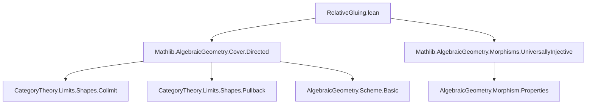

### Technical Brief: `RelativeGluing.lean`

---

#### **1. Key Definitions & Theorems**

| Name | Type / Structure | Purpose |
|------|------------------|---------|
| `isLocallyDirected_of_equifibered_of_injective` | `lemma` | Shows that if a natural transformation between functors into `Scheme` is equifibered and the target diagram is locally directed, and the source maps are injective, then the source diagram is also locally directed. Used to ensure colimit existence in the gluing construction. |
| `RelativeGluingData` | `structure` | Bundles a diagram `functor : 𝒰.I₀ ⥤ Scheme`, a natural transformation `natTrans : functor ⟶ 𝒰.functorOfLocallyDirected`, and the condition `equifibered`. Encodes the data needed to glue schemes over a locally directed open cover. |
| `glued` | `noncomputable abbrev` | The colimit of the diagram `d.functor`. This is the glued scheme over `S`. |
| `toBase` | `noncomputable def` | The structure morphism `d.glued ⟶ S`, induced by the universal property of the colimit using `d.natTrans` and the cover maps `𝒰.f`. |
| `ι_toBase` | `lemma` | Commutativity of the colimit cocone with `toBase`: `ι i ≫ toBase = natTrans.app i ≫ 𝒰.f i`. |
| `preimage_toBase_eq_range_ι` | `lemma` | Describes the preimage under `toBase` of the image of `𝒰.f i` as the image of the colimit leg `ι i`. Key for identifying open subsets. |
| `toBase_preimage_eq_opensRange_ι` | `lemma` | Refines the previous lemma to open subsets (via `opensRange`). |
| `isPullback_natTrans_ι_toBase` | `lemma` | Proves that for each `i`, the square formed by `natTrans.app i`, `ι i`, `𝒰.f i`, and `toBase` is a pullback. This is the core of the relative gluing lemma: $X_i \cong f^{-1}(U_i)$. |
| `instance IsOpenImmersion` | `instance` | Shows that each map in the diagram `d.functor.map hij` is an open immersion, using equifiberedness and the fact that pullbacks of open immersions are open immersions. |
| `instance (LocallyDirected)` | `instance` | Shows the cover of the glued scheme is locally directed, using properties of the original cover and equifiberedness. |

---

#### **2. Naming Conventions**

- **Prefixes:**
  - `is_`: Predicate-style (e.g., `isLocallyDirected`, `isPullback`, `IsOpenImmersion`)
  - `preimage_`, `toBase_`, `ι_`: Descriptive of construction or operation (e.g., `preimage_toBase_eq_range_ι`)
  - `natTrans_`, `functor_`: Component of the structure
- **Suffixes:**
  - `_app`: Application of a natural transformation (e.g., `natTrans.app i`)
  - `_ι`: Colimit cocone leg (e.g., `ι i`)
  - `_toBase`: Interaction with the structure map `toBase`
  - `_opensRange`: Refers to open subsets via `opensRange`
- **`[stacks 01LH]`**: Tag reference to the Stacks Project, indicating this is a formalization of Tag [01LH](https://stacks.math.columbia.edu/tag/01LH).

---

#### **3. Tactic Stack**

| Tactic | Usage |
|--------|-------|
| `simp` / `simp only` | Dominant tactic for simplifying hom-sets, naturality, pullback conditions, and forgetful functor actions. |
| `rw` | Rewriting naturality, associativity, and definitions (e.g., `← Scheme.Hom.comp_apply`, `ι_toBase`). |
| `obtain ⟨…⟩` / `refine ⟨…⟩` | Extracting witnesses from existential hypotheses (especially from `IsLocallyDirected` assumptions). |
| `apply` / `intro` | Standard intro/apply for constructing morphisms or proving properties. |
| `dsimp` | Simplifying definitions (e.g., unfolding `functorOfLocallyDirected_obj`). |
| `ext` | Extensionality for set equality (e.g., `preimage_toBase_eq_range_ι`). |
| `infer_instance` | Automatically inferring class instances (e.g., `IsOpenImmersion`, `LocallyDirected`). |
| `subsingleton` | Used in simplifying equalities in thin categories. |
| `cancel_mono` | Cancelling monomorphisms on left/right in diagrams. |

---

#### **4. Proof Logic**

The proof logic follows a **structured colimit-based gluing strategy**, typical in categorical geometry:

1. **Setup**: Given a locally directed open cover `𝒰` of `S`, and a compatible family of schemes `Xᵢ → Uᵢ`, encoded as `RelativeGluingData`.
2. **Diagram properties**:
   - Show each transition map `Xᵢ → Xⱼ` is an open immersion (via equifiberedness).
   - Show the diagram is locally directed (via `isLocallyDirected_of_equifibered_of_injective`), ensuring the colimit exists and behaves well.
3. **Construction**:
   - Define `glued := colimit d.functor`.
   - Define `toBase` via the universal property of the colimit.
4. **Verification**:
   - Show the cover of `glued` is locally directed.
   - Prove the key pullback property: $X_i \cong f^{-1}(U_i)$, i.e., `isPullback_natTrans_ι_toBase`.
   - Show preimages of cover opens under `toBase` match the images of colimit legs (`preimage_toBase_eq_range_ι`).
5. **Technical lemmas**:
   - Use injectivity of structure maps (from `𝒰` being a cover and `functor.map hij` being open immersion).
   - Use equifiberedness to lift elements through pullbacks.
   - Use joint surjectivity of colimit legs (`ι_jointly_surjective`) for set-theoretic arguments.

---

#### **5. Imports**

| Import | Purpose |
|--------|---------|
| `Mathlib.AlgebraicGeometry.Cover.Directed` | Provides `LocallyDirected` covers, `openCover`, and related infrastructure. |
| `Mathlib.AlgebraicGeometry.Morphisms.UniversallyInjective` | Provides tools for universally injective morphisms (used implicitly via `injective` on open immersions). |

> Note: The file does *not* import full `Scheme` infrastructure directly — it relies on `Scheme.forget`, `Pullback`, `colimit`, etc., from `CategoryTheory` and `AlgebraicGeometry`.

---

#### **6. Mermaid Diagrams**

##### **Dependency Graph (Module-Level)**



##### **Overview of Theory Flow**

```mermaid
flowchart LR
  A[Locally Directed Cover 𝒰 of S] --> B[RelativeGluingData d]
  B --> C[Diagram d.functor : 𝒰.I₀ ⥤ Scheme]
  C --> D[Colimit X = glued]
  D --> E[Structure map toBase : X → S]
  B --> F[Equifibered natTrans : d.functor ⇒ 𝒰.functor]
  F --> G[Each Xᵢ → Uᵢ is pullback of toBase]
  G --> H[IsPullback natTrans.app i ι i 𝒰.f i toBase]
  H --> I[Relative Gluing Lemma: Xᵢ ≅ toBase⁻¹(Uᵢ)]
```

##### **Proof Skeleton (High-Level)**

```mermaid
flowchart TD
  A[Given: 𝒰 locally directed cover of S] --> B[Given: d : RelativeGluingData 𝒰]
  B --> C[Show d.functor is locally directed]
  C --> D[Define X := colimit d.functor]
  D --> E[Define toBase : X → S via colimit.desc]
  E --> F[Show cover of X is locally directed]
  F --> G[Prove preimage_toBase_eq_range_ι]
  G --> H[Prove isPullback_natTrans_ι_toBase]
  H --> I[Conclude: Xᵢ ≅ toBase⁻¹(Uᵢ)]
```

---

#### **7. Summary**

This file formalizes the **relative gluing lemma** (Stacks Project Tag 01LH), a foundational result in algebraic geometry allowing one to glue a compatible family of schemes over a locally directed open cover. The formalization leverages:
- **Categorical colimits** to construct the glued space,
- **Equifibered natural transformations** to encode compatibility,
- **Locally directed covers** to ensure well-behaved colimits and open covers.

It is a key stepping stone toward more advanced gluing constructions (e.g., projective space, blow-ups, or algebraic spaces).
