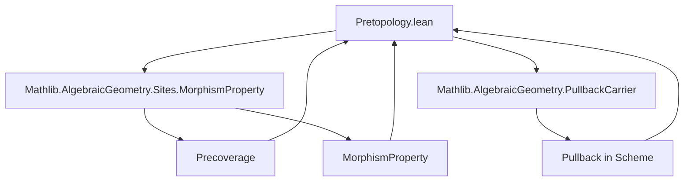
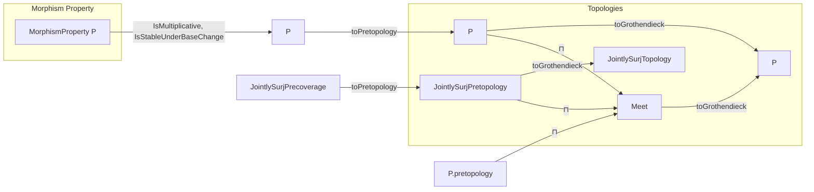

### Technical Brief: Pretopology.lean

---

#### **1. Key Definitions & Theorems**

| Name | Type | Purpose |
|------|------|---------|
| `pretopology (P : MorphismProperty Scheme) [P.IsStableUnderBaseChange] [P.IsMultiplicative]` | `Pretopology Scheme` | Defines a pretopology on `Scheme` where covering families are those satisfying property `P` and jointly surjective. Constructed via `precoverage P.toPretopology`. |
| `grothendieckTopology (P)` | `GrothendieckTopology Scheme` | The Grothendieck topology induced by `pretopology P`, i.e., the Grothendieck topology generated by the pretopology of `P`-covers. |
| `jointlySurjectivePretopology` | `Pretopology Scheme` | The pretopology defined by *jointly surjective* families of morphisms (no extra property `P`). |
| `jointlySurjectiveTopology` | `GrothendieckTopology Scheme` | The Grothendieck topology induced by `jointlySurjectivePretopology`. |
| `pretopology_eq_inf` | `pretopology P = jointlySurjectivePretopology ⊓ P.pretopology` | Shows that the `P`-pretopology is the *intersection* (meet) of the jointly surjective pretopology and the pretopology induced by `P` as a property of morphisms. |
| `grothendieckTopology_eq_inf` | `grothendieckTopology P = (jointlySurjectivePretopology ⊓ P.pretopology).toGrothendieck` | Analogous to above, but at the level of Grothendieck topologies. |
| `pretopology_monotone (hPQ : P ≤ Q)` | `pretopology P ≤ pretopology Q` | Monotonicity of the assignment `P ↦ pretopology P` with respect to pointwise implication of morphism properties. |
| `grothendieckTopology_monotone` | `grothendieckTopology P ≤ grothendieckTopology Q` | Monotonicity at the Grothendieck topology level. |
| `mem_pretopology_iff` | `R ∈ pretopology P X ↔ ∃𝒰, R = Presieve.ofArrows 𝒰.X 𝒰.f` | Characterizes membership in the `P`-pretopology via existence of a `precoverage P`-cover. |
| `mem_grothendieckTopology_iff` | `S ∈ grothendieckTopology P X ↔ ∃𝒰, Presieve.ofArrows 𝒰.X 𝒰.f ≤ S` | Characterizes membership in the `P`-Grothendieck topology via refinement by a `P`-cover. |

---

#### **2. Naming Conventions**

- **Prefixes**:
  - `precoverage_`: for precoverage constructions (e.g., `precoverage P`).
  - `pretopology_`: for pretopology definitions (e.g., `pretopology P`, `jointlySurjectivePretopology`).
  - `grothendieckTopology_`: for Grothendieck topologies (e.g., `grothendieckTopology P`, `jointlySurjectiveTopology`).
  - `isStableUnderBaseChange`, `IsMultiplicative`: typeclass interfaces for morphism properties.

- **Suffixes**:
  - `_iff`: equivalence lemmas (e.g., `mem_pretopology_iff`).
  - `_eq_inf`: equality lemmas expressing meet decomposition.
  - `_monotone`: monotonicity lemmas.

- **Abbreviations**:
  - `P.pretopology`: pretopology induced by `P` as a morphism property (assumed multiplicative & stable under base change).
  - `jointlySurjectivePrecoverage`: precoverage of jointly surjective families.

---

#### **3. Tactic Stack**

- **Core tactics**:
  - `rw`, `simp_rw`, `refine`, `use`, `exact`, `apply`, `intro`, `cases`
- **Domain-specific**:
  - `ext` (for extensionality of sets/sieves)
  - `funext` (for extensionality of functions)
  - `Set.ext` (to prove equality of sets)
  - `le_rfl`, `le_trans`, `le_generate` (for sieve ordering)
  - ` rfl`, ` rfl` (for definitional equalities)
- **Automation**:
  - `aesop` (not explicitly used here, but `grind` hints suggest potential use in automation)
  - `grind` hints (e.g., `@[grind ←]`) indicate support for automated simplification/backchaining.

---

#### **4. Proof Logic**

- **Structure of proofs**:
  - **Equational reasoning**: many lemmas are proven by unfolding definitions (`rw [pretopology, ...]`) and applying extensionality or set-theoretic arguments.
  - **Existential witnesses**: proofs of membership often construct explicit covers (`𝒰`) or use `mem_iff_exists_zeroHypercover`.
  - **Monotonicity**: proven via lifting a witness `𝒰` for `P` to one for `Q` using `𝒰.changeProp`.
  - **Grothendieck topology vs pretopology**: use the Galois insertion `(Pretopology.gi Scheme)` and properties of `toGrothendieck`.

- **Typical flow**:
  1. Unfold definitions (`pretopology`, `grothendieckTopology`, `⊓`, etc.)
  2. Apply `mem_iff_exists_*` lemmas to reduce to existence of a cover.
  3. Construct or manipulate covers using `changeProp`, `ulift`, or `map_monotone`.
  4. Use `Set.ext` + `funext` to prove equality of topologies.

---

#### **5. Imports & Dependencies**

- **Core imports**:
  ```lean
  Mathlib.AlgebraicGeometry.Sites.MorphismProperty
  Mathlib.AlgebraicGeometry.PullbackCarrier
  ```
- **Implicit dependencies**:
  - `CategoryTheory`, `Limits`, `Pretopology`, `GrothendieckTopology`, `Scheme`, `MorphismProperty`
  - `HasPullbacks Scheme` (used implicitly via `pullbackComparison_forget_surjective`)

---

#### **6. Mermaid Diagrams**

##### **Dependency Graph (Module-Level)**



##### **Conceptual Overview of Theory Flow**



##### **Topological Relationship (Meet Decomposition)**

```mermaid
graph LR
  GrothendieckTopology[P] <-->|eq| (JointlySurjPretopology ⊓ P.pretopology).toGrothendieck
  Pretopology[P] <-->|eq| JointlySurjPretopology ⊓ P.pretopology
```

---

#### **7. Summary**

This file formalizes how a multiplicative, base-change-stable morphism property `P` on `Scheme` induces a pretopology (and hence a Grothendieck topology) where covering families are jointly surjective families satisfying `P`. It shows that this topology coincides with the meet of the jointly surjective pretopology and the pretopology induced by `P` itself. The construction relies on the existence of pullbacks in `Scheme`, and the proofs are largely definitional, leveraging extensionality and cover-manipulation lemmas.

The module serves as a foundational step for defining cohomological sites (e.g., étale, fppf, fpqc) by choosing appropriate `P`.
