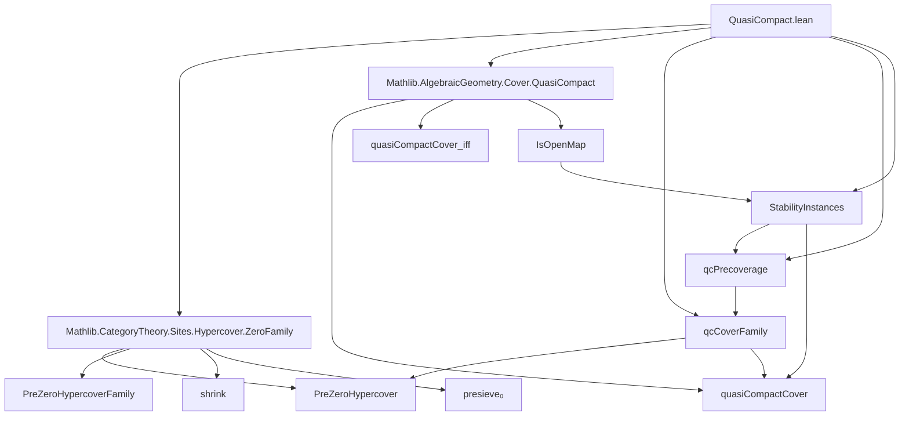

**Technical Brief: `QuasiCompact.lean`**

---

### 1. KEY DEFINITIONS & THEOREMS

| Name | Type / Signature | Purpose |
|------|------------------|---------|
| `quasiCompactCover_shrink_iff` | `∀ E : PreZeroHypercover S, QuasiCompactCover E.shrink ↔ QuasiCompactCover E` | Equivalence between quasi-compactness of a pre-zero-hypercover and its shrink; used to reduce proofs to the shrink. |
| `qcCoverFamily` | `PreZeroHypercoverFamily Scheme` | Defines the family of covers defining the quasi-compact precoverage: property = `quasiCompactCover`, with proof of invariance under shrinking. |
| `qcPrecoverage` | `Precoverage Scheme` | The precoverage induced by `qcCoverFamily`. |
| `presieve₀_mem_qcPrecoverage_iff` | `E.presieve₀ ∈ qcPrecoverage S ↔ QuasiCompactCover E` | Characterizes membership in the quasi-compact precoverage via the `QuasiCompactCover` predicate. |
| `qcPrecoverage.HasIsos` | `Instance` | Shows that isomorphisms are in the precoverage (via `PreZeroHypercoverFamily`). |
| `qcPrecoverage.IsStableUnderBaseChange` | `Instance` | Stability under pullback (base change). |
| `qcPrecoverage.IsStableUnderComposition` | `Instance` | Stability under composition of covers. |
| `qcPrecoverage.IsStableUnderSup` | `Instance` | Stability under supremum (join) of covers. |
| `precoverage_le_qcPrecoverage_of_isOpenMap` | `P ≤ IsOpenMap → precoverage P ≤ qcPrecoverage` | General criterion for coarseness: any precoverage defined by a property implying openness is coarser than `qcPrecoverage`. |
| `zariskiPrecoverage_le_qcPrecoverage` | `zariskiPrecoverage ≤ qcPrecoverage` | Zariski topology’s precoverage is coarser than the quasi-compact precoverage. |

---

### 2. NAMING CONVENTIONS

- **Prefixes**:
  - `qc_`: for quasi-compact related definitions (`qcCoverFamily`, `qcPrecoverage`).
  - `presieve₀_`: for properties of the underlying presieve of a `PreZeroHypercover`.
- **Suffixes**:
  - `_iff`: bi-implication lemmas (`quasiCompactCover_shrink_iff`, `presieve₀_mem_qcPrecoverage_iff`).
  - `_le_`: ordering of precoverages (`zariskiPrecoverage_le_qcPrecoverage`).
  - `_of_`: construction from a property (`precoverage_le_qcPrecoverage_of_isOpenMap`).
- **Predicate naming**:
  - `QuasiCompactCover`: unary predicate on `PreZeroHypercover`.
  - `IsOpenMap`: standard morphism property.

---

### 3. TACTIC STACK

- `rw`: rewriting using equivalences and definitions.
- `simp` / `simp only`: simplification with `simps` lemmas and definitional equalities.
- `infer_instance`: to discharge typeclass goals (e.g., stability properties).
- `exact`: used implicitly via `infer_instance` or `exact` in `of_` constructors.
- `refine`: for partial proof construction, especially in instance proofs.
- `intro`: implicit in `fun` abstractions.
- `by`-block tactic scripts with standard Lean tactics.

No heavy automation (`aesop`, `ring`, `linarith`) appears—proofs rely on definitional reasoning and typeclass inference.

---

### 4. PROOF LOGIC

- **Structure**: Most proofs follow a *definitional reduction* pattern:
  1. Unfold definitions (`qcPrecoverage`, `qcCoverFamily`, `presieve₀`, etc.).
  2. Use `simp` + `rw` to reduce to known properties (e.g., `quasiCompactCover_iff`).
  3. Apply typeclass instances (`infer_instance`) for stability properties.
- **Key logical flow**:
  - For stability properties (`HasIsos`, `IsStableUnderBaseChange`, etc.):
    - Use `of_preZeroHypercoverFamily` to reduce to verifying the property on the defining family.
    - Simplify using `qcCoverFamily_property` and `Scheme.quasiCompactCover_iff`.
    - Apply existing lemmas (e.g., `isClosedUnderIsomorphisms_quasiCompactCover`) or `infer_instance`.
  - For precoverage ordering:
    - Use `Precoverage.le_of_zeroHypercover`.
    - Reduce to showing `QuasiCompactCover E` using `of_isOpenMap` and hypothesis `hP`.

Induction or case analysis is *not* used—proofs are largely *algebraic* or *categorical*, leveraging universal properties and typeclass inference.

---

### 5. IMPORTS

- `Mathlib.CategoryTheory.Sites.Hypercover.ZeroFamily`: Provides `PreZeroHypercover`, `PreZeroHypercoverFamily`, `shrink`, `presieve₀`, etc.
- `Mathlib.AlgebraicGeometry.Cover.QuasiCompact`: Defines `quasiCompactCover`, `quasiCompactCover_iff`, and related scheme-theoretic facts.

These imports define the categorical and geometric foundations for hypercovers and quasi-compactness.

---

### 6. DEPENDENCY & OVERVIEW DIAGRAM

#### Overview of `QuasiCompact.lean`

- **Goal**: Construct and analyze the *quasi-compact precoverage* on `Scheme`.
- **Core idea**: A cover is in `qcPrecoverage` iff it is *quasi-compact*, i.e., for every affine $U \to S$, the pullback cover admits a finite subcover by quasi-compact opens.
- **Structure**:
  1. Define `qcCoverFamily` as the family of quasi-compact covers.
  2. Lift to `qcPrecoverage`.
  3. Prove stability under key operations (isos, base change, composition, sup).
  4. Show coarseness relative to other precoverages (e.g., Zariski, any open-map-defined one).

This serves as a foundational layer for defining the **fpqc precoverage**, as the intersection of `qcPrecoverage` with the flat surjective precoverage.

--- 

Let me know if you'd like the corresponding diagram for the fpqc precoverage or formalization of the fpqc case.
