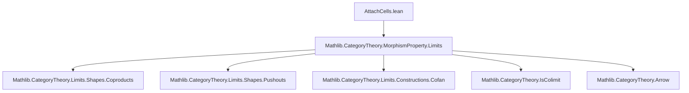

### Technical Brief: `AttachCells.lean`

---

#### **1. Key Definitions & Theorems**

| Name | Type / Structure | Purpose |
|------|------------------|---------|
| `AttachCells g f` | `Structure` | Encodes that `f : X₁ ⟶ X₂` is a pushout of a coproduct of morphisms from the family `g : ∀ a, A a ⟶ B a`. |
| `pushouts_coproducts` | `lemma` | Shows that `AttachCells g f` implies `(coproducts (ofHoms g)).pushouts f`. |
| `cell i` | `def` | The inclusion of a single cell `B (π i) ⟶ X₂` via the pushout square. |
| `hom_ext` | `lemma` | Uniqueness of maps out of `X₂`: if two maps agree on `f` and all `cell i`, they are equal. |
| `ofArrowIso` | `def` | Transport of `AttachCells` structure along isomorphism of arrows. |
| `reindex` | `def` | Reindexing of the cell index type `ι` along an equivalence. |
| `reindexCellTypes` | `def` | Base change of cell types along a map `a : α → α'` and isomorphisms `g i ≅ g' (a i)`. |
| `nonempty_attachCells_iff` | `lemma` | Equivalence: `Nonempty (AttachCells g f) ↔ (coproducts (ofHoms g)).pushouts f`. |

---

#### **2. Naming Conventions**

- **Prefixes**:
  - `isColimit₁`, `isColimit₂`: indicate that a cofan is a colimit.
  - `hm`: homogeneity condition for the mediating map `m`.
  - `cell`: for morphisms induced by attaching a single cell.
- **Suffixes**:
  - `reindex`: indicates change of indexing type.
  - `ofArrowIso`: indicates construction from an arrow isomorphism.
  - `pushouts_coproducts`: links to `MorphismProperty` terminology.

---

#### **3. Tactic Stack**

Frequently used tactics:
- `cat_disch`: for category-theoretic diagram chasing.
- `rw`, `simp`, `simpa`: for rewriting and simplification, especially with `cell_def`, `hm`.
- `apply`, `refine`, `exact`: for constructing morphisms and diagrams.
- `applyCofan.IsColimit.hom_ext`, `IsColimit.hom_ext`: for uniqueness in colimits.
- `eqToIso`, `Iso.refl`, `Iso.mk`: for handling isomorphisms.
- `let` + `def` + `simp`: for constructing intermediate isomorphisms (e.g., `e₁`, `e₂`).
- `whiskerEquivalence`, `precomposeHomEquiv`: for reindexing colimits.

---

#### **4. Proof Logic**

- **Structure of proofs**:
  - Most constructions are *explicit* and *constructive*: definitions build colimits, pushouts, and mediating maps directly.
  - **Uniqueness lemmas** (`hom_ext`) use universal properties of pushouts and colimits.
  - **Equivalence proofs** (`nonempty_attachCells_iff`) proceed by:
    1. From `AttachCells`, extract the pushout data.
    2. From pushout data, reconstruct `AttachCells` using choice (via `ofHoms_iff` and `choose`).
- **Key logical flow**:
  - Use `IsColimit.hom_ext` to verify mediating maps.
  - Use `IsPushout.hom_ext` to verify uniqueness in pushouts.
  - Use `Iso`-based transport (`ofArrowIso`, `reindex`, `reindexCellTypes`) to preserve structure under equivalence.

---

#### **5. Imports**

- `Mathlib.CategoryTheory.MorphismProperty.Limits`: provides:
  - `coproducts`, `pushouts`, `ofHoms`, `ofHoms_iff`.
  - `MorphismProperty` namespace with `pushouts`, `coproducts` properties.

---

#### **8. Mermaid Diagrams**

##### **Dependency Graph (Module Level)**



##### **Overview of `AttachCells` Structure**

```mermaid
graph TD
  A[AttachCells g f] --> B[ι : Type w]
  A --> C[π : ι → α]
  A --> D[cofan₁ : Cofan (A ∘ π)]
  A --> E[cofan₂ : Cofan (B ∘ π)]
  A --> F[isColimit₁]
  A --> G[isColimit₂]
  A --> H[m : cofan₁.pt ⟶ cofan₂.pt]
  A --> I[g₁ : cofan₁.pt ⟶ X₁]
  A --> J[g₂ : cofan₂.pt ⟶ X₂]
  A --> K[isPushout : Pushout square]
  H --> D
  H --> E
  I --> D
  J --> E
  K --> I
  K --> H
  K --> f
  K --> J
```

##### **Relationship to `coproducts` and `pushouts`**

```mermaid
graph LR
  AttachCells g f -->|pushouts_coproducts| (coproducts (ofHoms g)).pushouts f
  (coproducts (ofHoms g)).pushouts f -->|nonempty_attachCells_iff| Nonempty (AttachCells g f)
```

---

This file formalizes the categorical notion of *attaching cells* in a general category, building on coproducts and pushouts. It is foundational for relative cell complexes and cellular approximations in homotopical algebra.
