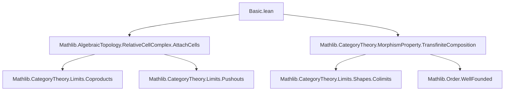
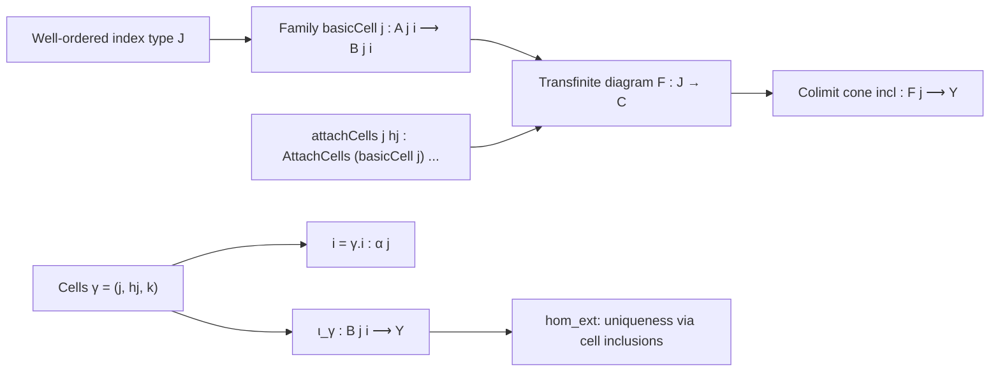
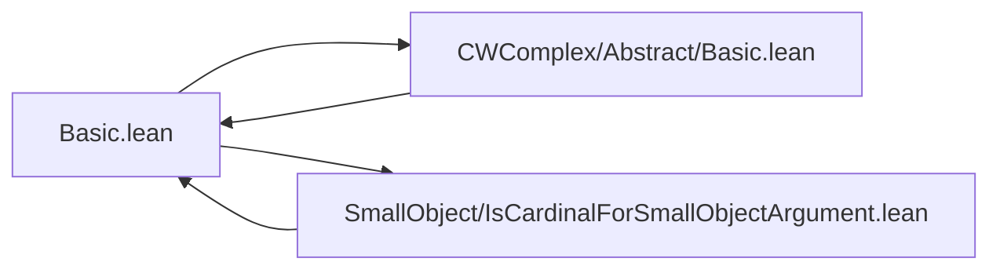

**Technical Brief: `Basic.lean` — Relative Cell Complexes in Lean 4**

---

### 1. **Key Definitions & Theorems**

| Name | Type / Structure | Purpose |
|------|------------------|---------|
| `RelativeCellComplex` | `structure` extending `TransfiniteCompositionOfShape J f` | Encodes that `f : X ⟶ Y` is a transfinite composition where each step `j` attaches cells from a family `basicCell j`. |
| `Cells` | `structure` | Represents individual cells in the complex: step `j`, non-max condition `hj`, and index `k` in the attaching morphism. |
| `Cells.i` | `def` | Extracts the index in the family `α j` corresponding to a cell. |
| `Cells.ι` | `def` | Inclusion morphism of a cell into the colimit `Y`. |
| `hom_ext` | `lemma` | Uniqueness of maps out of `Y`: if two maps agree on all cells and on `f`, they are equal. |
| `transfiniteCompositionOfShape` | `def` | Specializes `RelativeCellComplex` to a constant family `g`, showing it is a transfinite composition of pushouts of coproducts of `g`. |

---

### 2. **Naming Conventions**

- **Prefixes**:
  - `is_`: e.g., `IsMax`, `IsMin` (property predicates).
  - `homOfLE`: morphism induced by `≤`.
  - `attachCells`: property of the step being a cell attachment.
- **Suffixes**:
  - `_j`, `_hj`: step index and proof of non-maximality.
  - `_k`: index of a cell in the attaching family.
  - `_ι`, `_π`: canonical injections/projections in `AttachCells`.
- **Structure fields**:
  - `F`, `incl`, `isoBot`: inherited from `TransfiniteCompositionOfShape`.
  - `attachCells`: new field encoding cell attachments.

---

### 3. **Tactic Stack**

Frequently used tactics in proofs:
- `induction ... using SuccOrder.limitRecOn`: transfinite induction over well-ordered index type `J`.
- `simpa`, `simp only [...]`: simplification with custom lemmas and definitions.
- `exact`, `refine`, `apply`: for constructing morphism equalities.
- `dsimp`: definitional simplification.
- `cancel_epi`: used to cancel epimorphisms (e.g., `c.isoBot.inv`).

---

### 4. **Proof Logic**

- **Inductive structure**: Proofs over `RelativeCellComplex` rely on transfinite induction on `J`, using `SuccOrder.limitRecOn`.
- **Cases**:
  - `isMin`: base case (initial object / `bot`), often reduces to `f ≫ φ₁ = f ≫ φ₂`.
  - `succ`: successor step, uses `attachCells.hom_ext` and induction hypothesis.
  - `isSuccLimit`: limit ordinal step, uses continuity of the colimit (`isColimitOfIsWellOrderContinuous`).
- **Key idea**: Morphism uniqueness is reduced to checking agreement on all cell inclusions `Cells.ι` and on the initial map `f`.

---

### 5. **Imports**

| Import | Role |
|--------|------|
| `Mathlib.AlgebraicTopology.RelativeCellComplex.AttachCells` | Defines `AttachCells` — the building block for attaching a cell at a step. |
| `Mathlib.CategoryTheory.MorphismProperty.TransfiniteComposition` | Provides `TransfiniteCompositionOfShape`, the base structure for transfinite compositions. |

These imports define the categorical and topological machinery needed to model cell attachments and transfinite colimits.

---

### 8. **Mermaid Diagrams**

#### **Dependency Graph (Module-Level)**

#### **Overview of `RelativeCellComplex` Structure**

#### **Relation to Other Theories**

- `CWComplex` uses `RelativeCellComplex` with `basicCell n = (S^{n-1} → D^n)`.
- `SmallObjectArgument` uses `RelativeCellComplex` to construct factorizations via transfinite compositions of cell attachments.

--- 

Let me know if you'd like a formalized summary in Lean syntax or a visualization of the `hom_ext` proof structure.
