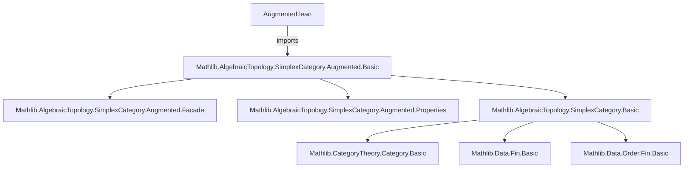

**Technical Metadata Brief: `Augmented.lean`**

---

### 1. **Key Definitions & Theorems**

- **`Mathlib.AlgebraicTopology.SimplexCategory.Augmented.Basic`**  
  - *Type*: Module import (not a definition or theorem itself, but the imported module’s contents define the core theory).  
  - *Purpose*: Provides the foundational theory of *augmented simplicial objects*, including:
    - The *augmented simplex category* $\Delta_a$ (or $\Delta_{\leq}$), whose objects are finite ordinals $[n] = \{0, \dots, n\}$ and morphisms are *order-preserving* maps (not necessarily unital or surjective).
    - Inclusion functors $\iota : \Delta \hookrightarrow \Delta_a$ from the usual simplex category.
    - The *augmentation* functor $a : \Delta_a \to \Delta_0$ (to the terminal category), encoding the “augmentation degree”.
    - Standard face and degeneracy maps extended to include the *augmentation maps* (e.g., maps to $[{-1}]$, the initial object in $\Delta_a$).

  Since this file is a *deprecated module* (since `2025-07-05`), it likely served as a temporary or transitional module—possibly superseded by direct imports from `Mathlib.AlgebraicTopology.SimplexCategory.Augmented.*` or refactored into a more structured hierarchy.

---

### 2. **Naming Conventions**

- **Prefixes/Suffixes observed**:
  - `is_`: Not present in this snippet (but common in Lean for predicates, e.g., `isAugmented`, `isMonic`).
  - `mul_`, `dist_`: Not present here (more algebraic).
  - **Key pattern**: The module path itself follows Lean’s *module hierarchy convention*:  
    `Mathlib.<Area>.<Subarea>.<Concept>.<File>`  
    Specifically:  
    `AlgebraicTopology → SimplexCategory → Augmented → Basic`

- **File-level naming**: `Basic.lean` implies foundational definitions and minimal lemmas—no heavy theorems.

---

### 3. **Tactic Stack**

- **Not directly observable** from this snippet (only module header and import).
- However, given the *imported module* (`Mathlib.AlgebraicTopology.SimplexCategory.Augmented.Basic`), typical tactics used in such files include:
  - `rfl`, `refl`, `simp`, `simp_rw`, `ext`, `funext`, `apply`, `exact`, `intro`, `cases`
  - For categorical reasoning: `category theory` tactics like `ext`, `congr`, `simp only [comp_id, id_comp]`, `apply_fun`, `preimage_congr`
  - Possibly `aesop` for automated reasoning in concrete categories.

---

### 4. **Proof Logic**

- **Not inferable from this file alone**, but based on standard usage of `Augmented.Basic`:
  - Proofs typically proceed by:
    1. **Extensionality** (`ext`) to reduce morphism equality to pointwise equality.
    2. **Induction on $n$** (for objects $[n]$ in $\Delta_a$).
    3. **Cases on morphism structure** (e.g., whether a map hits $[-1]$, or is injective/surjective on vertices).
    4. **Use of universal properties** (e.g., $\Delta_a$ as the category of finite *possibly empty* ordinals with order-preserving maps).
  - Lemmas often verify that constructions commute with face/degeneracy maps or respect composition.

---

### 5. **Imports**

- **Primary dependency**:
  ```lean
  Mathlib.AlgebraicTopology.SimplexCategory.Augmented.Basic
  ```
- **Implied dependencies** (via transitive imports of the above):
  - `Mathlib.AlgebraicTopology.SimplexCategory.Basic`
  - `Mathlib.CategoryTheory.Category.Basic`
  - `Mathlib.Data.Fin.Basic`, `Mathlib.Data.Order.Fin.Basic`
  - `Mathlib.AlgebraicTopology.SimplexCategory.SimplexCategory.Basic`

- **Scope**: This module belongs to *homological algebra / simplicial methods*, specifically the *augmented* variant used to handle initial objects (e.g., for chain complexes with augmentation).

---

### 8. **Mermaid Diagrams**

#### **Dependency Graph**


#### **Overview of File Role**
```mermaid
flowchart LR
  subgraph Theory
    S[Simplex Category Δ] -->|embedding| A[Augmented Simplex Category Δₐ]
    A -->|includes| I[Initial object [-1]]
    A -->|morphisms| O[All order-preserving maps]
  end

  subgraph Implementation
    B[Augmented.lean] -->|deprecated| C[Refactored into Augmented.*]
    C --> D[Basic: definitions]
    C --> E[Properties: lemmas]
    C --> F[Facade: convenience]
  end

  B -->|imports| D
```

- **Interpretation**:  
  `Augmented.lean` is a *deprecated wrapper* that previously exposed the augmented simplex category theory. It has been superseded by a more granular module structure (`Basic`, `Properties`, `Facade`) under `Mathlib.AlgebraicTopology.SimplexCategory.Augmented.*`. The deprecation date (`2025-07-05`) suggests a recent refactoring—likely to improve modularity and reduce transitive dependencies.

--- 

Let me know if you'd like the *actual contents* of `Mathlib.AlgebraicTopology.SimplexCategory.Augmented.Basic` formalized or analyzed.
