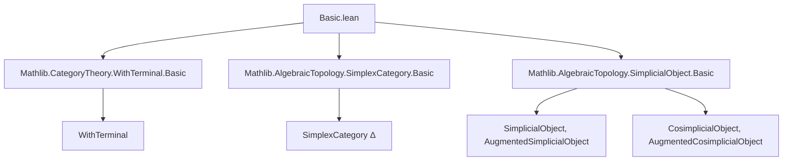

### Technical Brief: `Basic.lean` — Augmented Simplex Category

---

#### **1. Key Definitions & Theorems**

| Name | Type / Purpose |
|------|----------------|
| `AugmentedSimplexCategory` | `abbrev AugmentedSimplexCategory := WithInitial SimplexCategory`<br>Defines the augmented simplex category as `SimplexCategory` with an added initial object (`star`). |
| `inclusion` | `SimplexCategory ⥤ AugmentedSimplexCategory`<br>The canonical full and faithful inclusion functor embedding the ordinary simplex category. |
| `equivAugmentedCosimplicialObject` | `(AugmentedSimplexCategory ⥤ C) ≌ CosimplicialObject.Augmented C`<br>Equivalence between functors from the augmented simplex category and augmented cosimplicial objects in `C`. |
| `equivAugmentedSimplicialObject` | `(AugmentedSimplexCategoryᵒᵖ ⥤ C) ≌ SimplicialObject.Augmented C`<br>Equivalence between functors from the opposite of the augmented simplex category and augmented simplicial objects in `C`. |
| `equivAugmentedCosimplicialObjectFunctorCompDropIso` | Natural isomorphism expressing that *dropping the augmentation* corresponds to precomposition with `inclusion`. |
| `equivAugmentedCosimplicialObjectFunctorCompPointIso` | Natural isomorphism expressing that *taking the augmentation point* corresponds to evaluation at `star`. |
| `equivAugmentedCosimplicialObjectFunctorCompToArrowIso` | Natural isomorphism expressing that *the augmentation arrow* corresponds to evaluation at the unique map `star ⟶ [0]`. |
| Analogous isomorphisms for simplicial case (`equivAugmentedSimplicialObject*`) | Same as above but for functors out of `AugmentedSimplexCategoryᵒᵖ`. |

---

#### **2. Naming Conventions**

- **Prefixes**:
  - `equivAugmentedCosimplicialObject*`: for equivalences involving augmented cosimplicial objects.
  - `equivAugmentedSimplicialObject*`: for equivalences involving augmented simplicial objects.
- **Suffixes**:
  - `FunctorCompDropIso`: corresponds to `drop` (forgetting augmentation).
  - `FunctorCompPointIso`: corresponds to `point` (the object of augmentation).
  - `FunctorCompToArrowIso`: corresponds to `toArrow` (the structure map of augmentation).
- **Other**:
  - `inclusion`, `inclusion.op`: canonical embeddings.
  - `.star`: the added initial object.
  - `.op`, `.mk`, `homTo`: standard constructions from `WithInitial`/`WithTerminal`.

---

#### **3. Tactic Stack**

- `simp` / `simp!`: heavily used for simplification and definitional equality (e.g., `@[simps!]` attributes).
- `refl`: used in all isomorphism proofs (`iso.refl`), indicating definitional equality of functors/natural transformations.
- `congrLeft`, `trans`: used in constructing equivalences via composition of equivalences.
- `inferInstanceAs`: used to infer class instances (e.g., `Full`, `Faithful`, `HasInitial`).
- `aesop`: likely used implicitly in background (not explicit in this file, but standard in Mathlib).

---

#### **4. Proof Logic**

- **Structure**: All proofs are *definitional* or *by reflexivity* (`refl`), relying on the universal property of `WithInitial` and `WithTerminal`.
- **Strategy**:
  - Define equivalences using `WithInitial.equivComma` and `WithTerminal.equivComma`.
  - Use `whiskeringLeft`, `evaluation`, and `Functor.mapArrowFunctor` to express constructions in functor categories.
  - Show naturality via definitional equality (hence `iso.refl` suffices).
- **No induction or case analysis** is needed — the structure is purely categorical and built from universal constructions.

---

#### **5. Imports**

| Module | Role |
|--------|------|
| `Mathlib.CategoryTheory.WithTerminal.Basic` | Provides `WithTerminal`, used for dual constructions (e.g., `opEquiv`). |
| `Mathlib.AlgebraicTopology.SimplexCategory.Basic` | Defines the simplex category `Δ`. |
| `Mathlib.AlgebraicTopology.SimplicialObject.Basic` | Defines simplicial and augmented simplicial objects. |

> **Note**: Though `WithTerminal` is imported, the file primarily uses `WithInitial`. The dual is used only for the simplicial case via `opEquiv`.

---

#### **6. Mermaid Diagrams**

##### **Dependency Graph**



##### **Overview of File Structure**

```mermaid
flowchart LR
  A[AugmentedSimplexCategory] -->|definition| B[WithInitial SimplexCategory]
  B --> C[inclusion : Δ → Δ⁺]
  B --> D[HasInitial Δ⁺]

  C --> E[equivAugmentedCosimplicialObject]
  C --> F[equivAugmentedSimplicialObject]

  E --> G[drop ≅ precomp inclusion]
  E --> H[point ≅ eval star]
  E --> I[toArrow ≅ eval star → [0]]

  F --> J[drop ≅ precomp inclusion.op]
  F --> K[point ≅ eval starᵒᵖ]
  F --> L[toArrow ≅ eval starᵒᵖ → [0]ᵒᵖ]
```

---

#### **7. Theory Context**

- This file sits at the interface of **category theory** and **homological algebra / algebraic topology**.
- It formalizes the foundational categorical perspective on **augmented (co)simplicial objects**, showing how they arise naturally from functors out of an *enlarged* simplex category.
- The `AugmentedSimplexCategory` is a standard tool in homotopy theory (e.g., for defining augmented resolutions), and this formalization enables clean reasoning about augmentation data via universal properties.

--- 

Let me know if you'd like a formalization-level summary (e.g., for a Lean-specific documentation generator) or a comparison with other approaches (e.g., `Δ₊` in the literature).
