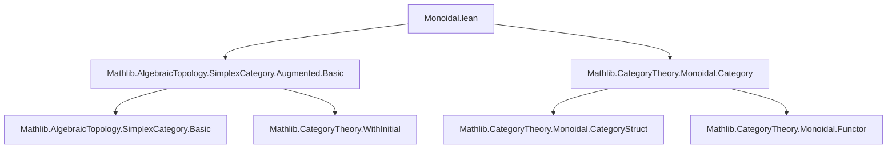
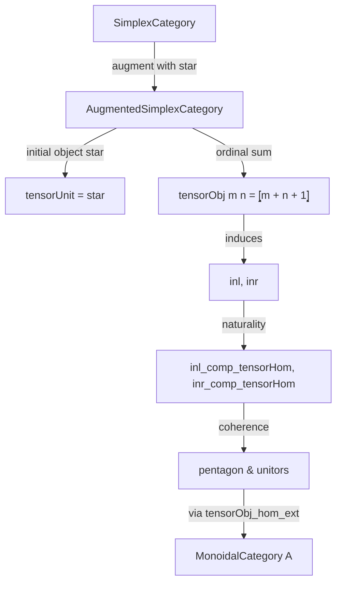

### Technical Brief: Monoidal Structure on `AugmentedSimplexCategory`

---

#### **1. Key Definitions & Theorems**

| Name | Type | Purpose |
|------|------|---------|
| `tensorObjOf` | `SimplexCategory → SimplexCategory → SimplexCategory` | Auxiliary definition: `tensorObjOf m n = ⦋m.len + n.len + 1⦌` |
| `tensorObj` | `AugmentedSimplexCategory → AugmentedSimplexCategory → AugmentedSimplexCategory` | Tensor product on objects: extends `tensorObjOf`, handles `star` as unit |
| `tensorHomOf` | `x₁ ⟶ y₁ → x₂ ⟶ y₂ → tensorObjOf x₁ x₂ ⟶ tensorObjOf y₁ y₂` | Tensor action on morphisms in `SimplexCategory`, via `Fin.addCases` |
| `tensorHom` | `x₁ ⟶ y₁ → x₂ ⟶ y₂ → tensorObj x₁ x₂ ⟶ tensorObj y₁ y₂` | Tensor action on morphisms in `AugmentedSimplexCategory`, case-split on `star` |
| `tensorUnit` | `AugmentedSimplexCategory` | Unit object: `star` (initial object) |
| `associator` | `tensorObj (tensorObj x y) z ≅ tensorObj x (tensorObj y z)` | Associativity isomorphism; trivial when any argument is `star` |
| `leftUnitor` / `rightUnitor` | `tensorUnit ⊗ x ≅ x`, `x ⊗ tensorUnit ≅ x` | Unitors; identity isos since `star` is initial and unit |
| `inl`, `inr` | `x ⟶ x ⊗ y`, `y ⟶ x ⊗ y` | Canonical inclusions induced by `star` being initial |
| `inl'`, `inr'` | `x ⟶ tensorObjOf x y`, `y ⟶ tensorObjOf x y` | Simplified versions in `SimplexCategory` |
| `tensorObj_hom_ext` | Extensionality principle for maps out of tensor product | `f = g` if they agree on `inl` and `inr` |
| `inl_comp_tensorHom`, `inr_comp_tensorHom` | Naturality of `inl`, `inr` w.r.t. tensor product of maps | `inl ≫ (f ⊗ g) = f ≫ inl`, etc. |
| `inr_comp_associator`, `inl_comp_inl_comp_associator`, `inr_comp_inl_comp_associator` | Compatibility of `inl`, `inr` with associator | Used to verify coherence laws |
| `tensorHom_comp_tensorHom`, `tensor_id` | Functoriality of `⊗ₘ` | Ensures `⊗ₘ` is a bifunctor |
| `instance : MonoidalCategory` | `MonoidalCategory AugmentedSimplexCategory` | Final structure; proven via `ofTensorHom` using extensionality and simplifications |

---

#### **2. Naming Conventions**

- **Prefixes**:
  - `tensorObj`, `tensorHom`: core tensor operations.
  - `inl`, `inr`: canonical injections (left/right).
  - `associator`, `leftUnitor`, `rightUnitor`: monoidal structure isos.
  - `tensorHomOf`, `tensorObjOf`: `SimplexCategory`-level analogues.
- **Suffixes**:
  - `'` (e.g., `inl'`, `inr'`): simplified versions in `SimplexCategory`.
  - `_eval`: lemmas describing action on elements (`Fin` indices).
- **Pattern**:
  - `comp_tensorHom`: naturality of inclusions w.r.t. tensor.
  - `comp_associator`: interaction with associator.
  - `hom_ext`: extensionality lemmas.

---

#### **3. Tactic Stack**

- **Core tactics**:
  - `cases`: on `AugmentedSimplexCategory` (i.e., `star` vs `of _`).
  - `ext`: extensionality for morphisms (via `Fin.ext_iff`, `OrderHom.ext_iff`).
  - `simp`: heavy use of `simp` with custom lemmas (`inl'_eval`, `inr'_eval`, etc.).
  - `rw`: rewriting using `Nat.succ_add`, `Fin.addCases`, `eqToHom_toOrderHom`.
  - `conv_lhs`: localized rewriting for complex expressions.
  - `aesop`, `lia`: for monotonicity and arithmetic goals.
  - `cat_disch`: custom tactic (likely from `CategoryTheory` utilities) to discharge trivial categorical goals.

- **Simplifier extensions**:
  - `@[reassoc (attr := simp)]`: marks lemmas for automatic associativity rewriting.
  - `@[local simp]`: local simplification lemmas (e.g., `id_tensorHom`, `whiskerLeft_id_star`).

---

#### **4. Proof Logic**

- **Structure**:
  1. **Case analysis** on whether objects are `star` or `of _`.
  2. **Reduction to `SimplexCategory`** via `WithInitial.down` and `mkHom`.
  3. **Element-wise reasoning** on `Fin` indices using `Fin.addCases`.
  4. **Order-theoretic verification** of monotonicity and extensionality.
  5. **Coherence checks** via `tensorObj_hom_ext` and naturality of inclusions.

- **Typical flow**:
  - Prove `tensorHom` is well-defined → verify bifunctor laws (`tensor_id`, `tensorHom_comp_tensorHom`) → verify monoidal coherence (pentagon, unitors) using `tensorObj_hom_ext`.

- **Key insight**:
  - Since `star` is initial, all morphisms involving `star` are unique, simplifying many cases.
  - Tensor on `SimplexCategory` corresponds to ordinal sum: `⦋m⦌ ⊗ ⦋n⦌ = ⦋m + n + 1⦌`.

---

#### **5. Imports & Dependencies**

- **Core imports**:
  ```lean
  Mathlib.AlgebraicTopology.SimplexCategory.Augmented.Basic
  Mathlib.CategoryTheory.Monoidal.Category
  ```
- **Implicit dependencies**:
  - `Mathlib.CategoryTheory.WithInitial`
  - `Mathlib.Algebra.Order.Fin.Basic` (for `Fin.addCases`, `Fin.castAdd`, etc.)
  - `Mathlib.CategoryTheory.Limits.IsInitial`
  - `Mathlib.CategoryTheory.Monoidal.Functor` (for `ofTensorHom`)

---

#### **6. Mermaid Diagrams**

##### **Dependency Graph (Module-Level)**



##### **Overview of Theory Flow**



##### **Tensor Product Behavior (Object Level)**

```mermaid
graph LR
  star ⊗ x = x
  x ⊗ star = x
  ⦋m⦌ ⊗ ⦋n⦌ = ⦋m + n + 1⦌
```

##### **Tensor Product Behavior (Morphism Level)**

```mermaid
graph LR
  f : ⦋m⦌ → ⦋m'⦌
  g : ⦋n⦌ → ⦋n'⦌
  f ⊗ g : ⦋m + n + 1⦌ → ⦋m' + n' + 1⦌
  via Fin.addCases: left part via f, right part via g
```

---

#### **7. Summary**

This file endows `AugmentedSimplexCategory` with a monoidal structure where:
- The unit is the initial object `star`.
- Tensor product on objects is ordinal sum: $ \llbracket m \rrbracket \otimes \llbracket n \rrbracket = \llbracket m + n + 1 \rrbracket $.
- Morphisms are built via `Fin.addCases`, encoding the ordinal sum’s universal property.
- All coherence laws are verified using extensionality (`tensorObj_hom_ext`) and case analysis, leveraging the simplicity of maps into/out of `star`.

The formalization is highly structured, with a clear separation between `SimplexCategory`-level constructions (`tensorObjOf`, `tensorHomOf`) and their lifting to the augmented category.
