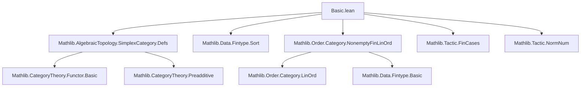

**Technical Brief: `Basic.lean` — Basic Properties of the Simplex Category**

---

### 1. KEY DEFINITIONS & THEOREMS

| Name | Type / Signature | Purpose |
|------|------------------|---------|
| `SimplexCategory` | `Category` | Category with objects `ℕ`, morphisms `n ⟶ m` = monotone maps `Fin (n+1) →o Fin (m+1)` |
| `const x y i` | `x ⟶ y` | Constant morphism picking out `i : Fin (y.len + 1)` |
| `mkHom f` | `⦋n⦌ ⟶ ⦋m⦌` | Construct morphism from monotone `f : Fin (n+1) →o Fin (m+1)` |
| `mkOfLe i j h` | `⦋1⦌ ⟶ ⦋n⦌` | Morphism picking edge `i ≤ j` |
| `mkOfSucc i` | `⦋1⦌ ⟶ ⦋n⦌` | Morphism picking `i → i+1` |
| `diag n` | `⦋1⦌ ⟶ ⦋n⦌` | Morphism picking `0 → last n` |
| `intervalEdge j l hjl` | `⦋1⦌ ⟶ ⦋n⦌` | Morphism picking `j → j+l` |
| `subinterval j l hjl` | `⦋l⦌ ⟶ ⦋n⦌` | Inclusion of subinterval `[j, j+l]` |
| `δ i` | `⦋n⦌ ⟶ ⦋n+1⦌` | `i`-th **face map** (injective monotone, skips `i`) |
| `σ i` | `⦋n+1⦌ ⟶ ⦋n⦌` | `i`-th **degeneracy map** (surjective monotone, repeats `i`) |
| `factor_δ f j` | `⦋m⦌ ⟶ ⦋n⦌` | Factorization of `f` through `δ j` when `j` not in image |
| `skeletalFunctor` | `SimplexCategory ⥤ NonemptyFinLinOrd` | Equivalence exhibiting `SimplexCategory` as skeleton of nonempty finite linear orders |
| `skeletalEquivalence` | `SimplexCategory ≌ NonemptyFinLinOrd` | Explicit equivalence |
| `mono_iff_injective` | `Mono f ↔ Function.Injective f.toOrderHom` | Monos = injective maps |
| `epi_iff_surjective` | `Epi f ↔ Function.Surjective f.toOrderHom` | Epis = surjective maps |
| `δ_comp_δ`, `δ_comp_σ_of_le`, `δ_comp_σ_self`, `σ_comp_σ`, etc. | `δ_i ≫ δ_j = ...`, `δ_i ≫ σ_j = ...` | **Simplicial identities** (defining relations of simplex category) |
| `eq_of_one_to_two`, `eq_of_one_to_two'` | Classification of `⦋1⦌ → ⦋2⦌` | Every morphism `1 → 2` is either a face map or constant |
| `eq_σ_comp_of_not_injective`, `eq_comp_δ_of_not_surjective` | Factorization lemmas | Any non-mono `n+1 → -` factors through a degeneracy; any non-epi `- → n+1` factors through a face |
| `isIso_of_bijective`, `eq_id_of_isIso`, `eq_id_of_mono`, `eq_id_of_epi` | Characterizations of isomorphisms | Isos = bijective maps; only identity automorphisms of `x` that are mono/epi |

---

### 2. NAMING CONVENTIONS

- **Prefixes**:
  - `δ_` / `σ_`: face / degeneracy maps (`δ` = *d*ifférentiel, `σ` = *s*ingularité)
  - `mkOf*`: constructors for morphisms from data (e.g., `mkOfLe`, `mkOfSucc`)
  - `const`: constant morphism
  - `factor_δ`: factorization through a face
  - `subinterval`, `intervalEdge`, `diag`: geometrically meaningful morphisms

- **Suffixes**:
  - `_eq`, `_self`, `_self'`: special cases or variants of identities
  - `_lt`, `_gt`, `_le`, `_succ`, `_castSucc`, `_castPred`: indicate inequality or casting context
  - `_spec`: specification lemma for a definition (e.g., `factor_δ_spec`)
  - `of_*`: e.g., `of_mono`, `of_epi`, `of_bijective`: “if X then Y” direction

- **Other**:
  - `eq_*`: classification or uniqueness lemmas
  - `len_*`: length-based inequalities (e.g., `len_le_of_mono`)
  - `isIso_*`: characterizations of isomorphisms

---

### 3. TACTIC STACK

| Tactic | Frequency | Role |
|--------|-----------|------|
| `aesop` | High | Automated reasoning for equality, subsingleton, monotonicity, etc. |
| `simp` / `simp only` | Very high | Simplification using `@[simp]` lemmas (e.g., `const_apply`, `mkOfSucc_homToOrderHom_*`) |
| `ext` | Very high | Extensionality for morphisms (via `Hom.ext_iff`) |
| `fin_cases`, `rcases`, `match` | High | Case analysis on `Fin` elements or existential witnesses |
| `rw`, `rwa`, `convert`, `congr` | High | Rewriting, congruence, and substitution |
| `lia`, `linarith` | High | Linear arithmetic on `Fin`/`ℕ` inequalities |
| `decide` | Medium | Decidable propositions (e.g., `δ 0 = const _ _ 1`) |
| `dsimp`, `unfold` | Medium | Delta-simplification and unfolding definitions |
| `exact`, `refine`, `apply` | Medium | Direct proof construction |
| `grind` | Low | Custom tactic (likely from `Mathlib.Tactic`) for grind-style reasoning |

---

### 4. PROOF LOGIC

**Typical proof structure**:

1. **Extensionality**: Prove morphism equality by `ext x` and case analysis on `x : Fin (n+1)`.
2. **Case analysis on `Fin` values**: Use `fin_cases`, `rcases`, or `match` to split on `0`, `1`, ..., `last`.
3. **Rewrite using simp lemmas**: Apply `@[simp]` lemmas (e.g., `const_apply`, `mkOfSucc_homToOrderHom_*`, `δ`, `σ` definitions).
4. **Arithmetic reasoning**: Use `lia`, `linarith`, `simp at *` to resolve inequalities and equalities in `Fin`.
5. **Inductive or structural factorization**:
   - For non-injective `f : n+1 → -`, extract witness `x < y` with `f x = f y`, then deduce `f x = f (x+1)`, and factor through `σ x`.
   - For non-surjective `f : - → n+1`, pick missing `i`, factor through `δ i`.
6. **Use skeletal equivalence**: For categorical properties (mono/epi/Iso), transport via `skeletalFunctor` to `NonemptyFinLinOrd`, where properties reduce to set-theoretic ones (injective/surjective/bijective).
7. **Subsingleton reasoning**: For morphisms into `⦋0⦌`, use `Subsingleton.elim (α := Fin 1)`.

---

### 5. IMPORTS (Primary Dependencies)

| Module | Role |
|--------|------|
| `Mathlib.AlgebraicTopology.SimplexCategory.Defs` | Core definition of `SimplexCategory` |
| `Mathlib.Data.Fintype.Sort` | Fintype, cardinality arguments |
| `Mathlib.Order.Category.NonemptyFinLinOrd` | Category of nonempty finite linear orders; target of skeletal functor |
| `Mathlib.Tactic.FinCases` | Case analysis on `Fin` |
| `Mathlib.Tactic.NormNum` | Normalization of numeric expressions |

---

### 6. MERMAID DIAGRAMS

#### Dependency Graph (Module-Level)



#### Overview of `Basic.lean` Structure

```mermaid
flowchart LR
  subgraph Init
    I1[const morphisms]
    I2[Hom.ext_zero_left / one_left]
    I3[mkHom / mkOfLe / mkOfSucc / diag / intervalEdge / subinterval]
    I4[Subsingleton (Δ ⟶ ⦋0⦌)]
  end

  subgraph Generators
    G1[δ, σ definitions]
    G2[δ-comp-δ identities]
    G2a[δ-comp-σ identities]
    G2b[σ-comp-σ identity]
    G3[δ-comp-σ_self / δ-comp-σ_succ]
    G4[δ-comp-σ_of_gt]
    G5[δ-comp-σ_of_gt']
    G6[σ-comp-σ]
    G7[δ_zero_eq_const, δ_one_eq_const]
    G8[eq_of_one_to_two / eq_of_one_to_two']
    G9[δ factorization: factor_δ]
  end

  subgraph Skeleton
    S1[skeletalFunctor]
    S2[skeletalEquivalence]
    S3[isSkeletonOf]
  end

  subgraph Concrete
    C1[ConcreteCategory instance]
    C2[ToType = Fin (n+1)]
  end

  subgraph EpiMono
    M1[mono_iff_injective]
    M2[epi_iff_surjective]
    M3[len_le_of_mono / len_le_of_epi]
    M4[isIso_of_bijective]
    M5[eq_id_of_isIso / eq_id_of_mono / eq_id_of_epi]
    M6[eq_σ_comp_of_not_injective]
    M7[eq_comp_δ_of_not_surjective]
    M8[eq_σ_of_epi]
  end

  A --> Init
  A --> Generators
  A --> Skeleton
  A --> Concrete
  A --> EpiMono
```

---

### 7. THEORY CONTEXT

- **Goal**: Provide a *concrete*, *computable*, and *categorically well-behaved* foundation for the simplex category.
- **Key insight**: `SimplexCategory` is the **skeleton** of `NonemptyFinLinOrd`, the category of nonempty finite linear orders.
- **Applications**:
  - Simplicial sets / homotopy theory (via `SimplexCategory` as indexing category).
  - Explicit constructions of face/degeneracy maps and verification of simplicial identities.
  - Categorical properties (epis/monos/isos) reduce to set-theoretic ones.
- **Novelty**:
  - Full explicitness: morphisms are monotone maps between finite types.
  - Practical for formalization: decidability, subsingltonness, and concrete homs.
  - Enables efficient reasoning about simplicial objects via `skeletalFunctor`.

--- 

Let me know if you'd like a **Lean tactic cheat sheet** or a **proof automation strategy** for this module.
