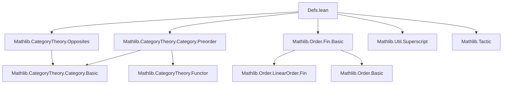

**Technical Brief: `Defs.lean` — Skeletal Simplex Category in Lean 4**

---

### 1. KEY DEFINITIONS & THEOREMS

| Name | Type / Signature | Purpose |
|------|------------------|---------|
| `SimplexCategory` | `Type u` (defined as `ℕ`) | Skeletal model of the simplex category; objects are natural numbers. |
| `SimplexCategory.mk` | `ℕ → SimplexCategory` | Embeds a natural number as an object in `SimplexCategory`. |
| `SimplexCategory.len` | `SimplexCategory → ℕ` | Recovers the underlying natural number (i.e., “length”) of an object. |
| `SimplexCategory.Hom` | `SimplexCategory → SimplexCategory → Type` | Morphisms: monotone maps `Fin (a.len + 1) →o Fin (b.len + 1)`. |
| `SimplexCategory.Hom.mk` | `Fin (a.len + 1) →o Fin (b.len + 1) → a ⟶ b` | Constructs a morphism from a monotone map. |
| `SimplexCategory.Hom.toOrderHom` | `a ⟶ b → Fin (a.len + 1) →o Fin (b.len + 1)` | Forgets the categorical structure to the underlying monotone map. |
| `SimplexCategory.Hom.id` | `a ⟶ a` | Identity morphism: `mk OrderHom.id`. |
| `SimplexCategory.Hom.comp` | `(b ⟶ c) → (a ⟶ b) → a ⟶ c` | Composition via composition of monotone maps. |
| `SimplexCategory.smallCategory` | `SmallCategory.{0} SimplexCategory` | Equips `SimplexCategory` with a category structure. |
| `SimplexCategory.Hom.ext` | `(f g : a ⟶ b) → f.toOrderHom = g.toOrderHom → f = g` | Extensionality: morphisms are equal iff their underlying maps are equal. |
| `SimplexCategory.homEquivOrderHom` | `(a ⟶ b) ≃ (Fin (a.len + 1) →o Fin (b.len + 1))` | Equivalence between hom-sets and monotone maps. |
| `SimplexCategory.homEquivFunctor` | `(a ⟶ b) ≃ (Fin (a.len + 1) ⥤ Fin (b.len + 1))` | Equivalence to functors between finite linear orders. |
| `SimplexCategory.Truncated` | `ℕ → Type u` | Full subcategory of `SimplexCategory` on objects `⦋n⦌` with `n ≤ N`. |
| `SimplexCategory.Truncated.inclusion` | `Truncated n ⥤ SimplexCategory` | Fully faithful inclusion functor. |
| `SimplexCategory.Truncated.incl` | `n ≤ m → Truncated n ⥤ Truncated m` | Inclusion of truncated categories. |
| `notation ⦋n⦌` | `Simplicial` locale | Denotes object `SimplexCategory.mk n`. |
| `notation ⦋m, p⦌ₙ` | `SimplexCategory.Truncated` locale | Denotes object `⟨⦋m⦌, p⟩` in `Truncated n`. |

**Theorems (key properties):**
- `len_mk`, `mk_len`: `len` and `mk` are inverses.
- `ext`, `ext'`, `Hom.ext`: Extensionality principles for objects and morphisms.
- `mk_toOrderHom`, `toOrderHom_mk`: `mk` and `toOrderHom` are inverses.
- `id_toOrderHom`, `comp_toOrderHom`: Compatibility of categorical operations with `toOrderHom`.
- `Hom.tr_id`, `Hom.tr_comp`, `Hom.tr_comp'`: Truncation preserves identities and composition.
- `inclCompInclusion`: Factorization of inclusions.

---

### 2. NAMING CONVENTIONS

- **Prefixes:**
  - `mk`: constructor (e.g., `mk`, `Hom.mk`, `trunc` tactic).
  - `to*`: projection / forgetful functor (e.g., `toOrderHom`, `toFun`).
  - `incl`, `inclusion`: inclusion functors.
  - `tr`: truncation of morphisms (`Hom.tr`).
- **Suffixes:**
  - `ext`: extensionality lemmas.
  - `rec`: recursor (`SimplexCategory.rec`).
  - `equiv`: equivalence of types (e.g., `homEquivOrderHom`).
- **Notation:**
  - `⦋n⦌`: object notation (Simplicial locale).
  - `⦋m, p⦌ₙ`: truncated object notation.
  - `trunc`: tactic for proving truncation bounds.

---

### 3. TACTIC STACK

Frequently used tactics in proofs (inferred from file content and style):

| Tactic | Usage |
|--------|-------|
| `rfl` | Simplifying definitional equalities (dominant). |
| `simp` / `simp_rw` | Simplifying with `@[simp]` lemmas. |
| `linarith` / `lia` | Solving linear arithmetic goals (e.g., truncation bounds). |
| `omega` | Solving goals in Presburger arithmetic (e.g., `n ≤ m`). |
| `dsimp` | Definitional simplification (e.g., `dsimp only [SimplexCategory.len_mk]`). |
| `first | assumption | ...` | Goal-directed simplification (used in `trunc` macro). |
| `exact`, `refine`, `apply` | Constructing terms (e.g., `Hom.tr`, `incl`). |
| `ext` | Proving equality of morphisms via extensionality. |
| `rw`, `rewrite` | Rewriting using equivalences or lemmas. |

---

### 4. PROOF LOGIC

- **Definitional reasoning dominates**: Most proofs are one-liners (`rfl`, `simp`), reflecting the skeletal, concrete definition.
- **Extensionality-first**: Morphism equality reduced to underlying monotone map equality via `Hom.ext`.
- **Truncation proofs**: Use `trunc` macro to discharge `≤` goals automatically.
- **Functoriality**: Verified via `@[simp]` lemmas (`id_toOrderHom`, `comp_toOrderHom`) and `rfl`.
- **Equivalences**: Constructed via `equivFunctor`, `homEquivOrderHom`, and verified via `ext` + `rfl`.
- **No heavy induction**: The skeletal definition avoids structural induction; truncation is handled via arithmetic.

---

### 5. IMPORTS

| Module | Role |
|--------|------|
| `Mathlib.CategoryTheory.Category.Preorder` | Provides `Preorder`-based category constructions. |
| `Mathlib.CategoryTheory.Opposites` | For `op`, dual constructions. |
| `Mathlib.Order.Fin.Basic` | Finite linear orders `Fin n`, monotone maps `→o`. |
| `Mathlib.Util.Superscript` | Enables subscript notation (`⦋n⦌ₙ`). |
| `Mathlib.Tactic` (via `subscriptTerm`) | For macro expansion of `⦋m, p⦌ₙ`. |

---

### 6. DEPENDENCY & THEORY OVERVIEW

#### Mermaid Diagram: Module Dependencies



#### Mermaid Diagram: Theory Structure

```mermaid
graph TD
  A[SimplexCategory] --> B[Objects: ℕ]
  A --> C[Morphisms: Fin(n+1) →o Fin(m+1)]
  C --> D[Monotone maps]
  D --> E[Fin n as linear orders]
  A --> F[Truncated SimplexCategory]
  F --> G[Full subcategory: len ≤ n]
  G --> H[Inclusion functors]
  A --> I[Equivalences]
  I --> J[→o ≃ ⥤ (Fin n ⥤ Fin m)]
  I --> K[SimplexCategory ≃ NonemptyFinLinOrd (see Basic.lean)]
```

#### Theory Scope

- **Core**: A *concrete*, *skeletal* model of the simplex category, defined as `ℕ` with monotone maps between finite ordinals.
- **Purpose**: Serves as the foundation for simplicial objects (e.g., simplicial sets, simplicial types), especially in algebraic topology and homotopy theory.
- **Complements**: `Basic.lean` proves equivalence with `NonemptyFinLinOrd`, enabling abstraction away from the skeletal model.
- **Truncation**: Supports finite-dimensional approximations (e.g., for truncated simplicial objects).

--- 

**End of Technical Brief**
