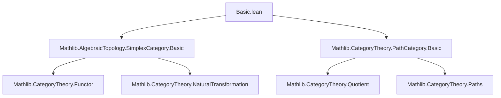
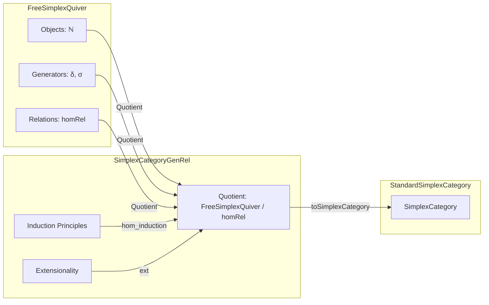
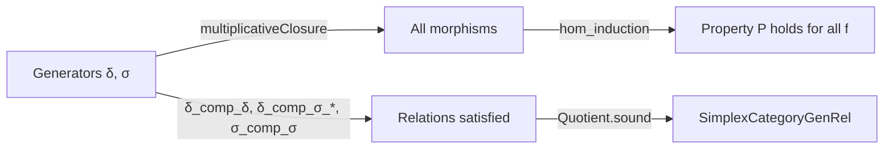

**Technical Brief: `Basic.lean` — Presentation of the Simplex Category by Generators and Relations**

---

### 1. Key Definitions & Theorems

| Name | Type / Signature | Purpose |
|------|------------------|---------|
| `FreeSimplexQuiver` | `Type` (≡ `ℕ`) | Objects are natural numbers; models the *free* quiver of simplex generators. |
| `FreeSimplexQuiver.Hom` | `inductive` | Morphisms are formal generators: `δ i` (face maps) and `σ i` (degeneracy maps). |
| `δ`, `σ` | `δ i : mk n ⟶ mk (n+1)`, `σ i : mk (n+1) ⟶ mk n` | Canonical generators (face/degeneracy maps) in `FreeSimplexQuiver`. |
| `homRel` | `inductive` on `Paths FreeSimplexQuiver` | Encodes the *five simplicial identities* as relations between paths (morphisms). |
| `SimplexCategoryGenRel` | `Quotient FreeSimplexQuiver.homRel` | The *presented* category: generators modulo simplicial identities. |
| `δ`, `σ` (in `SimplexCategoryGenRel`) | `mk n ⟶ mk (n+1)`, `mk (n+1) ⟶ mk n` | Images of generators under quotient map. |
| `len` | `SimplexCategoryGenRel → ℕ` | Extracts the underlying natural number (object “length”). |
| `hom_induction`, `hom_induction'` | `MorphismProperty → ... → P f` | Induction principles for morphisms: right- or left-composition with generators. |
| `rec` | `SimplexCategoryGenRel → Sort*` | Object induction: every object is `mk n`. |
| `ext` | `x.len = y.len → x = y` | Extensionality for objects. |
| `δ_comp_δ`, `δ_comp_σ_of_le`, `δ_comp_σ_self`, `δ_comp_σ_succ`, `δ_comp_σ_of_gt`, `σ_comp_σ` | `theorem` | Explicit simplicial identities in `SimplexCategoryGenRel`. |
| `δ_comp_δ_nat`, `σ_comp_σ_nat` | `lemma` | Natural-number-indexed versions of identities (for convenience). |
| `toSimplexCategory` | `SimplexCategoryGenRel ⥤ SimplexCategory` | Canonical functor to the *standard* simplex category (via universal property of quotient). |
| `multiplicativeClosure_isGenerator_eq_top` | `lemma` | Key lemma: every morphism is a composite of generators. Enables induction. |

---

### 2. Naming Conventions

- **Prefixes**:
  - `δ` / `σ`: face/degeneracy maps (used uniformly across `FreeSimplexQuiver` and `SimplexCategoryGenRel`).
  - `mk`: constructor for objects (`mk n`).
  - `len`: length (object → ℕ).
  - `hom_`, `gen_`, `fac_`, `deg_`: for properties (e.g., `faces`, `degeneracies`, `generators`).
- **Suffixes**:
  - `_comp_δ`, `_comp_σ_*`: denote composition identities involving `δ` or `σ`.
  - `_nat`: natural-number-indexed variants.
  - `_induction`, `_rec`, `_ext`: induction/recursion/extensionality lemmas.
- **Property names**:
  - `faces`, `degeneracies`, `generators`: inductive `MorphismProperty`s.
  - `multiplicativeClosure`: closure under composition and identities.

---

### 3. Tactic Stack

- **Core proof automation**:
  - `simp`, `simp only`, `simp_rw` (for rewriting using `simp` lemmas and definitional equalities).
  - `rcases`, `cases`, `induction`: for destructuring `Fin`, `Paths`, `homRel`, `multiplicativeClosure`.
  - `apply CategoryTheory.Quotient.sound`: to lift relations from the free quiver to the quotient.
  - `congr`, ` rfl`, `linarith`/`lia`: for index arithmetic and equality proofs.
  - `exact`, `refine`, `intro`, `apply ... at` for standard natural deduction.
  - `ext`: for object extensionality.
  - `aesop` is *not* used — proofs are mostly manual and structured.

---

### 4. Proof Logic

- **Structure of proofs**:
  1. **Induction on morphisms** via `hom_induction` / `hom_induction'`, reducing to base cases (`id`) and step cases (`δ`/`σ` composition).
  2. **Quotient lifting**: identities in `SimplexCategoryGenRel` are proven by appealing to the corresponding `homRel` constructor in `FreeSimplexQuiver` via `Quotient.sound`.
  3. **Index manipulation**: `Fin` indices are often converted to `ℕ` with proofs of boundedness (`by lia`, `by simpa`), especially in `*_nat` lemmas.
  4. **Universal property usage**: `toSimplexCategory` is defined via `Quotient.lift`, requiring verification that all `homRel` constructors map to equalities in `SimplexCategory`.

- **Typical flow**:
  ```lean
  apply CategoryTheory.Quotient.sound
  exact FreeSimplexQuiver.homRel.δ_comp_δ H
  ```

---

### 5. Imports

- `Mathlib.AlgebraicTopology.SimplexCategory.Basic`: provides the *standard* simplex category (`SimplexCategory`) with its `δ`, `σ`, and simplicial identities.
- `Mathlib.CategoryTheory.PathCategory.Basic`: provides `Paths`, `Quotient`, and `HomRel` machinery for presenting categories by generators and relations.

---

### 6. Mermaid Diagrams

#### Dependency Graph (Module-Level)



#### Overview of `Basic.lean` Structure



#### Morphism Generation Flow



---

### 7. Summary

This file constructs the *abstract simplex category* `SimplexCategoryGenRel` as a **finitely presented category**: objects are natural numbers, morphisms are generated by face (`δ`) and degeneracy (`σ`) maps, modulo the standard simplicial identities. It provides:

- A clean inductive presentation of morphisms (via `hom_induction`).
- Explicit verification of all simplicial identities in the quotient.
- A canonical functor to the concrete simplex category, setting up for an eventual equivalence proof.

The formalization is highly structured, with careful attention to index management (`Fin`, inequalities), and leverages Lean’s quotient and path-category infrastructure for categorical presentations.
