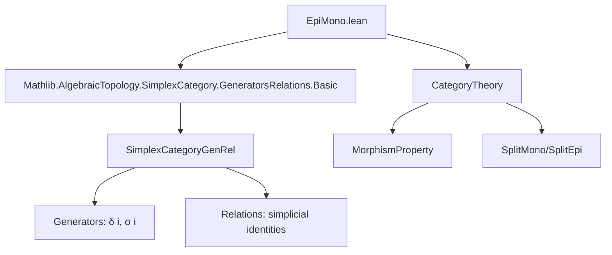
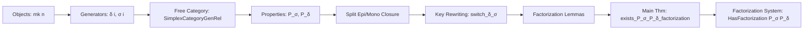
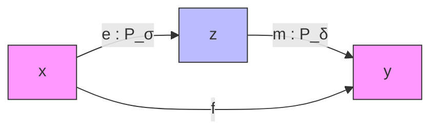

**Technical Brief: EpiMono.lean — Epi-Mono Factorization in `SimplexCategoryGenRel`**

---

### 1. **Key Definitions & Theorems**

| Name | Type / Signature | Purpose |
|------|------------------|---------|
| `splitMonoδ` | `{n : ℕ} → (i : Fin (n + 2)) → SplitMono (δ i)` | Shows each face map `δ i` is a split monomorphism via retraction `σ i` or `σ (i-1)`. |
| `splitEpiσ` | `{n : ℕ} → (i : Fin (n + 1)) → SplitEpi (σ i)` | Shows each degeneracy map `σ i` is a split epimorphism via section `δ i`. |
| `P_σ` | `MorphismProperty SimplexCategoryGenRel` | Predicate for morphisms that are compositions of degeneracies (`σ i`). Defined as `degeneracies.multiplicativeClosure`. |
| `P_δ` | `MorphismProperty SimplexCategoryGenRel` | Predicate for morphisms that are compositions of faces (`δ i`). Defined as `faces.multiplicativeClosure`. |
| `isSplitEpi_P_σ` | `P_σ f → IsSplitEpi f` | Every `P_σ` morphism is a split epimorphism (closed under composition, identity). |
| `isSplitMono_P_δ` | `P_δ f → IsSplitMono f` | Every `P_δ` morphism is a split monomorphism. |
| `eq_or_len_le_of_P_δ` | `P_δ f → (∃ h, f = eqToHom h) ∨ x.len < y.len` | Structural property of `P_δ` morphisms: either iso (identity up to equality) or strictly increases length. |
| `switch_δ_σ` | `δ i' ≫ σ i = 𝟙 ∨ ∃ j j', δ i' ≫ σ i = σ j ≫ δ j'` | Core simplification lemma: any `δ ≫ σ` reduces to identity or `σ ≫ δ`. |
| `factor_δ_σ` | `∃ z, e : mk n ⟶ z, m : z ⟶ mk n, P_σ e, P_δ m, δ i' ≫ σ i = e ≫ m` | Factorization of a single `δ ≫ σ` into `P_σ` then `P_δ`. |
| `factor_P_δ_σ` | `f : x ⟶ mk (n+1), P_δ f ⇒ ∃ z, e : x ⟶ z, m : z ⟶ mk n, P_σ e, P_δ m, f ≫ σ i = e ≫ m` | Inductive step: push a `σ` past a `P_δ` morphism into a `P_σ ≫ P_δ` factorization. |
| `exists_P_σ_P_δ_factorization` | `∀ f, ∃ z, e : x ⟶ z, m : z ⟶ y, P_σ e, P_δ m, f = e ≫ m` | **Main theorem**: every morphism factors as `P_σ` (split epi) followed by `P_δ` (split mono). |
| `MorphismProperty.HasFactorization` instance | `HasFactorization P_σ P_δ` | Encodes that `SimplexCategoryGenRel` has a factorization system `(P_σ, P_δ)`. |

---

### 2. **Naming Conventions**

- **Prefixes**:
  - `splitMono_`, `splitEpi_`: denote constructions of split monos/epis.
  - `isSplitEpi_`, `isSplitMono_`: lemmas showing a property implies split epi/mono.
  - `P_σ`, `P_δ`: predicates for degeneracy-only / face-only morphisms.
  - `switch_δ_σ`, `factor_δ_σ`, `factor_P_δ_σ`: technical lemmas for rewriting/composing across `δ`/`σ`.

- **Suffixes**:
  - `_mem`: used for membership in multiplicative closures (e.g., `P_σ.id_mem _`).
  - `_comp_mem`: closure under composition.
  - `_of_P_δ`, `_of_P_σ`: lemmas using `P_δ`/`P_σ` hypotheses.

- **Variables**:
  - `i`, `j`, `i'`, `j'`, `k`: indices for `δ`/`σ`.
  - `e`, `m`: generic morphisms intended to be `P_σ` (epi) and `P_δ` (mono).
  - `z`: intermediate object in factorization.

---

### 3. **Tactic Stack**

- **Core tactics**:
  - `induction ... using Fin.lastCases`: structural induction on `Fin` indices.
  - `fin_cases`: case analysis on `Fin` terms.
  - `rcases ... with ...`: destruct existential/unions.
  - `simp only [...]`: simplification using simp lemmas (e.g., `δ_comp_σ_self`, `δ_comp_σ_succ`).
  - `rw [...]`: rewriting using simp lemmas or equalities.
  - `cases h`: destruct hypotheses.
  - `apply Or.inr`, `apply Or.inl`: disjunction management.
  - `infer_instance`: auto-apply typeclass instances.
  - `aesop`: used implicitly via `infer_instance` and `simp`-based automation.

- **Key lemmas used in simplification**:
  - `δ_comp_σ_self`, `δ_comp_σ_succ`, `δ_comp_σ_of_gt`, `δ_comp_σ_of_le`
  - `assoc_of`, `reassoc_of%`, `eqToHom`, `eqToHom_refl`

---

### 4. **Proof Logic**

- **Structure**:
  1. **Base properties**: Show `δ i` and `σ i` are split mono/epi via simplicial identities.
  2. **Closure**: Extend to `P_σ`/`P_δ` (multiplicative closures) → all `P_σ` are split epis, all `P_δ` split monos.
  3. **Key rewriting lemma** (`switch_δ_σ`): `δ ≫ σ` simplifies to identity or `σ ≫ δ`. Proven by case analysis on index order.
  4. **Factorization lemmas**:
     - `factor_δ_σ`: single `δ ≫ σ` → `P_σ ≫ P_δ`.
     - `factor_P_δ_σ`: push `σ` past `P_δ` using induction on `n` and `switch_δ_σ`.
  5. **Main theorem** (`exists_P_σ_P_δ_factorization`):
     - Induction on morphism `f` (via `induction f with | id | comp_δ | comp_σ`).
     - For `comp_σ`, use `factor_P_δ_σ` to handle `P_δ ≫ σ`.
     - For `comp_δ`, append `δ` to `P_δ` part.
     - Identity case trivial.

- **Induction strategy**:
  - Morphism induction on `SimplexCategoryGenRel` (free category with generators `δ`, `σ` modulo simplicial identities).
  - Structural induction on `Fin` indices for case analysis.
  - Nested induction on natural numbers (`n`) for `factor_P_δ_σ`.

---

### 5. **Imports**

- `Mathlib.AlgebraicTopology.SimplexCategory.GeneratorsRelations.Basic`  
  → Provides `SimplexCategoryGenRel`, its objects (`mk n`), morphisms (`δ i`, `σ i`), and simplicial identities.

- `CategoryTheory` (via `open CategoryTheory`)  
  → For `SplitMono`, `SplitEpi`, `IsSplitMono`, `IsSplitEpi`, `eqToHom`, etc.

- Implicit use of:
  - `MorphismProperty` (from `CategoryTheory.MorphismProperty`)
  - `Fin` arithmetic and order (`Fin.lastCases`, `lt_trichotomy`, etc.)

---

### 6. **Mermaid Diagrams**

#### **Dependency Graph (Module Level)**

#### **Overview of Theoretical Flow**

#### **Factorization System**

> **Interpretation**: Every morphism `f : x → y` factors as a split epi (`P_σ`) followed by a split mono (`P_δ`). This yields a *factorization system* `(E, M)` where `E = {f | P_σ f}`, `M = {f | P_δ f}`.

---

### 7. **Summary**

This file establishes a **constructive epi-mono factorization system** in the simplex category presented by generators and relations. It leverages:
- **Simplicial identities** to prove `δ`, `σ` are split mono/epi,
- **Multiplicative closures** to extend to composite morphisms,
- **Rewriting lemmas** (`switch_δ_σ`) to reorder `δ` and `σ`,
- **Inductive constructions** to build global factorizations.

The result is foundational for homotopical algebra in this setting — e.g., for constructing model structures or studying homotopy coherence.
