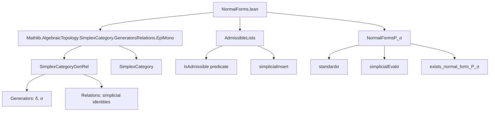

### Technical Brief: `NormalForms.lean`

---

#### **1. Key Definitions & Theorems**

| Name | Type / Signature | Purpose |
|------|------------------|---------|
| `IsAdmissible m L` | `ℕ → List ℕ → Prop` | Inductive predicate encoding that a list `L` is *strictly increasing* and satisfies `L[k] ≤ m + k` for all valid indices `k`. |
| `standardσ L h` | `List ℕ → {m₁ m₂ // m₂ + L.length = m₁} → mk m₁ ⟶ mk m₂` | Encodes a morphism in `SimplexCategoryGenRel` as a composition of degeneracy maps `σ i` in reverse order: `σ iₙ ≫ ⋯ ≫ σ i₀`. Valid when `L` is `m`-admissible. |
| `simplicialInsert j L` | `ℕ → List ℕ → List ℕ` | Algorithmic insertion of `j` into `L`, adjusting subsequent elements via `a ↦ a+1` when needed, mirroring simplicial identities. |
| `simplicialEvalσ L j` | `List ℕ → ℕ → ℕ` | Semantical lift of `standardσ L` to a monotone function on `ℕ`, defined inductively. Used to relate syntactic morphisms to order-theoretic behavior. |
| `isAdmissible_iff_isChain_and_le` | `IsAdmissible m L ↔ L.IsChain (· < ·) ∧ ∀ k < L.length, L[k] ≤ m + k` | Equivalence between inductive and non-inductive definitions of admissibility. |
| `simplicialInsert_isAdmissible` | `IsAdmissible (m + 1) L → j ≤ m → IsAdmissible m (simplicialInsert j L)` | Key lemma: `simplicialInsert` preserves admissibility. |
| `standardσ_simplicialInsert` | `standardσ (simplicialInsert j L) = standardσ L ≫ σ j` | Connects syntactic insertion with composition by a degeneracy map. |
| `exists_normal_form_P_σ` | `P_σ f → ∃ L, IsAdmissible m L ∧ f = standardσ L` | Main theorem: every `P_σ`-morphism has a normal form encoded by an admissible list. |
| `mem_isAdmissible_iff` | `j ∈ L ↔ j < m + L.length ∧ simplicialEvalσ L j = simplicialEvalσ L (j + 1)` | Characterizes membership in an admissible list via fixed points of `simplicialEvalσ`. |

---

#### **2. Naming Conventions**

- **Predicates**: `isAdmissible`, `isChain`, `sortedLT`, `Pairwise`, `le`, `head_lt`, `getElem_lt`, `mono`
- **Syntactic normal forms**: `standardσ`, `standardδ` (not yet defined, but implied by TODO)
- **Evaluation / semantics**: `simplicialEvalσ`, `simplicialInsert`
- **Structural lemmas**: `cons`, `of_cons`, `head`, `getElemAsFin`, `tail` (deprecated)
- **Equational reasoning**: `reassoc`, `grind`, `simp`, `grind ←`, `grind →`

**Prefixes / suffixes**:
- `is_`: predicate (e.g., `isAdmissible`)
- `standard_`: canonical syntactic representative (e.g., `standardσ`)
- `simplicial_`: semantic or algorithmic lift (e.g., `simplicialInsert`, `simplicialEvalσ`)
- `getElem_`: indexing into lists with bounds
- `head`, `tail`: list decomposition
- `of_cons`, `cons`: inductive constructors for `IsAdmissible`

---

#### **3. Tactic Stack**

- `grind` (custom tactic, likely `aesop`-based with simplification + rewriting)
- `simp` / `simp only` / `simp_rw`
- `induction ... using List.twoStepInduction`
- `cases L` (list case analysis)
- `subst_vars`, `congrArg`, `ext`, `apply_fun`
- `have := ...; grind`, `have := ...; simp_all`
- `convert ... <;> grind`
- `exact`, `rfl`, `by grind`

**Dominant pattern**: `induction` + `grind` + `simp` + `cases` + `congrArg`.

---

#### **4. Proof Logic**

- **Inductive structure** on lists (`List.twoStepInduction`) and morphisms (`P_σ f`).
- **Key strategy**:
  1. Define admissibility *inductively* for easier reasoning.
  2. Prove equivalence with a *non-inductive* characterization (`isChain ∧ ∀ k, L[k] ≤ m + k`).
  3. Define syntactic normal forms (`standardσ`) and semantic lifts (`simplicialEvalσ`).
  4. Prove correctness: `simplicialEvalσ` lifts `standardσ` to `SimplexCategory`.
  5. Show algorithmic insertion (`simplicialInsert`) corresponds to composition with `σ`.
  6. Use induction on `P_σ f` to construct normal form: base cases (`id`, `σ`) are trivial; composition uses `simplicialInsert` and `standardσ_simplicialInsert`.
- **Critical insight**: `simplicialInsert` unifies treatment of `P_δ` and `P_σ` via the same insertion algorithm (modulo indexing shift).

---

#### **5. Imports**

- `Mathlib.AlgebraicTopology.SimplexCategory.GeneratorsRelations.EpiMono`  
  → Provides the *generators and relations* framework for `SimplexCategoryGenRel`, including definitions of `P_σ`, `P_δ`, and the canonical functor `toSimplexCategory`.

---

#### **6. Mermaid Diagrams**

##### **Dependency Graph (Module-Level)**



##### **Overview of File Structure**

```mermaid
flowchart LR
  subgraph "AdmissibleLists"
    I1[IsAdmissible inductive def] --> I2[Equivalence lemmas]
    I2 --> I3[Structural lemmas: head, tail, cons]
    I3 --> I4[simplicialInsert algorithm]
    I4 --> I5[simplicialInsert preserves admissibility]
  end

  subgraph "NormalFormsP_σ"
    J1[standardσ syntactic morphism] --> J2[simplicialEvalσ semantic lift]
    J2 --> J3[Correctness: simplicialEvalσ lifts to SimplexCategory]
    J1 --> J4[simplicialInsert ↔ composition by σ]
    J4 --> J5[exists_normal_form_P_σ]
  end

  I5 --> J4
  J5 --> K[→ toSimplexCategory equivalence (future)]
```

---

#### **7. TODOs & Future Work**

- Prove *uniqueness* of normal forms for `P_δ` morphisms (currently only existence for `P_σ`).
- Extend `standardδ` and prove analogous results for `P_δ` morphisms.
- Formalize the equivalence `toSimplexCategory : SimplexCategoryGenRel ⥤ SimplexCategory`.

---

#### **8. Summary**

This file formalizes *normal forms* for degeneracy-generated morphisms (`P_σ`) in the syntactic simplex category with generators and relations (`SimplexCategoryGenRel`). It introduces the novel notion of *`m`-admissible lists*—strictly increasing lists bounded by `m + k`—and shows that every such morphism is uniquely representable as a `standardσ` over an admissible list. The construction is algorithmic (`simplicialInsert`) and semantically validated (`simplicialEvalσ`). This is foundational for proving that the canonical functor to the standard simplex category is an equivalence.
