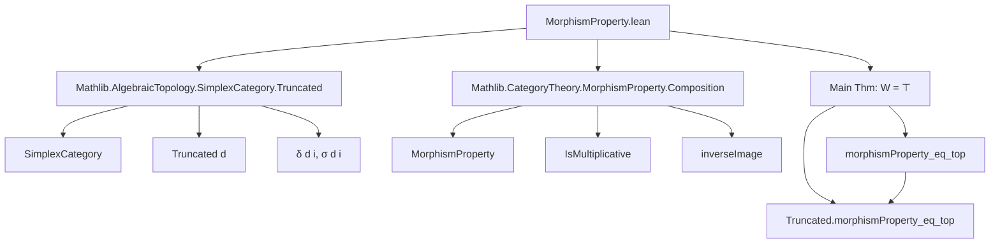
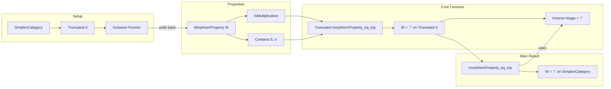

**Technical Brief: `MorphismProperty.lean`**

---

### 1. **Key Definitions & Theorems**

| Name | Type | Purpose |
|------|------|---------|
| `Truncated.morphismProperty_eq_top` | `{d : ℕ} → (W : MorphismProperty (Truncated d)) → [W.IsMultiplicative] → (∀ n < d, i, W (δ d i)) → (∀ n < d, i, W (σ d i)) → W = ⊤` | Shows that any *multiplicative* morphism property on `Truncated d` containing all faces `δ` and degeneracies `σ` must be the top (i.e., universal) property. |
| `morphismProperty_eq_top` | `(W : MorphismProperty SimplexCategory) → [W.IsMultiplicative] → (∀ n i, W (δ i)) → (∀ n i, W (σ i)) → W = ⊤` | Main theorem: any multiplicative morphism property on the full simplex category containing all faces and degeneracies is universal. Proven by reduction to the truncated case via inverse image along `Truncated.inclusion d`. |

- **`MorphismProperty`**: A predicate on morphisms closed under composition and identities (when `IsMultiplicative`).
- **`δ` (face maps)**: `SimplexCategory.δ i : [n] → [n+1]`, injective order-preserving maps missing one element.
- **`σ` (degeneracy maps)**: `SimplexCategory.σ i : [n+1] → [n]`, surjective order-preserving maps identifying two adjacent elements.
- **`Truncated d`**: Full subcategory of `SimplexCategory` on objects `[n]` with `n < d`.
- **`inverseImage (Truncated.inclusion d)`**: Pullback of a morphism property along the inclusion functor `Truncated d ⥤ SimplexCategory`.

---

### 2. **Naming Conventions**

- **Prefixes**:
  - `δ_mem`, `σ_mem`: membership of faces/degeneracies in the property.
  - `hW`, `h₁`, `h₂`, `h`: generic hypotheses (often about surjectivity/injectivity).
- **Suffixes**:
  - `_mem`: witness that a specific morphism lies in the property.
  - `_eq_top`: conclusion that a property equals the top element.
- **Inductive/structural naming**:
  - `rec` in `induction a using SimplexCategory.rec`: recursion on object length (`len`).
  - `tr` in `Hom.tr f`: truncation of a morphism to a `Truncated d` context.

---

### 3. **Tactic Stack**

Frequent tactics used in proofs:

| Tactic | Role |
|--------|------|
| `ext` | Extensionality for morphism properties (pointwise equality). |
| `simp only [...]` | Simplify using explicit lemmas (e.g., `MorphismProperty.top_apply`). |
| `induction ... using rec` | Structural induction on simplex objects (`[n] ≅ Fin (n+1)`). |
| `by_cases` | Split on surjectivity/injectivity of `f.hom.toOrderHom`. |
| `obtain ...` | Extract decompositions (e.g., `eq_comp_δ_of_not_surjective`, `eq_σ_comp_of_not_injective`). |
| `rw [...]` | Rewrite using equality of morphisms (via `InducedCategory.hom_ext`). |
| `apply ..._mem` | Use assumed membership of generators (`δ_mem`, `σ_mem`, `id_mem`). |
| `lia` | Linear integer arithmetic for bounds like `n < d`, `a + b = c`. |
| `Subsingleton.elim` | Use uniqueness of morphisms into/from subsingleton objects (e.g., `[0]`). |

---

### 4. **Proof Logic**

**High-level strategy**:

1. **Truncated case** (`Truncated.morphismProperty_eq_top`):
   - Reduce to proving `W f` for arbitrary `f : a → b`.
   - Induct on `a + b` (sum of object lengths).
   - Base case (`a = b = 0`): only identity; use `id_mem`.
   - Inductive step:
     - If `f` is not surjective ⇒ factor as `g ≫ δ_i` (face), apply `W.comp_mem` with induction hypothesis + `δ_mem`.
     - Else if `f` is not injective ⇒ factor as `σ_i ≫ g` (degeneracy), apply `W.comp_mem` with `σ_mem` + induction hypothesis.
     - Else `f` is both epi and mono ⇒ isomorphism ⇒ identity (since simplex category is skeletal), done.

2. **Full simplex case** (`morphismProperty_eq_top`):
   - For any `f : a → b`, embed into `Truncated d` where `d = max a.len b.len`.
   - Use `inverseImage` to relate `W` on `SimplexCategory` to `W ∘ inclusion` on `Truncated d`.
   - Apply truncated result to get `W.inverseImage (Truncated.inclusion d) = ⊤`.
   - Conclude `W f` since `f` lies in the image of the inclusion.

---

### 5. **Imports**

| Import | Purpose |
|--------|---------|
| `Mathlib.AlgebraicTopology.SimplexCategory.Truncated` | Defines `Truncated d`, its objects/morphisms, face/degeneracy maps, and inclusion functors. |
| `Mathlib.CategoryTheory.MorphismProperty.Composition` | Defines `MorphismProperty`, `IsMultiplicative`, `inverseImage`, and basic operations (e.g., `comp_mem`, `id_mem`). |

---

### 6. **Mermaid Diagrams**

#### **Dependency Graph (Module Scope)**

#### **Overview of Theory Flow**

---

### 7. **Domain-Specific AI Agent Notes**

- **Key abstractions**: Morphism properties, simplex category structure, truncation.
- **Critical lemmas**: Factorization of morphisms via `δ`/`σ` when not epi/mono.
- **Automation opportunities**: 
  - `simp`-based automation for `Truncated` bounds (`by dsimp; lia`).
  - `aesop` could automate `obtain ⟨i, g', hf'⟩` steps if lemmas like `eq_comp_δ_of_not_surjective` are made more accessible.
- **Generalizable pattern**: Prove property for truncated categories, then lift via inverse image.

--- 

Let me know if you'd like a formalized summary in Lean or a visualization of the proof DAG.
