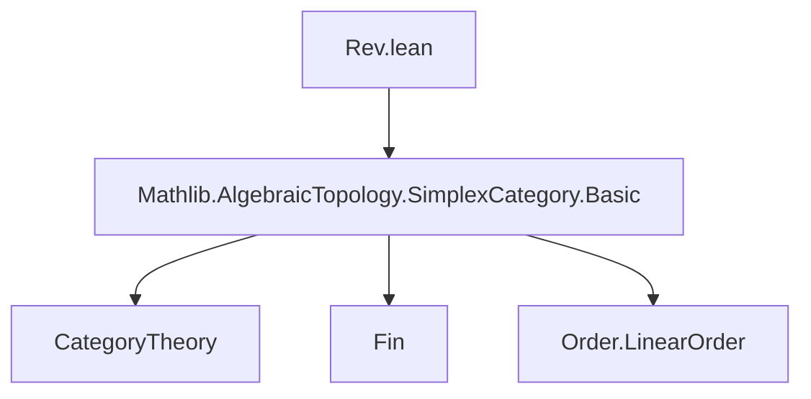

**Technical Brief: `Rev.lean` — Covariant Involution on the Simplex Category**

---

### 1. **Key Definitions & Theorems**

| Name | Type | Purpose |
|------|------|---------|
| `rev` | `SimplexCategory ⥤ SimplexCategory` | Covariant involution functor: on objects `n ↦ n`, on morphisms `f ↦ i ↦ (f(i.rev)).rev` |
| `revCompRevIso` | `rev ⋙ rev ≅ 𝟭 _` | Natural isomorphism witnessing that `rev` is an involution (up to iso) |
| `revEquivalence` | `SimplexCategory ≌ SimplexCategory` | The equivalence of categories induced by `rev`, using itself as both functor and inverse |
| `rev_map_apply` | `∀ f i, (rev.map f) i = (f i.rev).rev` | Explicit description of `rev` on morphisms (simplifies to definition) |
| `rev_map_δ` | `rev.map (δ i) = δ (i.rev)` | Behavior of `rev` on standard coface maps |
| `rev_map_σ` | `rev.map (σ i) = σ (i.rev)` | Behavior of `rev` on standard codegeneracy maps |
| `rev_map_rev_map` | `rev.map (rev.map f) = f` | `rev` is involutive on morphisms |

---

### 2. **Naming Conventions**

- **Prefixes**:
  - `rev_`: indicates involvement of the reversal involution (e.g., `rev_map`, `revCompRevIso`, `revEquivalence`)
- **Suffixes**:
  - `_iso`: for natural isomorphisms (`revCompRevIso`)
  - `_equivalence`: for equivalences of categories (`revEquivalence`)
- **Morphological patterns**:
  - `rev.map f`: application of `rev` to a morphism `f`
  - `i.rev`: reversal of an index `i : Fin (n+1)`

---

### 3. **Tactic Stack**

- `aesop`: used for automated reasoning in `rev_map_rev_map`
- `ext`: extensionality for morphisms (especially in `rev_map_δ`, `rev_map_σ`)
- `rw`: rewriting using lemmas like `Fin.rev_le_rev`, `Fin.rev_rev`, `Fin.succAbove_rev_right`, `Fin.predAbove_rev_right`
- `dsimp`: simplification of definitions (e.g., unfolding `δ`, `σ`)
- `rwa`: rewrite + assumption (used in monotonicity proof inside `rev.map` definition)
- `simps!`, `simps`: auto-generate simplification lemmas for functors and natural transformations

---

### 4. **Proof Logic**

- **Definition of `rev`**:
  - Constructed as a functor via `functor.mk`, verifying monotonicity using `Fin.rev_le_rev`.
- **Lemmas `rev_map_δ`, `rev_map_σ`**:
  - Proven by extensionality (`ext j : 3`) and rewriting using:
    - `rev_map_apply`
    - definitions of `δ`, `σ` (as `Fin.succAbove`, `Fin.predAbove`)
    - `Fin.rev_rev` and reversal lemmas for `succAbove`/`predAbove`
- **Involution properties**:
  - `revCompRevIso`: trivial iso (identity components), justified by `NatIso.ofComponents`
  - `rev_map_rev_map`: proven by `aesop`, leveraging simplification and involution of `.rev` on `Fin`
- **Equivalence**:
  - `revEquivalence` uses `rev` as both forward and inverse functor, with unit/counit given by `revCompRevIso` and its inverse.

---

### 5. **Imports**

- `Mathlib.AlgebraicTopology.SimplexCategory.Basic`: core definitions of the simplex category (`SimplexCategory`, `δ`, `σ`, `Hom.mk`, etc.)

---

### 6. **Mermaid Diagrams**

#### **Dependency Graph (Module-Level)**



#### **Theoretical Overview (File-Level)**

```mermaid
graph LR
  A[SimplexCategory] -->|objects| B[ℕ]
  A -->|morphisms| C[Monotone maps Fin(n+1) → Fin(m+1)]
  D[rev : SimplexCategory ⥤ SimplexCategory] -->|on obj| A
  D -->|on morph| E[i ↦ (f(i.rev)).rev]
  F[revCompRevIso] -->|witness| G[rev² ≅ id]
  H[revEquivalence] -->|uses| D & G
```

#### **Functorial Structure**

```mermaid
graph LR
  SimplexCategory["SimplexCategory"] -- rev --> SimplexCategory
  SimplexCategory -- rev --> SimplexCategory
  rev²["rev ⋙ rev"] -.->|iso| id["𝟭 _"]
  revEquivalence["rev : SimplexCategory ≌ SimplexCategory"] -.->|unit/counit| rev²
```

---

### 7. **Domain-Specific AI Agent Notes**

- **Target domain**: Homotopy theory / simplicial methods in category theory.
- **Key abstractions**: simplex category, order-preserving maps, reversal involution.
- **Pattern to recognize**: whenever `rev` appears, expect:
  - Use of `Fin.rev`, `rev_rev`, `rev_le_rev`
  - Symmetry between coface/codegeneracy maps under reversal
  - Involution-based equivalences (e.g., for dual constructions)
- **Common proof patterns**:
  - Prove equality of maps by extensionality + rewriting with `Fin` lemmas
  - Use `simps` to generate lemmas for functors/natural transformations
  - Leverage `NatIso.ofComponents` for trivial natural isos

--- 

Let me know if you'd like a formalized summary in Lean or a visualization of the simplex category with `rev`.
