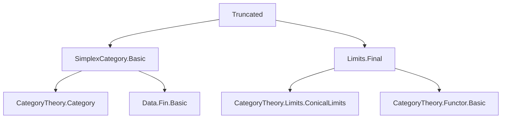
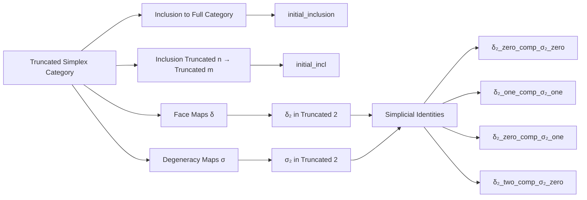

**Technical Brief: Truncated Simplex Category Properties (Lean 4)**  
*Source: `Truncated.lean` (Mathlib module)*  
*Author: Jakob von Raumer*  
*License: Apache 2.0*

---

### 1. KEY DEFINITIONS & THEOREMS

| Name | Type / Signature | Purpose |
|------|------------------|---------|
| `inclusion n` | `SimplexCategory.Truncated n ⥤ SimplexCategory` | Canonical inclusion of `n`-truncated into full simplex category |
| `incl n m hnm` | `SimplexCategory.Truncated n ⥤ SimplexCategory.Truncated m` (for `n ≤ m`) | Inclusion between truncated simplex categories |
| `initial_inclusion` | `Instance [NeZero n] : (inclusion n).Initial` | For `n > 0`, the inclusion `Truncated n → SimplexCategory` is an *initial functor* (i.e., its domain is *cofiltered* over the codomain) |
| `initial_incl` | `Theorem [NeZero n] (hnm : n ≤ m) : (incl n m).Initial` | For `0 < n ≤ m`, the inclusion `Truncated n → Truncated m` is initial |
| `δ m n i` | `abbrev (m : ℕ) {n} (i : Fin (n + 2)) → ⟨⟦n⟧, _⟩ ⟶ ⟨⟦n + 1⟧, _⟩` | `i`-th face map in `Truncated m` (truncation of `SimplexCategory.δ i`) |
| `σ m n i` | `abbrev (m : ℕ) {n} (i : Fin (n + 1)) → ⟨⟦n + 1⟧, _⟩ ⟶ ⟨⟦n⟧, _⟩` | `i`-th degeneracy map in `Truncated m` |
| `δ₂ i`, `σ₂ i` | `abbrev` (special case `m = 2`) | Face/degeneracy maps in the **2-truncated** simplex category |
| `δ₂_zero_comp_σ₂_zero` | `δ₂ 0 ≫ σ₂ 0 = 𝟙` | Standard simplicial identity: `d⁰ ∘ s⁰ = id` |
| `δ₂_one_comp_σ₂_zero` | `δ₂ 1 ≫ σ₂ 0 = 𝟙` | `d¹ ∘ s⁰ = id` in `Truncated 2` |
| `δ₂_one_comp_σ₂_one` | `δ₂ 1 ≫ σ₂ 1 = 𝟙` | `d¹ ∘ s¹ = id` |
| `δ₂_two_comp_σ₂_one` | `δ₂ 2 ≫ σ₂ 1 = 𝟙` | `d² ∘ s¹ = id` |
| `δ₂_zero_comp_σ₂_one` | `δ₂ 0 ≫ σ₂ 1 = σ₂ 0 ≫ δ₂ 0` | Simplicial identity `d⁰ ∘ s¹ = s⁰ ∘ d⁰` |
| `δ₂_two_comp_σ₂_zero` | `δ₂ 2 ≫ σ₂ 0 = σ₂ 0 ≫ δ₂ 1` | Simplicial identity `d² ∘ s⁰ = s⁰ ∘ d¹` |
| `δ₂_one_eq_const`, `δ₂_zero_eq_const` | `δ₂ 1 = Hom.tr (const _ _ 0)`, `δ₂ 0 = Hom.tr (const _ _ 1)` | Explicit description of `δ₂` maps as constant order-preserving maps |
| `δ₂_zero_comp_δ₂_two` | `δ₂ 0 ≫ δ₂ 2 = δ₂ 1 ≫ δ₂ 0` | Simplicial identity `d⁰ ∘ d² = d¹ ∘ d⁰` |

---

### 2. NAMING CONVENTIONS

- **Prefixes**:
  - `initial_`: Indicates *initial functor* properties (e.g., `initial_inclusion`, `initial_incl`)
  - `δ`, `σ`: Face and degeneracy maps (standard simplicial notation)
  - `δ₂`, `σ₂`: Specialization to `Truncated 2`
- **Suffixes**:
  - `_eq_const`: Equating a map to a constant homomorphism
  - `_comp_`: Denoting composition identities (e.g., `δ₂_zero_comp_σ₂_zero`)
  - `_of_le`, `_of_gt'`, `_self`, `_succ`, `_succ'`: Classify which simplicial identity is being used (based on relative positions of `i`, `j`)
- **Type suffixes**:
  - `hn`, `hn'`: Implicit `by decide` proofs that `n ≤ m` or `n + 1 ≤ m`, used to ensure truncation well-definedness

---

### 3. TACTIC STACK

| Tactic | Frequency | Role |
|--------|-----------|------|
| `decidable_of_iff` | High | Converts equality of homs to equality of underlying order-homs |
| `cat_disch` | Medium | Discharges category-theoretic goals via extensionality |
| `constructor` | Medium | For proving `Initial` (requires showing nonempty costructured arrows + zigzag-connectedness) |
| `intro`, `rintro`, `apply`, `trans` | High | Standard proof structuring |
| `Zigzag.trans`, `Zigzag.of_hom`, `Zigzag.of_inv` | High | Constructing zigzags to prove connectedness of comma categories |
| `ObjectProperty.hom_ext` | High | Proves equality of morphisms in truncated category via underlying hom equality |
| `simp_rw`, `reassoc` (via `@[reassoc]`) | Medium | Rewriting compositions using associativity and identities |
| `by decide` | Very High | Solves arithmetic and truncation well-formedness goals |
| `lia` | Medium | Linear integer arithmetic for `n ≤ m` reasoning |

---

### 4. PROOF LOGIC

- **Main proof strategy for `initial_inclusion`**:
  1. Show *nonemptiness* of the comma category `CostructuredArrow (inclusion n) Δ` by constructing a canonical cone point: `⟨⦋0⦌ₙ, ⟨⟨⟩⟩, ⦋0⦌.const _ 0⟩`.
  2. Prove *zigzag-connectedness*: For any two cones over `Δ`, construct a zigzag connecting them via intermediate cones based at `⦋0⦌ₙ` or `⦋1⦌ₙ`, using:
     - Constant maps (`const _ _ k`)
     - `mkOfLe` for order-preserving maps when `f(0) ≤ f'(0)` or vice versa
     - Invertible 1-morphisms (`Zigzag.of_inv`) for symmetry
  3. Use `zigzag_isConnected` to conclude `Initial`.

- **For `initial_incl`**:
  - Use `inclCompInclusion` to relate `incl n m ⋙ inclusion m` to `inclusion n`.
  - Apply `Functor.initial_of_natIso` and `Functor.initial_of_comp_full_faithful`.

- **Simplicial identities in `Two` section**:
  - All proven via `ObjectProperty.hom_ext` + known identities in `SimplexCategory` (e.g., `δ_comp_σ_self`, `δ_comp_σ_of_le`, etc.).
  - `by decide` used for trivial truncation conditions and arithmetic.

---

### 5. IMPORTS

| Module | Role |
|--------|------|
| `Mathlib.AlgebraicTopology.SimplexCategory.Basic` | Core definitions: `SimplexCategory`, `δ`, `σ`, truncation, homs as order-preserving maps |
| `Mathlib.CategoryTheory.Limits.Final` | Provides `Initial`, `CostructuredArrow`, `Zigzag`, `zigzag_isConnected`, and related limit-theoretic tools |

---

### 6. DEPENDENCY & OVERVIEW DIAGRAMS

#### 📐 Module Dependency Graph (Mermaid)

#### 🧭 File Overview (Mermaid)

---

### 7. DOMAIN SUMMARY

This module formalizes foundational categorical properties of the **truncated simplex category** `SimplexCategory.Truncated n`, especially its role as a *final* (i.e., cofinal) subcategory of the full simplex category when `n > 0`. This is essential for homotopy-theoretic applications (e.g., showing that truncated cosimplicial objects determine full ones under certain conditions). The `Truncated 2` section provides explicit computational lemmas for face/degeneracy maps, mirroring the standard simplicial identities but adapted to the truncated setting.

--- 

*End of Technical Brief.*
