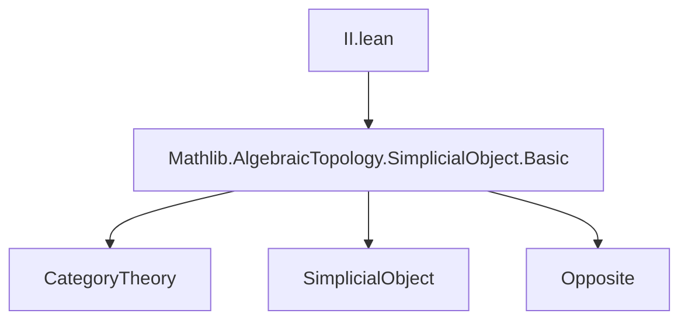

**Technical Brief: `II.lean` — Gabriel–Zisman Cosimplicial Object**

---

### 1. KEY DEFINITIONS & THEOREMS

| Name | Type / Signature | Purpose |
|------|------------------|---------|
| `finset f x` | `Finset (Fin (n + 2))` | Auxiliary finite set used to define the image of `x ∈ Fin (m+2)` under the contravariant action; contains candidates for `map' f x`. |
| `map' f x` | `Fin (n + 2)` | Minimal element of `finset f x`; defines the action of the cosimplicial object on morphisms. |
| `II.obj n` | `SimplexCategoryᵒᵖ` | Sends object `⦋n⦌` to `op ⦋n + 1⦌`. |
| `II.map f` | `II.obj m ⟶ II.obj n` in `SimplexCategoryᵒᵖ` | Opposite of `Hom.mk (map' f)`, i.e., the contravariant functorial action. |
| `II.δ i` | `II.δ i : II.obj n ⟶ II.obj (n+1)` | Image of the `i`-th face map under `II`; equals `σ i.op`. |
| `II.σ i` | `II.σ i : II.obj n ⟶ II.obj (n-1)` | Image of the `i`-th degeneracy map under `II`; equals `δ (i.succ.castSucc).op`. |
| `map'_id` | `map' OrderHom.id x = x` | Identity preservation for `map'`. |
| `map'_map'` | `map' f (map' g x) = map' (g.comp f) x` | Functoriality (contravariance) of `map'`. |
| `map'_succAboveOrderEmb` | `map' i.succAboveOrderEmb x = i.predAbove x` | Key computation linking `map'` to standard face/degeneracy combinatorics. |
| `map'_predAbove` | `map' (predAbove i) x = i.succ.castSucc.succAbove x` | Dual computation for degeneracies. |
| `monotone_map'` | `Monotone (map' f)` | Ensures `map' f` is an order homomorphism. |

---

### 2. NAMING CONVENTIONS

- **Prefix `map'`**: Used for auxiliary constructions related to the functorial action on morphisms.
- **Suffix `'`**: Denotes auxiliary or internal versions (e.g., `map'`, `finset`).
- **`II.` namespace**: All definitions and lemmas live in `SimplexCategory.II`.
- **`δ`, `σ`**: Standard notation for face and degeneracy maps in simplicial/cosimplicial contexts; here used for `II.δ`, `II.σ`.
- **`op`**: Opposite morphism; used to turn covariant `map'` into a morphism in the opposite category.

---

### 3. TACTIC STACK

- `simp` (with `at ⊢`, `only`, `←`, `-...` variants)
- `aesop`
- `obtain` / `cases` (especially `Fin.eq_castSucc_or_eq_last`, `Fin.eq_succ_of_ne_zero`)
- `rw` / `rwa`
- `by_contra!`
- `constructor` (for ↔ proofs)
- `ext : 3` (extensionality up to 3 layers, for morphism equality)
- `simpa` (with `using`, `using h`, `*` variants)
- `lt_of_lt_of_le`, `le_of_lt`, `le_refl`, etc., for order reasoning

---

### 4. PROOF LOGIC

- **Inductive decomposition on `Fin` elements**: Most proofs proceed by splitting on whether an element is `Fin.last _` or of the form `i.castSucc`.
- **Case analysis on inequalities**: E.g., `x ≤ i`, `i < x`, `j < y`, etc., often handled via `by_cases`.
- **Minimality arguments**: Use `Finset.min'_eq_iff` to translate properties of `map' f x` into logical conditions.
- **Monotonicity & order embeddings**: Leverage `OrderHom.coe_mk`, `monotone'`, and properties of `castSucc`, `castPred`, `succAbove`, `predAbove`.
- **Functoriality via computation**: `map'_map'` is proven by nested case analysis and order-theoretic reasoning; identity and composition laws follow from `map'_id` and `map'_map'`.

---

### 5. IMPORTS

- `Mathlib.AlgebraicTopology.SimplicialObject.Basic`  
  → Provides `SimplexCategory`, `CosimplicialObject`, `Opposite`, `Hom.mk`, `op`, etc.

---

### 6. THEORY OVERVIEW & DEPENDENCIES

#### **Conceptual Role**
- Constructs the **Gabriel–Zisman cosimplicial object** `II : SimplexCategory ⥤ SimplexCategoryᵒᵖ`.
- Interpreted as:  
  $T \mapsto \mathrm{Hom}_{\mathbf{Pos}}(T, \{0 < 1\})$,  
  with reverse order on hom-sets → yields a cosimplicial object.

#### **Concrete Description**
- On objects: `II.obj n = op ⦋n + 1⦌`.
- On morphisms: `II.map f = op (Hom.mk (map' f))`, where `map' f` is defined via minimal element selection in a filtered set.
- On standard generators:
  - `II.δ i = σ i.op` (faces ↦ degeneracies)
  - `II.σ i = δ (i+1).op` (degeneracies ↦ faces)

#### **Mermaid Diagrams**

##### **Dependency Graph (Module Level)**


##### **Theoretical Flow**
```mermaid
graph LR
  SimplexCategory -->|objects = [n]| Fin(n+1)
  SimplexCategory -->|morphisms = order-preserving maps| Fin(n+1) →o Fin(m+1)
  II -->|defines| CosimplicialObject SimplexCategoryᵒᵖ
  CosimplicialObject SimplexCategoryᵒᵖ -->|is| SimplexCategory ⥤ SimplexCategoryᵒᵖ
  II -->|on objects| op ⦋n+1⦌
  II -->|on morphisms| op (map' f)
```

##### **Morphism Action Summary**
```mermaid
graph LR
  f : [n] → [m] -->|II| II.map f : [m+1] → [n+1] in SimplexCategoryᵒᵖ
  II.map f = op (map' f)
  map' f : [m+2] → [n+2] in SimplexCategory
```

---

### 7. KEY LEMMAS (Summary)

| Lemma | Role |
|-------|------|
| `map'_eq_last_iff`, `map'_eq_castSucc_iff` | Characterize when `map' f x` is last or successor. |
| `map'_id`, `map'_map'` | Ensure `map'` defines a contravariant functor. |
| `map'_succAboveOrderEmb`, `map'_predAbove` | Compute `II` on face/degeneracy generators — crucial for verifying cosimplicial identities. |
| `monotone_map'` | Guarantees `map' f` is an order homomorphism. |

---

### 8. RELATION TO CLASSICAL THEORY

- Appears in *Calculus of fractions and homotopy theory*, Gabriel–Zisman (1967), Ch. III, §1.1.
- Used to construct **barycentric subdivision** and **realization functors**.
- In modern terms, `II` is the **dualizing object** for the simplex category: it implements the contravariant involution swapping faces and degeneracies.

--- 

Let me know if you'd like a formalization of the cosimplicial identities for `II`, or a comparison with the standard `Δ → Δᵒᵖ` duality via `(-) →o [1]`.
