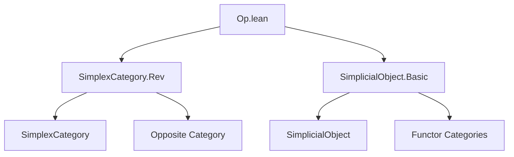

**Technical Brief: `Op.lean` — Covariant Involution on Simplicial Objects**

---

### 1. **Key Definitions & Theorems**

| Name | Type | Purpose |
|------|------|---------|
| `opFunctor` | `SimplicialObject C ⥤ SimplicialObject C` | Defines the covariant involution on simplicial objects induced by `SimplexCategory.rev`. |
| `opObjIso` | `(opFunctor.obj X).obj n ≅ X.obj n` | Provides the identity isomorphism between the underlying components of `opFunctor.obj X` and `X`. |
| `opFunctor_map_app` | `∀ f n, (opFunctor.map f).app n = opObjIso.hom ≫ f.app n ≫ opObjIso.inv` | Describes how `opFunctor` acts on morphisms (natural transformations). |
| `opFunctor_obj_map` | `∀ X f, (opFunctor.obj X).map f = opObjIso.hom ≫ X.map (SimplexCategory.rev.map f.unop).op ≫ opObjIso.inv` | Describes the action of `opFunctor.obj X` on morphisms in the simplex category. |
| `opFunctor_obj_δ`, `opFunctor_obj_σ` | `∀ X i, (opFunctor.obj X).δ i = …`, `∀ X i, (opFunctor.obj X).σ i = …` | Explicitly describe how degeneracy and face maps are twisted by `rev`. |
| `opFunctorCompOpFunctorIso` | `opFunctor ⋙ opFunctor ≅ 𝟭 _` | Shows that applying `opFunctor` twice is naturally isomorphic to the identity — i.e., it's an *involution*. |
| `opEquivalence` | `SimplicialObject C ≌ SimplicialObject C` | Packages `opFunctor` as an equivalence of categories (in fact, an autoequivalence with inverse also `opFunctor`). |

---

### 2. **Naming Conventions**

- **Prefixes**:
  - `opFunctor_`: for constructions related to the involution.
  - `opObjIso`: for the canonical isomorphism between components before/after applying `opFunctor`.
- **Suffixes**:
  - `_iso`: for isomorphisms (`opFunctorCompOpFunctorIso`).
  - `_app_app`: for components of natural isomorphisms between functors (i.e., 2-cells in `Cat`).
- **`rev`**: used for the involution on `SimplexCategory`, and its action on indices (`i.rev`).

---

### 3. **Tactic Stack**

- `simp`: heavily used, especially with lemmas tagged `@[simp]`.
- `simp [opFunctor, opObjIso]`: standard pattern for simplifying definitions.
- `rw`, `apply`, `exact`: implicit in `simp` usage.
- `≈` / `≪≫`: used for composition of isomorphisms (via `Iso.comp` or `Iso.trans`).
- No heavy automation like `aesop`, `ring`, or `linarith` — the proofs are mostly definitional or rely on `simp`-based simplification.

---

### 4. **Proof Logic**

- **Definitional reasoning**: Most lemmas are proved by unfolding definitions (`opFunctor`, `opObjIso`, etc.) and simplifying.
- **Functorial calculus**: Use of `Functor.whiskeringLeft`, `Functor.op`, and `Functor.mapIso` to construct natural isomorphisms.
- **Index reversal**: The key idea is that `rev : SimplexCategory ⥤ SimplexCategory` sends `n ↦ n` and reverses order of morphisms (e.g., `δ i ↦ δ i.rev`), and `opFunctor` lifts this to simplicial objects via precomposition and opposite.
- **Involution property**: Proven by chaining standard functorial isomorphisms (`whiskeringLeftObjCompIso`, `whiskeringLeftObjIdIso`) with the known involution `SimplexCategory.revCompRevIso`.

---

### 5. **Imports**

| Import | Role |
|--------|------|
| `Mathlib.AlgebraicTopology.SimplexCategory.Rev` | Provides `SimplexCategory.rev`, its properties, and `revCompRevIso`. |
| `Mathlib.AlgebraicTopology.SimplicialObject.Basic` | Defines `SimplicialObject`, its morphisms, face/degeneracy maps (`δ`, `σ`), and basic constructions. |

---

### 6. **Mermaid Diagrams**

#### **Dependency Graph (Module Level)**



#### **Conceptual Overview of `opFunctor` Construction**

```mermaid
graph LR
  A[SimplexCategory] -- rev --> A
  A -- op --> Aᵒᵖ
  Aᵒᵖ -- precompose --> SimplicialObject C
  subgraph Construction
    rev[rev : SimplexCategory ⥤ SimplexCategory]
    op[(-).op : SimplexCategory ⥤ SimplexCategoryᵒᵖ]
    pre[Precomposition with rev.op]
  end
  pre --> opFunctor
  opFunctor --> SimplicialObject C
```

#### **Involution Structure**

```mermaid
graph LR
  SimplicialObject C -- opFunctor --> SimplicialObject C
  SimplicialObject C -- opFunctor --> SimplicialObject C
  SimplicialObject C -- 𝟭 --> SimplicialObject C
  opFunctor .->|opFunctorCompOpFunctorIso| 𝟭
```

---

### 7. **Summary**

This file formalizes the *covariant involution* on simplicial objects induced by the reversal involution on the simplex category. It constructs a functor `opFunctor`, shows how it acts on objects, morphisms, face, and degeneracy maps, and proves it is an involution up to natural isomorphism — hence an autoequivalence of the category of simplicial objects. The proofs are largely definitional, leveraging Lean’s `simp`-based simplification and standard categorical constructions (whiskering, opposite functors, natural isomorphisms).
