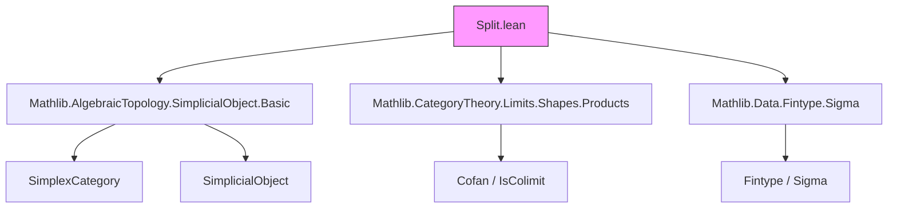
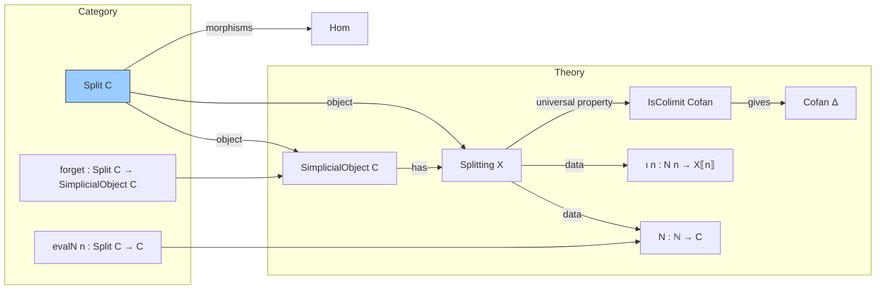

### Technical Brief: `Split.lean` — Split Simplicial Objects in Lean 4

---

#### **1. Key Definitions & Theorems**

| Name | Type / Structure | Purpose |
|------|------------------|---------|
| `IndexSet Δ` | `Σ Δ' : SimplexCategoryᵒᵖ, { α : Δ.unop ⟶ Δ'.unop // Epi α }` | Indexes the “nondegenerate” simplices contributing to `X.obj Δ` via epimorphisms. |
| `IndexSet.mk f` | `IndexSet (op Δ)` for `f : Δ ⟶ Δ'` epi | Constructs an index from an epi in `SimplexCategory`. |
| `IndexSet.id Δ` | `IndexSet Δ` | Distinguished index corresponding to identity morphism. |
| `IndexSet.epiComp A p` | `IndexSet Δ₂` | Pushes an index `A : IndexSet Δ₁` along an epi `p : Δ₁ ⟶ Δ₂`. |
| `IndexSet.pull A θ` | `IndexSet Δ'` | Pulls an index along a morphism `θ : Δ ⟶ Δ'` using epi-mono factorization. |
| `Splitting.IndexSet.Fintype` | `Fintype (IndexSet Δ)` | Proves finiteness of index set (key for coproducts). |
| `Splitting.summand A` | `C` | For `N : ℕ → C`, gives `N i` where `i = A.1.unop.len`. |
| `Splitting.cofan' N X φ Δ` | `Cofan (summand N Δ)` | Canonical cofan from `N` and `φ : N n ⟶ X _⦋n⦌`. |
| `Splitting N ι` | `Structure` | A splitting of `X : SimplicialObject C`: data `N`, `ι`, and colimit condition. |
| `Splitting.isColimit Δ` | `IsColimit (s.cofan Δ)` | The universal property of the coproduct decomposition. |
| `Splitting.φ f n` | `s.N n ⟶ Y _⦋n⦌` | Component of a morphism `f : X ⟶ Y` on nondegenerate simplices. |
| `Splitting.desc Δ F` | `X.obj Δ ⟶ Z` | Mediating morphism from coproduct decomposition. |
| `Splitting.ofIso e` | `Splitting Y` | Transfer splitting along isomorphism. |
| `Splitting.cofan_inj_epi_naturality` | naturality of cofan injections along epi pushforward | Ensures coherence of decomposition under morphisms. |
| `Splitting.hom_ext'` / `hom_ext` | `f = g` under equality on summands | Uniqueness of morphisms from splitting data. |
| `Split C` | `Structure` | Category of split simplicial objects: `⟨X, s : Splitting X⟩`. |
| `Split.Hom` | `Structure` | Morphism in `Split C`: `F : X ⟶ Y` + `f : N₁ n ⟶ N₂ n` compatible with `ι`. |
| `Split.Hom.ext` | `Φ₁ = Φ₂` under equality on `f n` | Extensionality for morphisms in `Split C`. |
| `Split.forget C` | `Split C ⥤ SimplicialObject C` | Forgetful functor. |
| `Split.evalN n` | `Split C ⥤ C` | Evaluates at `n`-th nondegenerate simplex. |
| `Split.natTransCofanInj A` | `evalN A.1.unop.len ⟶ forget ⋙ eval Δ` | Natural transformation encoding inclusion of summands. |

---

#### **2. Naming Conventions**

- **Prefixes**:
  - `isColimit`: indicates colimit data (e.g., `isColimit'`, `isColimit`).
  - `cofan`: for cofans (e.g., `cofan'`, `cofan`, `cofan_inj_eq`).
  - `φ`: for morphism components on nondegenerate simplices (`φ f n`).
  - `desc`: for universal morphisms (`desc Δ F`).
  - `epiComp`, `pull`: operations on `IndexSet`.
  - `natTrans`: for natural transformations (`natTransCofanInj`).

- **Suffixes**:
  - `'` (prime): often denotes a more general or auxiliary version (`cofan'` vs `cofan`).
  - `ext`: extensionality lemmas (`hom_ext`, `Hom.ext`).
  - `naturality`: naturality squares (`cofan_inj_epi_naturality`, `cofan_inj_naturality_symm`).
  - `id`, `mk`: constructors or distinguished elements (`id`, `mk`).

- **Structure fields**:
  - `N`, `ι`, `isColimit'`: core data of a splitting.
  - `F`, `f`, `comm`: data of a morphism in `Split C`.

---

#### **3. Tactic Stack**

Frequently used tactics in proofs:

| Tactic | Role |
|--------|------|
| `simp` / `simp only` | Simplification using `@[simp]` lemmas (e.g., `cofan_inj_eq`, `ι_desc`). |
| `rw` / `rw [assoc]` | Rewriting using naturality, associativity, or definitional equalities. |
| `induction ... using SimplexCategory.rec` | Structural induction on `SimplexCategory` (used in `hom_ext`). |
| `ext` / `ext1` | Extensionality for morphisms or objects. |
| `subst` | Substituting equalities after `rcases` or `have`. |
| `apply Cofan.IsColimit.desc` / `fac` / `hom_ext` | Leveraging colimit universal properties. |
| `cat_disch` | In `comm` fields to discharge category-theoretic goals. |
| `exact`, `infer_instance`, `epi_comp` | Handling `Epi` instances and composition. |
| `rw [← X.map_comp]`, `rw [X.map_comp]` | Manipulating simplicial object maps. |

---

#### **4. Proof Logic**

- **Structure of proofs**:
  - **Induction on dimension**: e.g., `hom_ext` uses `SimplexCategory.rec` (induction on `n` for `Δ = [n]`).
  - **Colimit universal property**: Most key lemmas (`desc`, `hom_ext'`, `cofan_inj_epi_naturality`) rely on `IsColimit` data.
  - **Factorization**: `pull` uses epi-mono factorization in `SimplexCategory`.
  - **Uniqueness via colimit**: Morphism extensionality (`hom_ext`, `Hom.ext`) reduces to equality on summands.
  - **Naturality checks**: Verified by unfolding definitions and applying naturality of `X.map` or `ι`.

- **Common pattern**:
  ```lean
  apply Cofan.IsColimit.hom_ext _ _ _
  intro A
  -- reduce to equality on each summand A
  simp [cofan_inj_eq, ...]
  ```

---

#### **5. Imports & Dependencies**

| Import | Purpose |
|--------|---------|
| `Mathlib.AlgebraicTopology.SimplicialObject.Basic` | Core simplicial object definitions (`SimplicialObject`, `SimplexCategory`, `obj`, `map`, etc.). |
| `Mathlib.CategoryTheory.Limits.Shapes.Products` | Used for coproducts (via `Cofan`, `IsColimit`). |
| `Mathlib.Data.Fintype.Sigma` | To prove `IndexSet Δ` is finite (`Fintype`). |

**Key dependencies**:
- `SimplexCategory`, `SimplexCategoryᵒᵖ`, `op`, `unop`
- `Epi`, `Mono`, `factorThruImage`, `image.ι`
- `Cofan`, `IsColimit`, `Cofan.IsColimit.desc`, `fac`, `hom_ext`
- `evaluation`, `forget`, `natTrans`, `comp`, `Hom`

---

#### **6. Mermaid Diagrams**

##### **Dependency Graph (Module Level)**



##### **Theoretical Overview (Split Simplicial Objects)**



##### **Morphism Compatibility in `Split C`**

```mermaid
graph LR
  S1[S₁ : Split C] -->|ι₁ n| X1⟦n⟧
  S2[S₂ : Split C] -->|ι₂ n| X2⟦n⟧
  S1 -->|Φ : S₁ → S₂| S2
  X1⟦n⟧ -->|Φ.F.app (op ⟦n⟧)| X2⟦n⟧
  N₁ n -->|Φ.f n| N₂ n
  N₁ n -->|ι₁ n| X1⟦n⟧
  N₂ n -->|ι₂ n| X2⟦n⟧

  N₁ n -- Φ.f n --> N₂ n
  N₁ n -- ι₁ n --> X1⟦n⟧
  N₂ n -- ι₂ n --> X2⟦n⟧
  X1⟦n⟧ -- Φ.F.app ⟦n⟧ --> X2⟦n⟧

  %% naturality square
  N₁ n -- ι₁ n --> X1⟦n⟧
  N₁ n -- Φ.f n --> N₂ n
  N₂ n -- ι₂ n --> X2⟦n⟧
  X1⟦n⟧ -- Φ.F.app ⟦n⟧ --> X2⟦n⟧

  N₁ n -> X1⟦n⟧
  N₁ n -> N₂ n
  N₂ n -> X2⟦n⟧
  X1⟦n⟧ -> X2⟦n⟧

  %% commutativity
  N₁ n -- ι₁ n --> X1⟦n⟧
  N₁ n -- Φ.f n --> N₂ n
  N₂ n -- ι₂ n --> X2⟦n⟧
  X1⟦n⟧ -- Φ.F.app ⟦n⟧ --> X2⟦n⟧

  N₁ n -> X1⟦n⟧
  N₁ n -> N₂ n
  N₂ n -> X2⟦n⟧
  X1⟦n⟧ -> X2⟦n⟧

  %% square
  square[N₁ n & N₂ n \cr X1⟦n⟧ & X2⟦n⟧]
  square.north Φ.f n
  square.south Φ.F.app ⟦n⟧
  square.west ι₁ n
  square.east ι₂ n
```

---

#### **7. Summary**

This file formalizes the theory of **split simplicial objects** in a category `C` with finite coproducts. A splitting decomposes each simplicial object `X` as a coproduct over “nondegenerate” simplices indexed by epimorphisms in the simplex category. The key insight is that such a decomposition is **universal**, making morphisms uniquely determined by their action on nondegenerate simplices.

The formalization:
- Defines `IndexSet Δ` to index summands,
- Constructs `Splitting X` as a structure with colimit data,
- Builds the category `Split C`,
- Proves essential properties: extensionality, naturality, compatibility with isomorphisms.

It serves as a foundational tool for homotopical algebra and simplicial homotopy theory in Lean, especially for constructing resolutions or proving representability.

--- 

Let me know if you'd like a formalized summary in `lean` comment style or a high-level theorem catalog.
