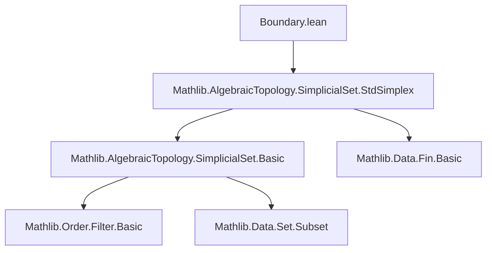

**Technical Brief: `Boundary.lean`**

---

### 1. KEY DEFINITIONS & THEOREMS

| Name | Type / Signature | Purpose |
|------|------------------|---------|
| `boundary` | `def boundary (n : ℕ) : (Δ[n] : SSet.{u}).Subcomplex` | Defines the *boundary subcomplex* of the standard $n$-simplex $\Delta[n]$, consisting of simplices that are *not surjective* as order-preserving maps. |
| `∂Δ[n]` | `notation3 "∂Δ[" n "]"` | Scoped notation for `boundary n`, introduced via `open Simplicial`. |
| `boundary_eq_iSup` | `lemma boundary_eq_iSup (n : ℕ) : boundary n = ⨆ (i : Fin (n + 1)), stdSimplex.face {i}ᶜ` | Shows that the boundary is the *supremum (join)* of all codimension-1 faces (i.e., the union of all faces missing one vertex). |

---

### 2. NAMING CONVENTIONS

- **Prefixes**:
  - `boundary_`: for definitions/lemmas about the boundary operator.
  - `stdSimplex.`: for standard simplex constructions (e.g., `stdSimplex.asOrderHom`, `stdSimplex.face`).
- **Suffixes**:
  - `_eq_iSup`: indicates an equality with a supremum (join) over a family.
- **Notation**:
  - `∂Δ[n]` uses TeX-style boundary notation, consistent with algebraic topology conventions.

---

### 3. TACTIC STACK

- `ext`: extensionality for subcomplexes (i.e., pointwise equality on objects and morphisms).
- `simp [stdSimplex.face_obj, boundary, Function.Surjective]`: simplification using definitions and properties of surjectivity.
- `tauto`: automated tautology solver for logical equivalences involving quantifiers and negations.

No heavy automation (e.g., `aesop`, `ring`, `linarith`) is used—proofs are mostly definitional.

---

### 4. PROOF LOGIC

- **Structure of `boundary_eq_iSup`**:
  1. Apply `ext` to reduce to showing equality on each object (i.e., for each $m$, compare $m$-simplices).
  2. Unfold definitions (`boundary`, `stdSimplex.face`, `iSup`).
  3. Simplify using `simp` with relevant lemmas.
  4. Use `tauto` to resolve the logical equivalence:
     $$
     \neg (\text{surjective } f) \iff \exists i,\, i \notin \operatorname{range}(f)
     \iff f \text{ factors through some face } \widehat{i}.
     $$

- **General proof style**: definitional + logical reasoning; no induction or case analysis needed due to clean categorical description.

---

### 5. IMPORTS & DEPENDENCIES

- **Primary import**:
  ```lean
  import Mathlib.AlgebraicTopology.SimplicialSet.StdSimplex
  ```
  Provides:
  - `Δ[n]`: standard simplex as a simplicial set.
  - `stdSimplex`: the representable functor $\hom(-, [n])$, with its action on monotone maps.
  - `stdSimplex.face`: face maps (codimension-1 inclusions).
  - `SSet.Subcomplex`: subcomplexes of a simplicial set.

- **Implicit dependencies**:
  - `Mathlib.AlgebraicTopology.SimplicialSet.Basic`: for `SSet`, `Subcomplex`, `iSup`, etc.
  - `Mathlib.Order.Filter.Basic`: for `setOf`, `iSup`, etc.
  - `Mathlib.Data.Fin.Basic`: for `Fin n`, `Fin (n+1)`.

---

### 6. MERMAID DIAGRAMS

#### Dependency Graph (Module-Level)



#### Overview of `boundary` Construction

```mermaid
graph LR
  A[Δ[n]] -->|Subcomplex| B[∂Δ[n]]
  B -->|obj m| C[{ s : Δ[n]_m | ¬surj(s) }]
  C -->|equivalently| D[⋃_{i:Fin(n+1)} im(face_i)]
  D -->|face_i| E[Δ[n-1] ↪ Δ[n]]
```

#### Logical Equivalence in `boundary_eq_iSup`

```mermaid
graph LR
  A[¬surj(f: [m]→[n])] -->|iff| B[∃i, i ∉ range(f)]
  B -->|iff| C[f factors through face_i^c: [n]\{i}]
  C -->|iff| D[f ∈ im(face_i)]
  D -->|join| E[⋁_i im(face_i) = ∂Δ[n]]
```

---

### 7. FUTURE WORK (from docstring)

- API for horns $\Lambda^k[n]$ and more general subcomplexes.
- Construction of maps $\Delta[n] \to \partial\Delta[n]$ from non-surjective order maps $[n] \to [n]$.
- Universal properties of boundaries (e.g., pushout squares defining horns).

---

### 8. SUMMARY

This file formalizes the *boundary* of the standard simplex in the category of simplicial sets, using a *subcomplex* definition based on non-surjectivity of representing order-preserving maps. It establishes the key equivalence with the join of codimension-1 faces, laying groundwork for homotopical constructions (e.g., horns, Kan conditions). The formalization is clean, definitional, and aligned with standard homological algebra conventions.
