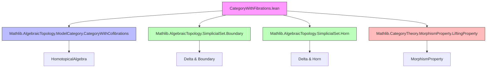
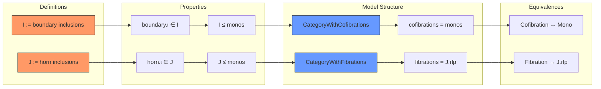

**Technical Brief: `CategoryWithFibrations.lean` (SSet Quillen Model Structure)**

---

### 1. KEY DEFINITIONS & THEOREMS

| Name | Type / Signature | Purpose |
|------|------------------|---------|
| `I` | `MorphismProperty SSet.{u}` | Generating cofibrations: family of boundary inclusions `∂Δ[n].ι : ∂Δ[n] ⟶ Δ[n]` |
| `J` | `MorphismProperty SSet.{u}` | Generating trivial cofibrations: family of horn inclusions `Λ[n+1,i].ι : Λ[n+1,i] ⟶ Δ[n]` for `i : Fin (n+2)` |
| `boundary_ι_mem_I` | `I (∂Δ[n].ι)` | Witness that boundary inclusions belong to `I` |
| `horn_ι_mem_J` | `J (Λ[n+1,i].ι)` | Witness that horn inclusions belong to `J` |
| `I_le_monomorphisms` | `I ≤ monomorphisms _` | Every generating cofibration is a monomorphism |
| `J_le_monomorphisms` | `J ≤ monomorphisms _` | Every generating trivial cofibration is a monomorphism |
| `instance : CategoryWithCofibrations SSet` | `cofibrations := monomorphisms _` | Defines cofibrations in Quillen’s model structure on `SSet` |
| `instance : CategoryWithFibrations SSet` | `fibrations := J.rlp` | Defines fibrations as those with right lifting w.r.t. horn inclusions |
| `cofibrations_eq` | `cofibrations SSet = monomorphisms _` | Equality of defined and expected cofibrations |
| `fibrations_eq` | `fibrations SSet = J.rlp` | Equality of defined and expected fibrations |
| `cofibration_iff` | `Cofibration f ↔ Mono f` | Characterization of cofibrations as monomorphisms |
| `fibration_iff` | `Fibration f ↔ J.rlp f` | Characterization of fibrations via lifting property |
| `mono_of_cofibration` | `[Cofibration f] ⇒ Mono f` | Immediate consequence of `cofibration_iff`; used as instance |
| `cofibration_of_mono` | `[Mono f] ⇒ Cofibration f` | Converse of above; used to upgrade monos to cofibrations |
| `instance [Fibration f]` | `HasLiftingProperty (Λ[n+1,i].ι) f` | Fibrations have lifts against all horn inclusions |

---

### 2. NAMING CONVENTIONS

- **Prefixes**:
  - `boundary_`, `horn_`: refer to simplicial boundary/horn objects.
  - `ι` suffix (e.g., `boundary.ι`, `horn.ι`): standard notation for inclusion maps.
  - `mem_`: e.g., `boundary_ι_mem_I`, `horn_ι_mem_J` — asserts membership in a generating class.
  - `le_`: e.g., `I_le_monomorphisms`, `J_le_monomorphisms` — subset relations between morphism properties.
  - `cofibration_`, `fibration_`: e.g., `cofibration_iff`, `fibration_iff`, `cofibration_of_mono`.
  - `of_`: e.g., `cofibration_of_mono`, `mono_of_cofibration` — direction of implication.

- **Suffixes**:
  - `_iff`: equivalence statements.
  - `_eq`: definitional equalities.
  - `_mem_`: membership in a class.

---

### 3. TACTIC STACK

- `rw`: rewriting using equalities/lemmas (`cofibration_iff`, `fibration_iff`, etc.)
- `rwa`: `rw` + `assumption` (used in `mono_of_cofibration`, `cofibration_of_mono`)
- `intro` / `rintro`: for destructuring hypotheses (e.g., `intro _ _ _ ⟨n⟩`)
- `simp only [...]`: simplification with precise lemmas (e.g., in `horn_ι_mem_J`)
- `exact`: direct proof term injection
- `constructor`: for proving conjunctions or class instances (e.g., in `boundary_ι_mem_I`)
- `rwa [← ...]`: rewriting backwards to match assumptions

No heavy automation (`aesop`, `linarith`, `tauto`) is used — proofs are mostly direct and rely on definitional reasoning.

---

### 4. PROOF LOGIC

- **Structure**: The file establishes the *Quillen model structure* on simplicial sets (`SSet`) by:
  1. Defining generating classes `I` (cofibrations) and `J` (trivial cofibrations).
  2. Proving they consist of monomorphisms (`I_le_monomorphisms`, `J_le_monomorphisms`).
  3. Defining `CategoryWithCofibrations` and `CategoryWithFibrations` instances via `monomorphisms` and `J.rlp`.
  4. Proving equivalences (`cofibration_iff`, `fibration_iff`) to connect abstract notions with concrete ones.
  5. Deriving lifting properties as corollaries.

- **Logical Flow**:
  - Use `MorphismProperty.ofHoms` and `iSup` to build `I` and `J`.
  - Use `rlp` (right lifting property) to define fibrations.
  - Leverage `HomotopicalAlgebra` module’s lemmas (`cofibration_iff`, `fibration_iff`) to bridge definitions.
  - Prove lifting existence for fibrations using `HasLiftingProperty` and `horn_ι_mem_J`.

- **No induction** or recursion on `n` beyond indexing families; proofs are mostly *definition unfolding* + *typeclass resolution*.

---

### 5. IMPORTS & DEPENDENCIES

| Module | Role |
|--------|------|
| `Mathlib.AlgebraicTopology.ModelCategory.CategoryWithCofibrations` | Provides `CategoryWithCofibrations`, `Cofibration`, `cofibration_iff` |
| `Mathlib.AlgebraicTopology.SimplicialSet.Boundary` | Defines `∂Δ[n]`, `boundary.ι` |
| `Mathlib.AlgebraicTopology.SimplicialSet.Horn` | Defines `Λ[n,i]`, `horn.ι` |
| `Mathlib.CategoryTheory.MorphismProperty.LiftingProperty` | Provides `HasLiftingProperty`, `rlp`, `MorphismProperty` machinery |

**Core dependencies**: `CategoryTheory`, `SimplicialSet`, `ModelCategory`, `MorphismProperty`.

---

### 6. MERMAID DIAGRAMS

#### Dependency Graph (Top-Level)

#### Overview of File Structure

---

### 7. DESIGN NOTES

- **Why use `[Mono f]` instead of `[Cofibration f]`?**  
  Because `mono_of_cofibration` is an *instance*, while `cofibration_of_mono` is only a *lemma*. Using `[Mono f]` avoids unnecessary typeclass search overhead and aligns with Lean’s preference for structural properties over derived ones.

- **TODO**: The comment `(TODO)` next to `CategoryWithCofibrations` and `CategoryWithFibrations` suggests that full model category axioms (e.g., factorization, 2-out-of-3) are not yet proven here.

- **Universe polymorphism**: All constructions are universe-polymorphic (`u`), consistent with Mathlib’s conventions.

--- 

Let me know if you'd like a formalization roadmap for completing the Quillen model structure (e.g., factorization, weak equivalences).
