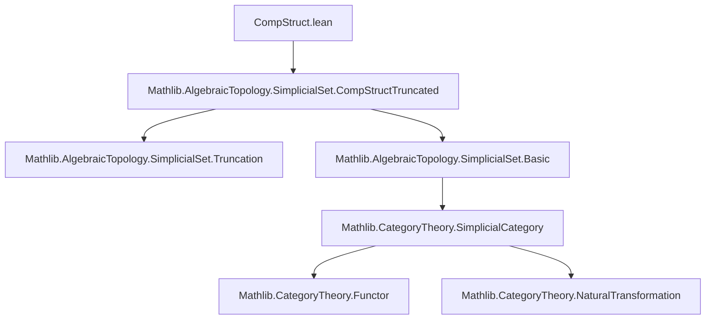
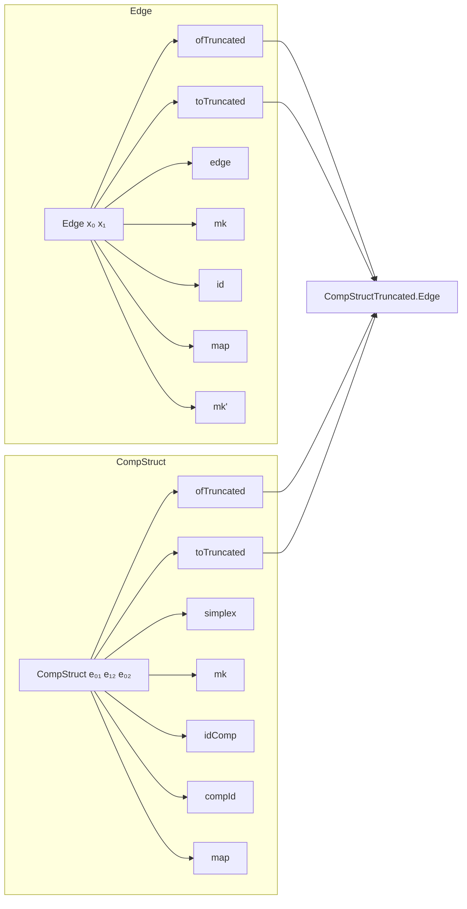

### Technical Brief: `CompStruct.lean`

---

#### **1. Key Definitions & Theorems**

| Name | Type | Purpose |
|------|------|---------|
| `Edge x₀ x₁` | `Type u` | Type of 1-simplices in `X` with source `x₀` and target `x₁`. Defined via 2-truncation for definitional convenience. |
| `Edge.ofTruncated e` | `Edge x₀ x₁` | Constructor lifting a 2-truncated edge `e` to `Edge`. |
| `Edge.toTruncated e` | `((truncation 2).obj X).Edge x₀ x₁` | Projection from `Edge` to its 2-truncated counterpart. |
| `Edge.edge e` | `X _⦋1⦌` | Underlying 1-simplex of an edge. |
| `Edge.mk edge src_eq tgt_eq` | `Edge x₀ x₁` | Constructor for edges given a 1-simplex and proofs of its faces. |
| `Edge.id x₀` | `Edge x₀ x₀` | Identity edge (degenerate 1-simplex at `x₀`). |
| `Edge.map e f` | `Edge (f.app _ x₀) (f.app _ x₁)` | Functorial action on edges. |
| `Edge.mk' s` | `Edge (X.δ 1 s) (X.δ 0 s)` | Edge induced by an arbitrary 1-simplex `s`. |
| `CompStruct e₀₁ e₁₂ e₀₂` | `Type u` | Data of a 2-simplex in `X` whose faces are `e₀₁`, `e₁₂`, `e₀₂` (in order `d₂`, `d₀`, `d₁`). Used to encode composition relations in homotopy category. |
| `CompStruct.ofTruncated h` | `CompStruct e₀₁ e₁₂ e₀₂` | Constructor from 2-truncated version. |
| `CompStruct.toTruncated h` | `Truncated.Edge.CompStruct ...` | Projection to 2-truncated version. |
| `CompStruct.simplex h` | `X _⦋2⦌` | Underlying 2-simplex of a composition structure. |
| `CompStruct.mk simplex d₂ d₀ d₁` | `CompStruct e₀₁ e₁₂ e₀₂` | Constructor given a 2-simplex and face equalities. |
| `CompStruct.idComp e` | `CompStruct (.id x₀) e e` | Structure witnessing that `e` composes with identity on left. |
| `CompStruct.compId e` | `CompStruct e (.id x₁) e` | Structure witnessing that `e` composes with identity on right. |
| `CompStruct.map h f` | `CompStruct (e₀₁.map f) (e₁₂.map f) (e₀₂.map f)` | Functoriality of composition structures. |

**Key lemmas**:
- `ofTruncated_edge`, `toTruncated_edge`: Compatibility of `edge` with constructors.
- `src_eq`, `tgt_eq`: Faces of an edge.
- `ext` lemmas for both `Edge` and `CompStruct`: Extensionality via underlying simplex.
- `map_id`, `map_simplex`: Functoriality.
- `idComp_simplex`, `compId_simplex`: Degeneracy descriptions.

---

#### **2. Naming Conventions**

- **Prefixes**:
  - `ofTruncated`: Lift from 2-truncated version.
  - `toTruncated`: Project to 2-truncated version.
  - `mk`, `mk'`: Constructors (explicit vs. implicit face proofs).
  - `id`, `idComp`, `compId`: Identity and unit laws.
  - `map`: Action of morphisms.

- **Suffixes**:
  - `_edge`, `_simplex`: Projection to underlying simplex data.
  - `_eq`: Equality proofs for faces (used in `mk` arguments).

- **Variables**:
  - `e`, `e₀₁`, `e₁₂`, `e₀₂`: Edges.
  - `h`: Composition structure.
  - `s`, `simplex`: 1- or 2-simplices.

---

#### **3. Tactic Stack**

- `rfl`: Used heavily for definitional equalities (especially with `ofTruncated`, `toTruncated`, `mk`, etc.).
- `cat_disch`: Used to discharge definitional face equalities in `mk` arguments.
- `simp_rw` / `simp`: Implicitly used via `@[simp]` attributes.
- `ext`: Extensionality lemmas applied via `ext` tactic or `apply ext`.
- `apply Truncated.*`: Many proofs defer to truncated analogues.

No heavy automation (e.g., `aesop`, `ring`, `linarith`) is used—proofs are mostly definitional or rely on properties of truncation.

---

#### **4. Proof Logic**

- **Definitional equality is central**: Most constructions are defined via `ofTruncated` to reuse the 2-truncated API.
- **Lemmas are mostly definitional**: Proofs of `@[simp]` lemmas are `rfl`, or follow from `Truncated.*` lemmas.
- **Extensionality**: Both `Edge.ext` and `CompStruct.ext` reduce to equality of underlying simplices.
- **Functoriality**: Proved by lifting to 2-truncation, applying `map`, then projecting back.
- **Existence lemmas**: `exists_of_simplex` for edges/compstructs are lifted from truncated versions.

Typical proof pattern:
```lean
apply Truncated.Edge.*.lemma
-- or
rw [ofTruncated_edge, ...]; rfl
```

---

#### **5. Imports**

- `Mathlib.AlgebraicTopology.SimplicialSet.CompStructTruncated`: Core truncated definitions (edges, composition structures in `2`-truncated simplicial sets).
- `Mathlib.AlgebraicTopology.SimplicialSet` (via `open Simplicial`): Basic simplicial set operations (`δ`, `σ`, `obj`, `map`, `app`).
- `Mathlib.CategoryTheory` (via `open CategoryTheory`): For `SSet`, morphisms, truncation functor.

---

#### **8. Mermaid Diagrams**

##### **Dependency Graph**



##### **Overview of File Structure**



##### **Conceptual Flow**

- **Edges** are defined as 1-simplices with fixed endpoints, *via* 2-truncation.
- **Composition structures** (`CompStruct`) encode 2-simplices witnessing that `e₀₁ ⋆ e₁₂ = e₀₂` up to homotopy.
- These structures are designed to be *definitionally equal* to their truncated counterparts, enabling reuse of `CompStructTruncated` lemmas.
- The API supports:
  - Construction from raw simplices (`mk`, `mk'`, `CompStruct.mk`)
  - Functoriality (`map`)
  - Unit laws (`idComp`, `compId`)
  - Extensionality (`ext`)
  - Existence from any simplex (`exists_of_simplex`)

This forms the foundational API for defining the **homotopy category** of a simplicial set (via edges as morphisms, `CompStruct` as composition witnesses).

--- 

Let me know if you'd like a formalized dependency graph in `leanpkg` format or a comparison with the truncated version.
