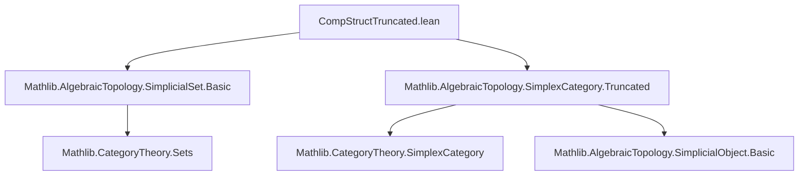
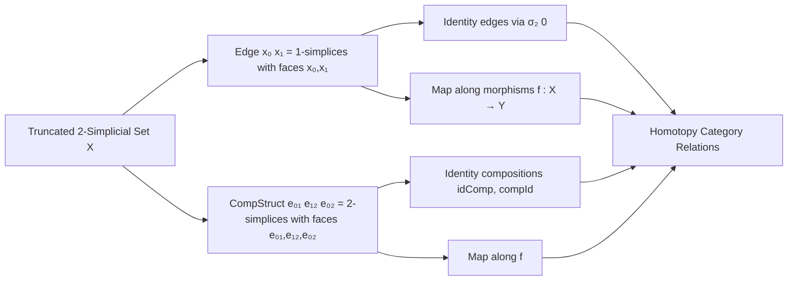

Here is the structured technical brief extracted from `CompStructTruncated.lean`:

---

### **1. Key Definitions & Theorems**

| Name | Type / Structure | Purpose |
|------|------------------|---------|
| `Edge` | `structure` | Represents a 1-simplex in a `2`-truncated simplicial set with specified source and target 0-simplices. |
| `Edge.mk'` | `s : X _⦋1⦌₂ → Edge (X.map (δ₂ 1).op s) (X.map (δ₂ 0).op s)` | Constructs an edge from an arbitrary 1-simplex. |
| `Edge.id` | `x : X _⦋0⦌₂ → Edge x x` | Constant edge at a vertex, induced by degeneracy map `σ₂ 0`. |
| `Edge.map` | `e : Edge x₀ x₁ → (f : X ⟶ Y) → Edge (f.app _ x₀) (f.app _ x₁)` | Functorial action on edges. |
| `Edge.exists_of_simplex` | `∃ (x₀ x₁ e), e.edge = s` | Every 1-simplex arises as the edge of some `Edge`. |
| `CompStruct` | `structure` | Records a 2-simplex whose three 1-faces match given edges `e₀₁`, `e₁₂`, `e₀₂`. |
| `CompStruct.idComp` | `e : Edge x y → CompStruct (.id x) e e` | Witness that `e` composes with identity on left. |
| `CompStruct.compId` | `e : Edge x y → CompStruct e (.id y) e` | Witness that `e` composes with identity on right. |
| `CompStruct.idCompId` | `x : X _⦋0⦌₂ → CompStruct (.id x) (.id x) (.id x)` | Identity edge composes with itself. |
| `CompStruct.map` | `h : CompStruct e₀₁ e₁₂ e₀₂ → (f : X ⟶ Y) → CompStruct (e₀₁.map f) (e₁₂.map f) (e₀₂.map f)` | Functorial action on composition structures. |
| `CompStruct.exists_of_simplex` | `∃ (x₀ x₁ x₂ e₀₁ e₁₂ e₀₂ h), h.simplex = s` | Every 2-simplex gives rise to a `CompStruct`. |

---

### **2. Naming Conventions**

- **Prefixes**:
  - `Edge.`: for edge-related definitions (`Edge.mk'`, `Edge.id`, `Edge.map`).
  - `CompStruct.`: for composition structure definitions (`CompStruct.idComp`, `CompStruct.map`).
- **Suffixes**:
  - `_eq`: for equality proofs in structures (`src_eq`, `tgt_eq`, `d₀`, `d₁`, `d₂`).
  - `map`: for functorial actions (`Edge.map`, `CompStruct.map`).
  - `idComp`, `compId`, `idCompId`: indicate left/right identity composition and self-composition.

---

### **3. Tactic Stack**

Frequently used tactics in proofs:
- `simp`: heavily used to simplify using `@[simp]` lemmas (`src_eq`, `tgt_eq`, `d₀`, `d₁`, `d₂`, `FunctorToTypes.naturality`, etc.).
- `rw`: for rewriting using definitional equalities and lemmas like `δ₂_two_comp_σ₂_zero`.
- `ext`: for extensionality proofs on structures (`Edge`, `CompStruct`).
- `all_goals`: in `CompStruct.exists_of_simplex`, used to discharge multiple similar goals.
- `subsingleton`: for proving subsingleton instances.
- `cat_disch`: used in field definitions to discharge proof obligations automatically.

---

### **4. Proof Logic**

- **Structure-based reasoning**: Proofs rely on extensionality (`ext`) and destructuring of `Edge`/`CompStruct`.
- **Inductive construction**: Definitions like `mk'`, `id`, `idComp`, `compId` construct witnesses explicitly using degeneracy and face maps.
- **Functoriality checks**: Proofs of `map_id`, `map_comp`, etc., use naturality and simplicial identities (e.g., `δ₂_i_comp_σ₂_j`).
- **Existence lemmas**: Use `refine` + `⟨…, rfl⟩` to construct existential witnesses from a simplex and projections via `Hom.tr`.

---

### **5. Imports**

- `Mathlib.AlgebraicTopology.SimplicialSet.Basic`: foundational simplicial set theory.
- `Mathlib.AlgebraicTopology.SimplexCategory.Truncated`: truncated simplex category `Δₙ`, truncation functors, and face/degeneracy maps (`δ₂ i`, `σ₂ i`).

---

### **6. Mermaid Diagrams**

#### **Dependency Graph (Module Level)**

#### **Overview of Theory Flow**

---

Let me know if you'd like a formalization of the homotopy category construction using these `CompStruct`s.
