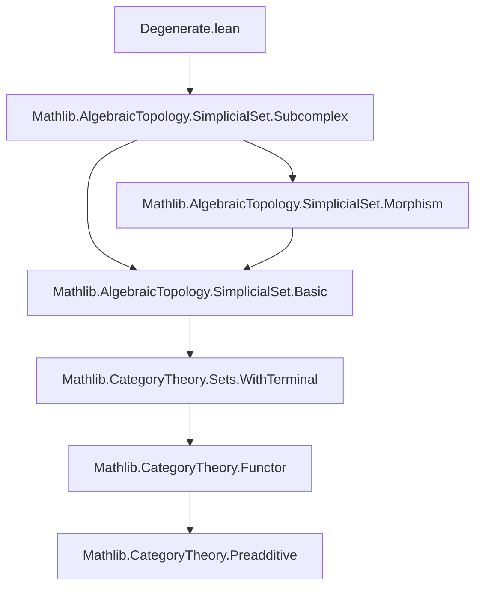

**Technical Brief: Degenerate Simplices in Simplicial Sets (Lean 4)**  
*Source: `Degenerate.lean` (2025, Joël Riou)*

---

### 1. KEY DEFINITIONS & THEOREMS

| Name | Type / Signature | Purpose |
|------|------------------|---------|
| `degenerate X n` | `Set (X _⦋n⦌)` | Set of degenerate $n$-simplices: those in the image of some `X.map f.op` with `f : [n] → [m]`, `m < n`. |
| `nonDegenerate X n` | `Set (X _⦋n⦌)` | Complement of `degenerate X n`; set of non-degenerate $n$-simplices. |
| `σ_mem_degenerate` | `X.σ i x ∈ X.degenerate (n + 1)` | Faces (degeneracies) of any simplex are degenerate. |
| `mem_degenerate_iff` | `x ∈ X.degenerate n ↔ ∃ (m < n) (f : [n] ↠ [m]), x ∈ range (X.map f.op)` | Refines definition to require `f` epi (standard in simplicial homotopy theory). |
| `degenerate_eq_iUnion_range_σ` | `X.degenerate (n + 1) = ⋃ᵢ range (X.σ i)` | Degenerate $(n+1)$-simplices are exactly unions of images of all degeneracy maps. |
| `exists_nonDegenerate` | `∃ m f y, x = X.map f.op y` with `f` epi and `y` non-degenerate | Every simplex factors through a unique (up to iso) non-degenerate one. |
| `isIso_of_nonDegenerate` | If `x` non-degenerate and `x = X.map f.op y` with `f` epi, then `f` is iso. | Key structural lemma: non-degenerate simplices cannot factor through proper epimorphisms. |
| `mono_of_nonDegenerate` | Same setup ⇒ `f` mono. | Follows from `isIso_of_nonDegenerate` + factorization. |
| `unique_nonDegenerate_dim` | `m₁ = m₂` | Uniqueness of dimension of the non-degenerate core. |
| `unique_nonDegenerate_simplex` | `y₁ = y₂` | Uniqueness of the non-degenerate simplex itself. |
| `unique_nonDegenerate_map` | `f₁ = f₂` | Uniqueness of the epimorphism (up to equality, not just iso). |
| `nonDegenerateEquivOfIso` | `X.nonDegenerate n ≃ Y.nonDegenerate n` for `X ≅ Y` | Isomorphic simplicial sets have bijective non-degenerate simplices. |
| `degenerate_iff_of_mono` / `nonDegenerate_iff_of_mono` | Preservation under monomorphisms. | Monos reflect/preserve degeneracy. |

---

### 2. NAMING CONVENTIONS

- **Prefixes**:
  - `degenerate_`, `nonDegenerate_`: for definitions and properties of degenerate/non-degenerate sets.
  - `mem_`: membership lemmas (`mem_degenerate_iff`, `mem_nonDegenerate_iff`).
  - `unique_nonDegenerate_`: uniqueness lemmas for the canonical decomposition.
- **Suffixes**:
  - `_iff`: characterizations via logical equivalence.
  - `_app_apply`: behavior under simplicial maps.
  - `_le_`, `_le_preimage`, `_image_le`: inclusion statements.
  - `_eq_top_iff`, `_eq_iSup`: maximality/covering properties.
- **Notable pattern**: `X.σ i` for degeneracy maps (`σ` = *sigma*), `f.op` for opposite morphisms.

---

### 3. TACTIC STACK

| Tactic | Frequency | Role |
|--------|-----------|------|
| `aesop` | High | Automated reasoning for simple goals, especially in `nonDegenerateEquivOfIso`, `unique_nonDegenerate_map`. |
| `simp` / `simp only` | Very high | Simplification of set membership, `Set.range`, `Set.mem_iUnion`, `Subtype.ext_iff`, etc. |
| `rw` | High | Rewriting using lemmas like `op_comp`, `image.fac`, `FunctorToTypes.map_comp_apply`. |
| `obtain` / `rcases` | High | Extracting witnesses from existential hypotheses (e.g., `exists_nonDegenerate`). |
| `ext` | Medium | Extensionality for sets, morphisms, order homomorphisms. |
| `intro` / `intro x` | Medium | Standard proof setup. |
| `by_cases` | Medium | Splitting on `x ∈ X.nonDegenerate (n+1)`. |
| `lia` | Medium | Linear arithmetic for inequalities like `m < n`. |
| `infer_instance` | Medium | Supplying `Epi`, `Mono`, `IsIso` instances. |
| `induction` | Medium | Structural induction on `n` (e.g., `exists_nonDegenerate`). |
| `simpa` | Medium | Simplifying with a lemma and discharging goals. |

---

### 4. PROOF LOGIC

- **Inductive structure**: Proofs often proceed by induction on dimension `n`, especially for existence (`exists_nonDegenerate`).
- **Case analysis**: Splitting on whether a simplex is degenerate or not (`by_cases hx : x ∈ X.nonDegenerate ...`).
- **Factorization + uniqueness**:
  - Use `mem_degenerate_iff` to get an epi `f` and `y`.
  - Apply `isIso_of_nonDegenerate` to deduce `f` iso when `y` is non-degenerate.
  - Use `unique_nonDegenerate_*` lemmas to compare two factorizations.
- **Set-theoretic reasoning**:
  - Many lemmas are proven by extensionality (`ext x`) and unfolding definitions (`simp only [Set.mem_]`).
  - `degenerate_eq_iUnion_range_σ` is a key bridge between categorical and set-theoretic views.
- **Subcomplex handling**:
  - Lifts properties from ambient `X` to subcomplexes via `mem_degenerate_iff` and `Subtype.ext_iff`.
  - Uses `le_iff_contains_nonDegenerate` to reduce inclusion checks to non-degenerate simplices.

---

### 5. IMPORTS & SCOPE

- **Primary dependency**:  
  `Mathlib.AlgebraicTopology.SimplicialSet.Subcomplex`  
  → Provides `Subcomplex`, `ofSimplex`, `Subcomplex.toRange`, etc.

- **Implicit imports** (via `open`/`import`):
  - `CategoryTheory`: `Category`, `Functor`, `NaturalTransformation`, `IsIso`, `Mono`, `Epi`, `Opposite`, `limits`.
  - `SimplicialSet`: `SSet`, `SimplexCategory`, `σ`, `face`, `map`, `op`, `image`, `factorThruImage`.
  - `Limits`: for categorical limits/colimits (used implicitly via `Subcomplex`).
  - `OrderTheory`: `Fin`, `OrderHom`, `Monotone`, `toOrderHom`.

- **Universe polymorphism**: `universe u`, `SSet.{u}`.

---

### 6. MERMAID DIAGRAMS

#### Dependency Graph (Module-Level)



#### Overview of File Structure

```mermaid
flowchart LR
  subgraph Definitions
    D1[degenerate X n]
    D2[nonDegenerate X n]
  end

  subgraph Core Lemmas
    L1[σ_mem_degenerate]
    L2[mem_degenerate_iff]
    L3[degenerate_eq_iUnion_range_σ]
    L4[exists_nonDegenerate]
    L5[isIso_of_nonDegenerate]
    L6[mono_of_nonDegenerate]
  end

  subgraph Uniqueness
    U1[unique_nonDegenerate_dim]
    U2[unique_nonDegenerate_simplex]
    U3[unique_nonDegenerate_map]
  end

  subgraph Subcomplex Theory
    S1[mem_degenerate_iff (subcomplex)]
    S2[le_iff_contains_nonDegenerate]
    S3[eq_top_iff_contains_nonDegenerate]
  end

  subgraph Functoriality
    F1[degenerate_app_apply]
    F2[degenerate_iff_of_isIso]
    F3[nonDegenerateEquivOfIso]
    F4[degenerate_iff_of_mono]
  end

  D1 --> L1
  D1 --> L2
  L2 --> L3
  L3 --> L4
  L4 --> L5
  L5 --> L6
  L5 --> U1
  L5 --> U2
  L5 --> U3
  D2 --> S1
  S1 --> S2
  S2 --> S3
  L4 --> F1
  L5 --> F2
  F2 --> F3
  L6 --> F4
```

---

### 7. DOMAIN THEORY SUMMARY

This file formalizes the foundational decomposition theory of simplicial sets:

- **Degenerate simplices** are those that factor through lower-dimensional simplices via degeneracy maps.
- **Non-degenerate simplices** form a “basis” for the simplicial set: every simplex has a *unique* factorization through a non-degenerate one along an epimorphism.
- This decomposition is **functorial** under isomorphisms and monomorphisms.
- In subcomplexes, inclusion can be tested on non-degenerate simplices alone — a key tool for inductive arguments (e.g., in homotopy extension properties or cellular approximations).

The results are standard in algebraic topology (see, e.g., May’s *Simplicial Objects in Algebraic Topology*), but here formalized in Lean 4 with full categorical rigor.

--- 

*End of Technical Brief.*
