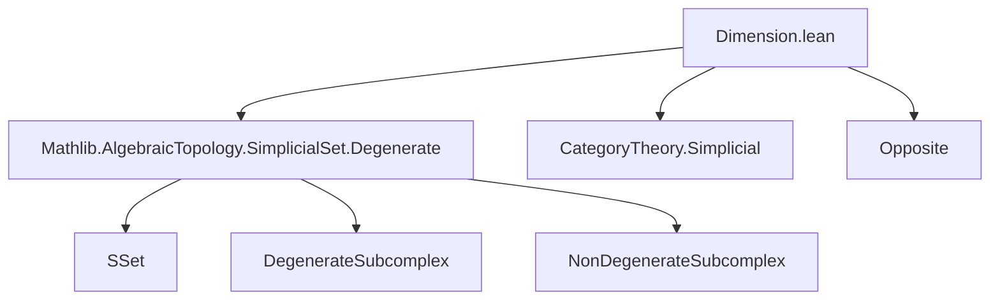
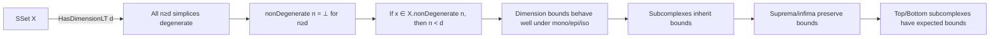
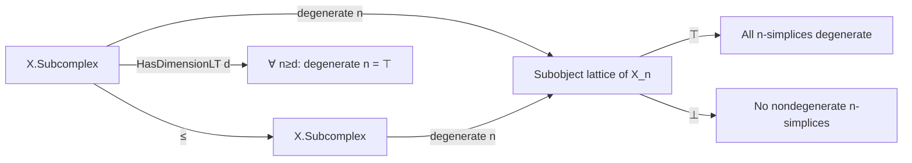

### Technical Brief: `Dimension.lean`

---

#### **1. Key Definitions & Theorems**

| Name | Type | Purpose |
|------|------|---------|
| `HasDimensionLT X d` | `Prop` | Typeclass asserting all nondegenerate simplices of `X` have dimension `< d`. Equivalently: for all `n ≥ d`, all `n`-simplices are degenerate (`X.degenerate n = ⊤`). |
| `HasDimensionLE X d` | `abbrev` | Defined as `X.HasDimensionLT (d + 1)`. |
| `degenerate_eq_top_of_hasDimensionLT` | `lemma` | Extracts the defining property: if `d ≤ n`, then all `n`-simplices are degenerate. |
| `nonDegenerate_eq_bot_of_hasDimensionLT` | `lemma` | Dually, if `d ≤ n`, then there are no nondegenerate `n`-simplices (`X.nonDegenerate n = ⊥`). |
| `dim_lt_of_nonDegenerate` | `lemma` | If `x : X.nonDegenerate n`, then `n < d` under `X.HasDimensionLT d`. |
| `dim_le_of_nonDegenerate` | `lemma` | If `x : X.nonDegenerate n`, then `n ≤ d` under `X.HasDimensionLE d`. |
| `hasDimensionLT_of_le` | `lemma` | Monotonicity: if `X` has dimension `< d` and `d ≤ n`, then `X` has dimension `< n`. |
| `Subcomplex.hasDimensionLT_of_le` | `lemma` | Subcomplex inherits dimension bound from ambient complex. |
| `hasDimensionLT_of_mono` | `lemma` | Monomorphism reflects dimension bound: if `f : X ↪ Y` and `Y` has dim `< d`, then so does `X`. |
| `hasDimensionLT_of_epi` | `lemma` | Epimorphism preserves dimension bound: if `f : X ↠ Y` and `X` has dim `< d`, then so does `Y`. |
| `hasDimensionLT_iff_of_iso` | `lemma` | Isomorphic simplicial sets share the same dimension bound. |
| `hasDimensionLT_iSup_iff` | `lemma` | Supremum (join) of subcomplexes has dimension `< d` iff each component does. |
| `hasDimensionLT_subcomplex_top_iff` | `lemma` | Top subcomplex `⊤` has dimension `< d` iff the ambient `X` does. |
| `instance ⊥` | `instance` | Bottom subcomplex `⊥` has dimension `< d` for any `d`. |

---

#### **2. Naming Conventions**

- **Prefixes**:
  - `hasDimensionLT_`: for lemmas/instances about `HasDimensionLT`.
  - `degenerate_eq_top_`, `nonDegenerate_eq_bot_`: direct consequences of the definition.
  - `dim_lt_of_nonDegenerate`, `dim_le_of_nonDegenerate`: relate nondegenerate simplex dimension to bound.
- **Suffixes**:
  - `_of_hasDimensionLT`: applies under assumption `[X.HasDimensionLT d]`.
  - `_of_mono`, `_of_epi`, `_of_iso`: apply under categorical properties of maps.
  - `_iff_of_hasDimensionLT`: characterizations under dimension bound.
- **Abbreviations**:
  - `HasDimensionLE` = `HasDimensionLT (d + 1)`.

---

#### **3. Tactic Stack**

- `simp` (extensively, especially with `nonDegenerate`, `degenerate`, `mem_degenerate_iff`)
- `rw [← degenerate_iff_of_isIso, ...]`
- `ext x` (extensionality for subcomplexes / sets)
- `by_contra!` (for contradiction proofs, e.g., `dim_lt_of_nonDegenerate`)
- `aesop` (in `hasDimensionLT_iSup_iff`)
- `obtain ⟨x, rfl⟩` (epi ⇒ surjective on components)
- `apply degenerate_app_apply`
- `lia` (in `hasDimensionLT_of_le` for linear arithmetic)

---

#### **4. Proof Logic**

- **Core strategy**: Reduce statements about nondegenerate simplices to degenerate ones via the defining equivalence `X.degenerate n = ⊤ ↔ X.nonDegenerate n = ⊥`.
- **Induction not used** — proofs rely on:
  - Direct manipulation of subcomplexes via `mem_degenerate_iff`.
  - Categorical properties (`Mono`, `Epi`, `Iso`) to transport bounds along maps.
  - Monotonicity of `HasDimensionLT` in the bound `d`.
- **Typical flow**:
  1. Assume `[X.HasDimensionLT d]`.
  2. Use `degenerate_eq_top_of_hasDimensionLT` to get degeneracy in high degrees.
  3. Translate via `nonDegenerate_eq_bot_of_hasDimensionLT` to eliminate nondegenerate simplices.
  4. For subcomplexes: use `mem_degenerate_iff` and extensionality (`ext`).
  5. For maps: use `Subcomplex.toRange`, `degnerate_iff_of_isIso`, and surjectivity/injectivity.

---

#### **5. Imports**

- `Mathlib.AlgebraicTopology.SimplicialSet.Degenerate`: core definitions of `degenerate`, `nonDegenerate`, and their lattice-theoretic properties.

---

#### **8. Mermaid Diagrams**

##### **Dependency Graph (Module-Level)**

##### **Overview of Theory Flow**

##### **Lattice-Theoretic Structure**

---

This module formalizes a *dimension theory* for simplicial sets, treating dimension as a *bound on the degrees where nondegenerate simplices may live*. It is foundational for truncation, skeletal filtrations, and homotopical arguments where control over simplex dimension is essential.
