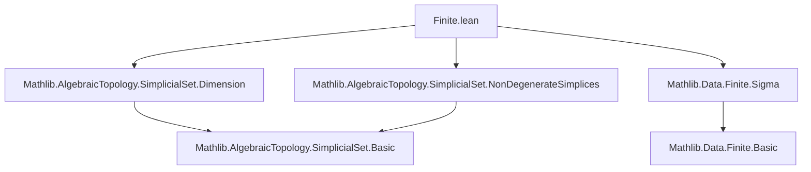
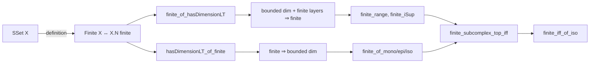

**Technical Brief: `Finite.lean` — Finite Simplicial Sets in Lean 4**

---

### 1. **Key Definitions & Theorems**

| Name | Type / Signature | Purpose |
|------|------------------|---------|
| `SSet.Finite` | `class Finite (X : SSet) : Prop` | Defines a simplicial set $X$ as *finite* iff its set of nondegenerate simplices $X.N$ is finite. |
| `finite_of_hasDimensionLT` | `∀ d, X.HasDimensionLT d → (∀ i < d, Finite (X.nonDegenerate i)) → X.Finite` | Shows finiteness follows from bounded dimension and finiteness of each nondegenerate layer below the bound. |
| `hasDimensionLT_of_finite` | `X.Finite → ∃ d, X.HasDimensionLT d` | Converse: finiteness implies existence of a uniform dimension bound. |
| `finite_range` | `Y.Finite → SSet.Finite (range f)` | The range (as a subcomplex) of a map from a finite simplicial set is finite. |
| `finite_iSup_iff` | `finite ι → (⨆ i, A i).Finite ↔ ∀ i, (A i).Finite` | Finiteness of a finite supremum of subcomplexes is equivalent to finiteness of each component. |
| `finite_of_mono`, `finite_of_epi`, `finite_of_iso` | `Mono f → Y.Finite → X.Finite`, etc. | Finiteness is preserved under monomorphisms, epimorphisms, and isomorphisms. |
| `finite_iff_of_iso` | `X ≅ Y → X.Finite ↔ Y.Finite` | Finiteness is invariant under isomorphism. |
| `finite_subcomplex_top_iff` | `⊤ : X.Subcomplex.Finite ↔ X.Finite` | The top subcomplex (i.e., $X$ itself) is finite iff $X$ is finite. |

---

### 2. **Naming Conventions**

- **Class/property prefix**: `Finite` (capitalized, used as a typeclass).
- **Predicate suffixes**:
  - `finite_of_…`: constructing finiteness from structural properties.
  - `finite_…_iff`: characterizing finiteness via equivalences.
- **Helper lemmas**:
  - `hasDimensionLT_of_…`: relating dimension bounds to finiteness.
- **Instance naming**: implicit via `attribute [instance] Finite.finite`.

---

### 3. **Tactic Stack**

Frequently used tactics in proofs:

| Tactic | Role |
|--------|------|
| `aesop` | Automated reasoning for equality and membership goals (e.g., in `N.ext_iff`, `S.ext_iff'`). |
| `grind` | Custom tactic (likely from Mathlib) for linear arithmetic over `WithBot ℕ`. |
| `simp_rw`, `simp only`, `simp` | Simplification using definitional equalities and lemmas (e.g., `nonDegenerate_iff_of_mono`, `mem_degenerate_iff_notMem_nonDegenerate`). |
| `induction … using …` | Structural induction on `SimplexCategory`. |
| `obtain ⟨…⟩` / `rcases` | Destructuring existential/universal quantifiers and sums. |
| `refine`, `exact`, `infer_instance` | Proof construction and typeclass resolution. |
| `by_cases`, `by_contra` | Case analysis on decidable propositions. |
| `lia`, `linarith` | Linear integer arithmetic solving. |

---

### 4. **Proof Logic**

The logical flow across most proofs follows this pattern:

1. **Dimensional reduction**: Use `hasDimensionLT_of_finite` or `finite_of_hasDimensionLT` to reduce to bounded dimension.
2. **Finite sum decomposition**: Represent $X.N$ as a surjective image of $\sum_{i < d} X.\text{nonDegenerate}\ i$, leveraging boundedness.
3. **Inductive/structural arguments**:
   - For `finite_range`, use surjectivity of the range inclusion.
   - For `finite_iSup`, use finite index set and surjectivity of the canonical map from the disjoint union of components.
4. **Transfer along morphisms**:
   - Monos pull back finiteness via injectivity on nondegenerate simplices.
   - Epis push forward finiteness via surjectivity on simplices.
   - Isos preserve finiteness in both directions.

Induction is used explicitly for `SimplexCategory` (via `rec`), and case analysis on dimension bounds (`by_cases hj : x.dim < d`) is common.

---

### 5. **Imports & Dependencies**

| Module | Role |
|--------|------|
| `Mathlib.AlgebraicTopology.SimplicialSet.Dimension` | Defines `HasDimensionLT`, dimension-related lemmas. |
| `Mathlib.AlgebraicTopology.SimplicialSet.NonDegenerateSimplices` | Defines `X.N`, `X.nonDegenerate`, `mk`, `S`, `N`, etc. |
| `Mathlib.Data.Finite.Sigma` | Provides `Finite.of_surjective`, `Finite.of_injective`, and finite sum properties. |

These imports define the foundational simplicial set machinery and finite type theory needed to reason about nondegenerate simplices and their finiteness.

---

### 6. **Mermaid Diagrams**

#### **Dependency Graph (Module-Level)**

#### **Conceptual Overview of `Finite.lean`**

---

### 7. **Summary**

This module formalizes the notion of *finite simplicial sets* — those with only finitely many nondegenerate simplices — and establishes their closure properties under standard categorical constructions (mono/epi/iso, subcomplexes, suprema, ranges). It bridges homotopical structure (via nondegenerate simplices and dimension bounds) with finiteness conditions in set theory, using Lean’s typeclass inference and constructive reasoning.

The proofs rely heavily on:
- The decomposition of simplices into degenerate images of nondegenerate ones,
- Bounded dimension (via `HasDimensionLT`),
- Surjectivity/injectivity arguments for morphism behavior on simplices.

This forms a foundational layer for further development in homological algebra or homotopy theory involving finite simplicial sets (e.g., finite CW complexes, effective homology).
