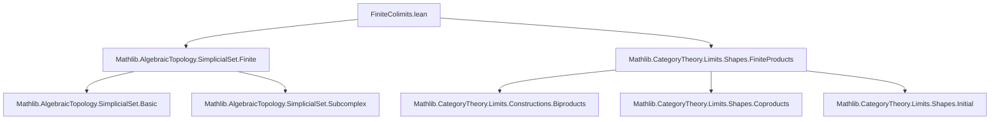
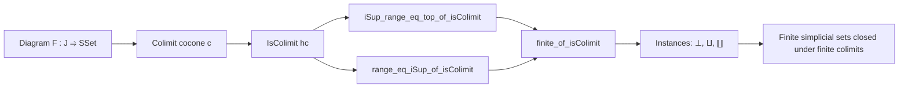

### Technical Brief: `FiniteColimits.lean`

---

#### **1. Key Definitions & Theorems**

| Name | Type / Signature | Purpose |
|------|------------------|---------|
| `iSup_range_eq_top_of_isColimit` | `⨆ (j : J), Subcomplex.range (c.ι.app j) = ⊤` | Shows that the colimit cocone’s image covers the entire colimit simplicial set (i.e., jointly surjective). |
| `range_eq_iSup_of_isColimit` | `Subcomplex.range φ = ⨆ (j : J), Subcomplex.range (c.ι.app j ≫ φ)` | Expresses the range of a map out of the colimit as the supremum (join) of ranges of its components. |
| `hasDimensionLT_of_isColimit` | `(∀ j, HasDimensionLT (F.obj j) n) → HasDimensionLT c.pt n` | Propagates dimension bounds through finite colimits. |
| `finite_of_isColimit` | `[Finite J] → (∀ j, (F.obj j).Finite) → c.pt.Finite` | Main finiteness propagation result: finite colimits of finite simplicial sets are finite. |
| `instance (⊥_ SSet).Finite` | `⊥_ SSet.{u}.Finite` | The initial object (empty simplicial set) is finite. |
| `instance (X Y : SSet).Finite → (X ⨿ Y).Finite` | Binary coproduct of finite simplicial sets is finite. |
| `instance (∐ X).Finite` | Coproduct over a finite index type of finite simplicial sets is finite. |
| `range_eq_iSup_sigma_ι` | `Subcomplex.range f = ⨆ i, Subcomplex.range (Sigma.ι i ≫ f)` | Explicit description of the range of a map from a coproduct. |

---

#### **2. Naming Conventions**

- **Prefixes**:
  - `isColimit_`: properties of colimits given a proof that a cocone is a colimit.
  - `finite_of_`: constructing finiteness from hypotheses.
  - `range_`: statements about subcomplex ranges.
- **Suffixes**:
  - `_of_isColimit`: applied under assumption `hc : IsColimit c`.
  - `_iSup_`: involve indexed suprema (`⨆`) over diagrams.
- **Other**:
  - `hasDimensionLT_`: dimension-related lemmas.
  - `instance` declarations follow standard Lean naming for typeclass instances.

---

#### **3. Tactic Stack**

- `rw`, `conv_lhs`: for rewriting and equational reasoning.
- `simp only`, `simp_rw`: heavy use of simplification with explicit lemmas.
- `exact`, `infer_instance`: for typeclass resolution.
- `intro`, `apply`, `refine`: standard intro/apply style.
- `le_antisymm`: to prove equality of subcomplexes via mutual inequality.
- `rintro`: for destructuring existential or product hypotheses.
- `dsimp`: simplification of definitional equalities (e.g., in coproduct cases).
- `obtain ⟨n, ⟨e⟩⟩ := ...`: for extracting equivalences from finiteness assumptions.

---

#### **4. Proof Logic**

- **General Strategy**:
  - Work in the context of a colimit cocone `c` with `hc : IsColimit c`.
  - Use the universal property (via `Types.jointly_surjective_of_isColimit`) to prove surjectivity/joint surjectivity.
  - Reduce properties of the colimit object (`c.pt`) to properties of the diagram via:
    - Supremum over ranges (`iSup_range_eq_top_of_isColimit`)
    - Subcomplex calculus (e.g., `Subcomplex.range_comp`, `Subcomplex.image_iSup`)
  - For finiteness/dimension bounds, lift properties from the diagram to the colimit using:
    - `finite_iSup_iff`, `hasDimensionLT_iSup_iff`
    - `finite_subcomplex_top_iff`, `hasDimensionLT_subcomplex_top_iff`
- **Instance Proofs**:
  - Use `finite_of_isColimit` with known colimit constructions (`initialIsInitial`, `coprodIsCoprod`, `coproductIsCoproduct`).
  - For coproducts over finite index types, construct an equivalence to `Discrete (Fin n)` to get colimits in `Type u`.

---

#### **5. Imports**

| Module | Purpose |
|--------|---------|
| `Mathlib.AlgebraicTopology.SimplicialSet.Finite` | Defines finite simplicial sets (`Finite`, `HasDimensionLT`, `Subcomplex.range`, etc.). |
| `Mathlib.CategoryTheory.Limits.Shapes.FiniteProducts` | Provides finite product limits machinery; used for general colimit reasoning. |

> Note: Though the title says *colimits*, the import is for *finite products* — likely because `FiniteProducts` includes general limit/colimit infrastructure (e.g., `HasColimitsOfShape`, `IsColimit`). The main colimit machinery is likely in `Mathlib.CategoryTheory.Limits.Shapes.Coproduct` or `Colimits`, but not explicitly imported here — possibly assumed via transitive imports.

---

#### **8. Mermaid Diagrams**

##### **Dependency Graph (Module-Level)**



##### **Overview of Theoretical Flow**



##### **Proof Structure of `finite_of_isColimit`**

```mermaid
flowchart LR
  A[Finite J] --> B[finite_of_isColimit]
  C[∀ j, (F.obj j).Finite] --> B
  B --> D[← iSup_range_eq_top_of_isColimit]
  D --> E[finite_iSup_iff]
  E --> F[∀ i, Subcomplex.range (c.ι.app i).Finite]
  F --> G[by infer_instance]
```

---

### Summary

This file formalizes that **finite colimits preserve finiteness** in the category of simplicial sets (`SSet`). It leverages:
- Subcomplex calculus (ranges, suprema),
- Colimit universal properties (joint surjectivity),
- Typeclass inference for finiteness and dimension bounds.

The core lemma is `finite_of_isColimit`, with supporting lemmas enabling range and dimension propagation. The structure is typical of modern Lean homological algebra: abstract categorical reasoning + concrete simplicial set properties.
