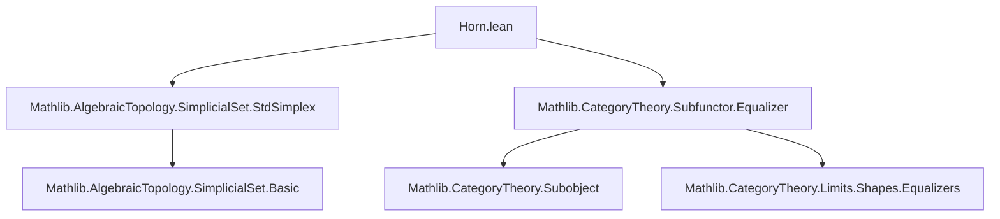

**Technical Brief: Horns in Simplicial Sets (`Horn.lean`)**  
*Based on Lean 4 formalization in Mathlib*

---

### 1. KEY DEFINITIONS & THEOREMS

| Name | Type / Signature | Purpose |
|------|------------------|---------|
| `horn` | `ℕ → Fin (n + 1) → Subcomplex (Δ[n])` | Defines the *i*-th horn Λ[n, i] as a subcomplex of the standard *n*-simplex Δ[n], consisting of simplices whose image avoids at least one vertex besides *i*. |
| `Λ[n, i]` | Notation for `horn n i` | Standard shorthand for the *i*-th horn. |
| `horn_eq_iSup` | `horn n i = ⨆ (j : ({i}ᶜ)), stdSimplex.face {j}ᶜ` | Expresses the horn as the supremum (join) of all codimension-1 faces *except* the *i*-th. |
| `face_le_horn` | `i ≠ j ⇒ stdSimplex.face {j}ᶜ ≤ horn n i` | Shows that every face *≠ i* is contained in the horn. |
| `horn_obj_zero` | `(horn (n + 2) i).obj (op (.mk 0)) = ⊤` | The 0-simplices of a horn of dimension ≥ 2 are all possible vertices (i.e., full set). |
| `horn.const` | `SimplexCategoryᵒᵖ → Λ[n + 2, i].obj _` | Degenerate subsimplex concentrated at vertex *k*. |
| `horn.edge` | `a ≤ b → #{i, a, b} ≤ n ⇒ (Λ[n, i])₁` | Edge in the horn with endpoints *a*, *b*, exists iff the three vertices do not cover all of `Fin (n+1)`. |
| `horn.edge₃` | `3 ≤ n ⇒ edge n i a b hab H` | Simplified constructor for edges when *n ≥ 3*. |
| `horn.primitiveEdge` | `0 < i < n ⇒ Fin n → (Λ[n, i])₁` | Edge between consecutive vertices *j*, *j+1*, used in quasicategorical horn conditions. |
| `horn.primitiveTriangle` | `0 < i < n+3 ⇒ k < n+2 ⇒ (Λ[n+3, i])₂` | Triangle with vertices *k*, *k+1*, *k+2* in a horn of dimension ≥ 3. |
| `horn.face` | `j ≠ i ⇒ (Λ[n+1, i])ₙ` | The *j*-th codimension-1 face of the horn (as a simplex). |
| `horn.faceι` | `j ≠ i ⇒ stdSimplex.face {j}ᶜ ⟶ Λ[n, i]` | Inclusion of a face into the horn. |
| `horn.ι` | `j ≠ i ⇒ Δ[n] ⟶ Λ[n+1, i]` | Inclusion of the *j*-th face of Δ[n+1] into the horn Λ[n+1, i]. |
| `horn.hom_ext` | `(∀ j ≠ i, σ₁ ∘ face i j = σ₂ ∘ face i j) ⇒ σ₁ = σ₂` | Extensionality: morphisms out of a horn are determined by their action on all included faces. |
| `yonedaEquiv_ι`, `ι_ι`, `faceι_ι`, etc. | Lemmas about interaction of inclusion maps with ι and ιₕ | Technical coherence lemmas for diagrams involving horns and standard simplices. |

---

### 2. NAMING CONVENTIONS

- **Prefixes**:
  - `horn.`: Module-local namespace for horn-specific definitions.
  - `stdSimplex.`: Standard simplex and its faces/degeneracies.
  - `faceι`, `ι`: Inclusion maps into horns.
  - `primitiveEdge`, `primitiveTriangle`: Specialized edges/triangles used in quasicategory theory.
- **Suffixes**:
  - `_ι`: Inclusion morphism (e.g., `faceι`, `ι`).
  - `₃`: Variant assuming `3 ≤ n`.
- **Notation**:
  - `Λ[n, i]`: Standard notation for the *i*-th horn.
  - `σ₁.app _ (face i j h)`: Evaluation of a morphism on a horn face.

---

### 3. TACTIC STACK

Frequently used tactics in proofs:
- `simp only [...]`: Heavy use of `simp` with explicit lemmas (e.g., `horn_eq_iSup`, `mem_face_iff`, `Finset` lemmas).
- `rw [...]`: Rewriting using definitions and lemmas like `horn_eq_iSup`, `yonedaEquiv_ι`.
- `refine ⟨..., fun a ↦ ?_⟩`: Constructing elements of subfunctors via `setOf`.
- `fin_cases a`: Case analysis on `Fin` indices.
- `have := ...; simp at this`: Deriving contradictions from cardinality assumptions.
- `lia`, `decide`: For arithmetic and finite type reasoning (e.g., `Finset.card` inequalities).
- `ext`: Extensionality for subfunctors/subsets.
- `apply le_antisymm ...`: Proving equality of subfunctors via mutual inclusion.

---

### 4. PROOF LOGIC

The logical flow in proofs follows a pattern:

1. **Extensionality / Equality**:
   - Use `ext` or `le_antisymm` to reduce equality of subfunctors to pointwise membership.
2. **Simplification via `horn_eq_iSup`**:
   - Rewrite horns as suprema of faces using `horn_eq_iSup`.
   - Apply `simp only [horn_eq_iSup, ...]` to reduce membership questions to disjunctions over `Finset`.
3. **Cardinality Arguments**:
   - Assume for contradiction that a set equals `Finset.univ`.
   - Derive `card ≤ n` vs `card = n+1`, then use `lia`.
4. **Case Analysis**:
   - On `Fin` elements (`fin_cases`), or on `n = 2 ∨ 2 < n`.
5. **Inclusion Lemmas**:
   - Use `face_le_horn` to embed known faces into horns.
   - Use `Subfunctor.lift`, `Subcomplex.homOfLE`, or `yonedaEquiv` to construct morphisms.

Induction is *not* used here—proofs are mostly direct, leveraging algebraic properties of `Finset`, `Subfunctor`, and `SSet`.

---

### 5. IMPORTS & SCOPE

**Primary Dependencies**:
- `Mathlib.AlgebraicTopology.SimplicialSet.StdSimplex`: Standard simplices Δ[n], faces δᵢ, degeneracies σᵢ.
- `Mathlib.CategoryTheory.Subfunctor.Equalizer`: Subfunctors, equalizers, suprema.

**Scope**:
- Formalization of * horns* in the category of simplicial sets (`SSet`).
- Foundation for *quasicategories* (via horn-filling conditions).
- Used in higher category theory, homotopy theory, and derived algebraic geometry.

---

### 6. MERMAID DIAGRAMS

#### Dependency Graph (Module-Level)



#### Overview of Horn Construction & Inclusions

```mermaid
graph LR
  Δ[n+1] -->|δ_j| Λ[n+1,i]
  stdSimplex.face {j}ᶜ -->|faceι i j| Λ[n,i]
  Δ[n] -->|ι i j| Λ[n+1,i]
  Λ[n,i] -->|ι| Δ[n]
  stdSimplex.face {j}ᶜ -->|ι| Δ[n]
```

- `ι : Λ[n,i] ↪ Δ[n]` is the inclusion.
- `faceι i j` and `ι i j` are canonical inclusions of faces into the horn.
- Horns are built as unions (suprema) of codimension-1 faces missing one vertex.

---

### 7. THEORY CONTEXT

- **Purpose**: Horns are central to the definition of *kan complexes* and *quasicategories*.
- **Quasicategories**: Require fillers for *inner horns* (`0 < i < n`), e.g., `primitiveEdge`, `primitiveTriangle`.
- **Homotopy Theory**: Horns model boundaries of simplices missing one face; their fillers encode homotopy coherence.
- **Yoneda Embedding**: Used heavily via `yonedaEquiv` to identify simplices with morphisms from Δ[n].

---

### 8. SUMMARY

This file formalizes the foundational theory of horns in simplicial sets, providing:
- A clean definition via subfunctors (`horn`).
- Key structural lemmas (`horn_eq_iSup`, `face_le_horn`).
- Explicit constructions of low-dimensional simplices (edges, triangles) in horns.
- A powerful extensionality principle (`hom_ext`) for morphisms out of horns.
- Coherence lemmas for inclusions (`ι_ι`, `faceι_ι`), enabling diagrammatic reasoning.

It serves as a critical stepping stone for higher categorical structures in Mathlib.
