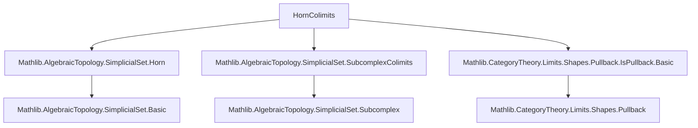

### Technical Brief: HornColimits.lean

---

#### **1. Key Definitions & Theorems**

| Name | Type / Signature | Purpose |
|------|------------------|---------|
| `sq` (in `horn₂₀`, `horn₂₁`, `horn₂₂`) | `Subcomplex.BicartSq ...` | Establishes that the horn $\Lambda[2,i]$ is a *bicartesian square* (i.e., both pushout and pullback) of two 1-simplices along a 0-simplex. |
| `ι₀₁`, `ι₀₂`, `ι₁₂`, etc. | `Δ[1] ⟶ Λ[2,i]` | Canonical inclusions of $\Delta[1]$ into $\Lambda[2,i]$ omitting a specified vertex. |
| `isPushout` (in `horn₂₀`, `horn₂₁`, `horn₂₂`) | `IsPushout ...` | Proves that each $\Lambda[2,i]$ is a pushout of two copies of $\Delta[1]$ along $\Delta[0]$. |
| `multicoequalizerDiagram` | `Subcomplex.MulticoequalizerDiagram ...` | Constructs the diagram whose multicoequalizer is $\Lambda[n,i]$: all $(n-1)$-faces of $\Delta[n]$ except the $i$-th, glued along $(n-2)$-faces. |
| `isColimit` | `IsColimit ...` | Shows that $\Lambda[n,i]$ is the colimit (multicoequalizer) of the above diagram. |
| `ι₀`, `ι₂`, `ι₃` (in `horn₃₁`, `horn₃₂`) | `Δ[2] ⟶ Λ[3,i]` | Inclusions of 2-simplices into inner horns $\Lambda[3,1]$ and $\Lambda[3,2]$, omitting one vertex. |
| `desc.multicofork` | `Multicofork ...` | Auxiliary construction encoding compatible families of maps $\Delta[2] \to X$ into a cocone over the multicoequalizer diagram. |
| `desc` | `(Λ[n,i] ⟶ X)` | Universal morphism induced by the colimit property: gluing maps $\Delta[2] \to X$ along matching faces. |
| `ι₀_desc`, `ι₂_desc`, `ι₃_desc` | `ι_k ≫ desc = f_k` | Verification that `desc` restricts correctly on each included $\Delta[2]$. |
| `exists_desc` | `∃ φ, ...` | Existence of a mediating morphism from the horn to $X$ extending given compatible faces. |

---

#### **2. Naming Conventions**

- **Prefixes**:
  - `ι_` (Greek *iota*): Inclusion maps of faces into horns (e.g., `ι₀₁`, `ι₂`, `ι₃`).
  - `desc`: Mediating morphism from a colimit (e.g., `desc`, `desc.multicofork`).
  - `sq`: Bicartesian square data for pushout/pullback characterizations.
- **Suffixes**:
  - `_zero`, `_two`, `_three`: Indexing components of diagrams or coforks (e.g., `desc.multicofork_π_zero`).
  - `_inv`: Inverse of an isomorphism (e.g., `faceSingletonComplIso ... .inv`).
- **Other**:
  - `faceSingletonComplIso`, `facePairIso`: Standard isomorphisms identifying subcomplexes with standard simplices.
  - `face`: Refers to face maps $\delta_i : \Delta[n-1] \to \Delta[n]$.

---

#### **3. Tactic Stack**

- **Core tactics**:
  - `simp`, `simp_rw`, `aesop`, `decide`, `reflexivity`, `convert`, `rw`, `apply`, `fapply`, `intro`, `cases`, `fin_cases`, `dsimp`.
- **Category-theoretic helpers**:
  - `cancel_epi`, `Category.assoc`, `Iso.refl`, `Iso.inv_comp`, `Iso.comp_inv`.
- **Subcomplex-specific**:
  - `le_antisymm`, `sup_le_iff`, `iSup_le_iff`, `horn_eq_iSup`, `stdSimplex.face_inter_face`.

---

#### **4. Proof Logic**

- **Structure**:
  1. **Base case ($n=2$)**: For each $i \in \{0,1,2\}$, prove $\Lambda[2,i]$ is a pushout:
     - Construct bicartesian square `sq`.
     - Use isomorphisms to identify components with $\Delta[0], \Delta[1]$.
     - Apply `isPushout.of_iso'` and close with `decide`.
  2. **General case ($n \geq 2$)**:
     - Define `multicoequalizerDiagram` encoding all $(n-1)$-faces except the $i$-th.
     - Prove it is a multicoequalizer diagram using `horn_eq_iSup` and face intersection identities.
     - Conclude $\Lambda[n,i]$ is a colimit via `isColimit`.
  3. **Inner horns in $\Delta[3]$**:
     - For $i=1,2$, define explicit inclusions $\iota_k : \Delta[2] \to \Lambda[3,i]$.
     - Given compatible maps $f_k : \Delta[2] \to X$, build a multicofork `desc.multicofork`.
     - Use `isColimit` to get a unique mediating map `desc`.
     - Verify compatibility via `ι_k_desc` and prove existence via `exists_desc`.

- **Common pattern**:
  - Use isomorphisms to reduce to standard face maps.
  - Leverage `Subcomplex` API (e.g., `face_le_horn`, `horn_eq_iSup`, `face_inter_face`).
  - Apply universal properties of colimits/pushouts.

---

#### **5. Imports**

| Module | Purpose |
|--------|---------|
| `Mathlib.AlgebraicTopology.SimplicialSet.Horn` | Definitions of horns $\Lambda[n,i]$, inclusions $\iota$, face maps. |
| `Mathlib.AlgebraicTopology.SimplicialSet.SubcomplexColimits` | Theory of subcomplex colimits, multicoequalizers, bicartesian squares. |
| `Mathlib.CategoryTheory.Limits.Shapes.Pullback.IsPullback.Basic` | Tools for proving pushouts/pullbacks (e.g., `IsPushout`, `IsPullback`). |

---

#### **6. Mermaid Diagrams**

##### **Dependency Graph (Module-Level)**



##### **Overview of Theoretical Flow**

```mermaid
flowchart LR
  A[Standard Simplex Δ[n]] --> B[Face Maps δ_i : Δ[n-1] → Δ[n]]
  B --> C[Subcomplexes: faces ⊆ Δ[n]]
  C --> D[Horn Λ[n,i] = ⋃_{j≠i} im(δ_j)]
  D --> E[For n=2: Λ[2,i] is a pushout]
  D --> F[For general n: Λ[n,i] is multicoequalizer]
  F --> G[Inner horns Λ[3,1], Λ[3,2]: explicit gluing of 3 copies of Δ[2]]
  G --> H[Universal property: mediating map Λ[n,i] → X]
```

##### **Multicoequalizer Diagram for Λ[n,i]**

```mermaid
flowchart LR
  subgraph Diagram
    direction TB
    A["⊔_{j≠k≠l} Δ[n-2]"] -->|π₁| B["⊔_{j≠i} Δ[n-1]"]
    A -->|π₂| B
    B --> C[Λ[n,i]]
  end

  Diagram -->|colim| C
```

Where:
- Top object: disjoint union of all $(n-2)$-faces (pairs $j,k \ne i$),
- Bottom object: disjoint union of all $(n-1)$-faces except $i$,
- Arrows: face inclusions (coequalizer pair),
- Colimit: horn $\Lambda[n,i]$.

---

#### **7. Summary**

This file formalizes the foundational fact that horns are *colimits* of standard simplices:
- Low-dimensional cases ($n=2$) are pushouts of $\Delta[1]$ along $\Delta[0]$,
- General horns $\Lambda[n,i]$ are multicoequalizers of $(n-1)$-faces,
- Inner horns $\Lambda[3,1], \Lambda[3,2]$ admit explicit gluing descriptions with a clean API for constructing maps out of them.

The proofs rely heavily on the `Subcomplex` API and categorical colimit machinery, with heavy use of `simp`-based automation and isomorphism-based reductions. The `desc` construction provides a practical tool for defining maps out of horns — essential for homotopy theory and model structures on simplicial sets.
