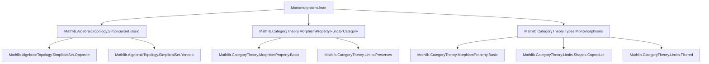
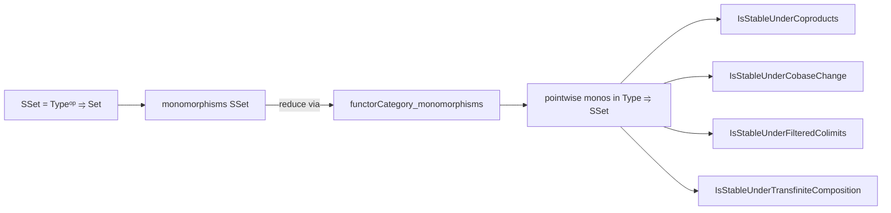

**Technical Brief: `Monomorphisms.lean`**

---

### 1. **Key Definitions & Theorems**

| Name | Type / Statement | Purpose |
|------|------------------|---------|
| `instance [HasCoproducts.{v'} (Type u)] : IsStableUnderCoproducts.{v'} (monomorphisms SSet.{u})` | `IsStableUnderCoproducts.{v'} (monomorphisms SSet.{u})` | Shows monomorphisms in `SSet` are stable under coproducts (indexed by types of universe `v'`). |
| `instance : (monomorphisms SSet).IsStableUnderCobaseChange` | `IsStableUnderCobaseChange (monomorphisms SSet)` | Proves stability under cobase change (i.e., pushouts along any morphism). |
| `instance : MorphismProperty.IsStableUnderFilteredColimits.{u, u} (monomorphisms SSet)` | `IsStableUnderFilteredColimits (monomorphisms SSet)` | Establishes stability under filtered colimits in `SSet`. |
| `example (K : Type u) [...] : (monomorphisms SSet).IsStableUnderTransfiniteCompositionOfShape K` | `IsStableUnderTransfiniteCompositionOfShape K (monomorphisms SSet)` | Shows stability under transfinite composition (for well-founded, linearly ordered index categories `K`). |

All instances are proven by reduction to the corresponding fact in functor categories (`_ ⥤ _`), using `functorCategory_monomorphisms`.

---

### 2. **Naming Conventions**

- **Prefixes / Suffixes**:
  - `monomorphisms _`: standard notation for the class of monomorphisms in a category.
  - `IsStableUnder*`: predicate naming for stability under categorical constructions (`Coproducts`, `CobaseChange`, `FilteredColimits`, `TransfiniteCompositionOfShape`).
  - `functorCategory_monomorphisms`: theorem name linking monomorphisms in functor categories to pointwise monomorphisms.

- **Universe polymorphism**: `.{u}`, `.{v'}` used consistently for universe levels.

---

### 3. **Tactic Stack**

- `rw [← functorCategory_monomorphisms]`: rewrites monomorphisms in `SSet` as monomorphisms in a functor category (`Type u ⥤ SSet.{u}`).
- `infer_instance`: automatically discharges stability properties by leveraging existing instances in `MorphismProperty` and `Limits`.
- `change`: used to align goal types before applying `infer_instance`.

No heavy automation (e.g., `aesop`, `ring`, `simp_rw`) is used—proofs are purely structural, relying on pre-established categorical lemmas.

---

### 4. **Proof Logic**

- **Strategy**: Reduce to known stability properties in functor categories.
  - Use the equivalence `monomorphisms (Type u ⥤ SSet) ≅ monomorphisms SSet`.
  - Apply `functorCategory_monomorphisms` to rewrite the goal.
  - Use `infer_instance` to invoke pre-proved stability results for functor categories (e.g., `IsStableUnderCoproducts`, `IsStableUnderCobaseChange`, etc.).
- **Structure**:
  - For each stability property, the proof is a one-line `rw` + `infer_instance`.
  - The transfinite composition case uses `example` (not `instance`) because it depends on an additional hypothesis (`K` with order-theoretic structure).

---

### 5. **Imports**

| Import | Role |
|--------|------|
| `Mathlib.AlgebraicTopology.SimplicialSet.Basic` | Defines `SSet` (simplicial sets) and basic constructions. |
| `Mathlib.CategoryTheory.MorphismProperty.FunctorCategory` | Provides `functorCategory_monomorphisms` and stability lemmas for functor categories. |
| `Mathlib.CategoryTheory.Types.Monomorphisms` | Defines `monomorphisms C` and stability predicates (`IsStableUnder*`). |

These imports define the ambient categorical and simplicial context.

---

### 8. **Mermaid Diagrams**

#### **Dependency Graph (File-Level)**

#### **Overview of Theoretical Flow**

- **Key Insight**: Stability of monomorphisms in `SSet` is inherited from stability in functor categories, leveraging the fact that `SSet ≅ [Δᵒᵖ, Set]` and monomorphisms in functor categories are pointwise monic.

--- 

**End of Brief**
