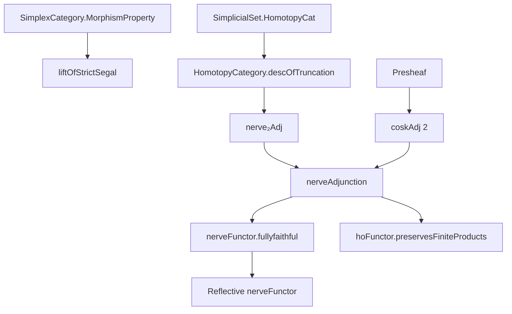
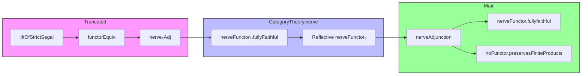

### Technical Brief: `NerveAdjunction.lean`

---

#### **1. Key Definitions & Theorems**

| Name | Type / Signature | Purpose |
|------|------------------|---------|
| `liftOfStrictSegal` | `X ⟶ Y` (for `Y` strict Segal) | Constructs a morphism of 2-truncated simplicial sets from data on 0- and 1-simplices. |
| `descOfTruncation` | `(X ⟶ truncation 2 (nerve C)) → (X.HomotopyCategory ⥤ C)` | Realizes the universal property of homotopy category via truncation. |
| `homToNerveMk` | `(X.HomotopyCategory ⥤ C) → (X ⟶ truncation 2 (nerve C))` | Inverse direction of the hom-set bijection for `nerve₂Adj`. |
| `functorEquiv` | `(X.HomotopyCategory ⥤ C) ≃ (X ⟶ truncation 2 (nerve C))` | Establishes the adjunction `hoFunctor₂ ⊣ nerveFunctor₂`. |
| `nerve₂Adj` | `hoFunctor₂ ⊣ nerveFunctor₂` | The core adjunction between 2-truncated homotopy category and nerve functors. |
| `functorOfNerveMap` | `nerveFunctor₂.obj C ⟶ nerveFunctor₂.obj D → C ⥤ D` | Reconstructs a functor from a map between 2-truncated nerves. |
| `nerveFunctor₂.fullyFaithful` | `nerveFunctor₂.FullyFaithful` | Proves 2-truncated nerve is fully faithful. |
| `nerveAdjunction` | `hoFunctor ⊣ nerveFunctor` | Main adjunction: homotopy category ⊣ nerve (up to iso). |
| `nerveFunctorCompHoFunctorIso` | `nerveFunctor ⋙ hoFunctor ≅ 𝟭 Cat` | Counit of `nerveAdjunction` is an isomorphism (reflectivity). |
| `preservesBinaryProducts` | `PreservesLimitsOfShape (Discrete WalkingPair) hoFunctor` | `hoFunctor` preserves binary products. |
| `preservesFiniteProducts` | `PreservesFiniteProducts hoFunctor` | Extends to all finite products. |

---

#### **2. Naming Conventions**

- **Prefixes**:
  - `liftOfStrictSegal`: “lift” from low-dimensional data under strict Segal condition.
  - `descOfTruncation`: “desc” for descent / universal property of homotopy category.
  - `homToNerveMk`: “mk” for “make” — constructs a morphism in the nerve direction.
  - `functorOfNerveMap`: “of” — extracts structure from a nerve map.
- **Suffixes**:
  - `_app_0`, `_app_1`, `_app_edge`: specify behavior on simplices.
  - `_comp`: naturality or compatibility with composition.
  - `_iso`: indicates an isomorphism (e.g., `cosk₂Iso`, `nerveFunctorCompHoFunctorIso`).
- **Notable patterns**:
  - `δ₂ i`, `σ₂ i`: face and degeneracy maps in `SimplexCategory.Truncated 2`.
  - `_₂`: subscript for 2-truncated constructions (`hoFunctor₂`, `nerveFunctor₂`).
  - `nerveEquiv`, `nerve.homEquiv`: equivalences from nerve construction.

---

#### **3. Tactic Stack**

| Tactic | Usage Frequency | Role |
|--------|-----------------|------|
| `simp` | Very High | Simplify hom-sets, naturality, and simplex maps. |
| `rw` | High | Rewrite using lemmas like `δ₂_zero_eq_const`, `spineEquiv`, etc. |
| `ext` | High | Extensionality for functions, natural transformations, functors. |
| `apply` / `exact` | Medium | Apply injectivity/surjectivity lemmas (e.g., `spine_bijective`, `ComposableArrows.arrowEquiv.injective`). |
| `aesop` | Medium | Solve trivial goals involving equalities and isomorphisms. |
| `fin_cases` | Medium | Case analysis on finite indices (`i : Fin n`). |
| `dsimp` | Medium | Simplify definitional equalities in dependent contexts. |
| `congr_arg`, `congr_fun` | Low | Handle congruence of function application. |
| `cat_disch` | Low | Category-theoretic discharge tactic (likely custom). |

---

#### **4. Proof Logic**

- **Structure**:
  1. **Local constructions** (`liftOfStrictSegal`, `descOfTruncation`, `homToNerveMk`):
     - Define maps on 0- and 1-simplices.
     - Use strict Segal condition to define 2-simplices.
     - Prove naturality via `MorphismProperty` and `naturalityProperty_eq_top`.
  2. **Adjointness** (`nerve₂Adj`):
     - Use `Adjunction.mkOfHomEquiv` with `functorEquiv`.
     - Verify naturality of hom-set bijection via `descOfTruncation_comp`, `homToNerveMk_comp`.
  3. **Reflectivity** (`nerveFunctor₂.fullyFaithful`, `Reflective` instance):
     - Show `nerveFunctor₂` is fully faithful via `functorOfNerveMap`.
     - Deduce reflectivity from adjunction + fully faithful right adjoint.
  4. **Global adjunction** (`nerveAdjunction`):
     - Composite `coskAdj 2` and `nerve₂Adj`.
     - Use `Nerve.cosk₂Iso` (nerves are 2-coskeletal).
  5. **Product preservation** (`preservesBinaryProducts`, `preservesFiniteProducts`):
     - Prove binary product preservation via `prodComparison`.
     - Reduce to standard simplices using colimit arguments and `isIso_prodComparison_stdSimplex`.

- **Inductive/Case-based reasoning**:
  - Finite index induction (`n : ℕ`) on simplex dimension.
  - Case analysis on `Fin 3` for faces/degeneracies.
  - Use of `Edge.exists_of_simplex` to reduce to edge-based reasoning.

---

#### **5. Imports & Dependencies**

| Module | Role |
|--------|------|
| `Mathlib.AlgebraicTopology.SimplexCategory.MorphismProperty` | Morphism property framework for naturality. |
| `Mathlib.AlgebraicTopology.SimplicialSet.HomotopyCat` | Homotopy category of simplicial sets. |
| `Mathlib.CategoryTheory.Category.Cat.CartesianClosed` | Cartesian closure of `Cat`. |
| `Mathlib.CategoryTheory.Monoidal.Closed.FunctorToTypes` | Monoidal structure on `[C, Type]`. |
| `Mathlib.CategoryTheory.Limits.Presheaf` | Presheaf limits/colimits. |
| `Mathlib.CategoryTheory.Monoidal.Closed.Cartesian` | Cartesian closed structure. |

---

#### **6. Mermaid Diagrams**

##### **Dependency Graph (High-Level)**

##### **Overview of `NerveAdjunction.lean`**

---

#### **7. Theory Context**

- **Goal**: Establish that the homotopy category functor `hoFunctor : SSet → Cat` is left adjoint to the nerve functor `nerveFunctor : Cat → SSet`.
- **Strategy**:
  - Factor through 2-truncated simplicial sets:  
    `hoFunctor ≃ hoFunctor₂ ⋙ truncation 2`  
    `nerveFunctor ≃ nerveFunctor₂ ⋙ cosk 2`
  - Use that nerves are 2-coskeletal (`cosk₂Iso`) to reduce to `nerve₂Adj`.
- **Consequences**:
  - `nerveFunctor` is fully faithful ⇒ adjunction is *reflective*.
  - `Cat` has colimits (via `SSet` cocomplete + adjoint lifting).
  - `hoFunctor` preserves finite products (but not infinite ones).

---

#### **8. Notable Lemmas & Identities**

- `liftOfStrictSegal_app_0`, `liftOfStrictSegal_app_1`: Behavior on low simplices.
- `spineEquiv_f₂_arrow₀`, `spineEquiv_f₂_arrow₁`: Coordinates of `f₂` via spine equivalence.
- `hδ'₀`, `hδ'₁`, `hδ'₂`: Naturality for faces.
- `hσ'₀`, `hσ'₁`: Naturality for degeneracies.
- `nerveFunctor₂_map_functorOfNerveMap`, `functorOfNerveMap_nerveFunctor₂_map`: Inverse laws.
- `prodComparison_natural`, `isIso_prodComparison_of_stdSimplex`: Product preservation via colimits.

--- 

This file formalizes a foundational result in higher category theory: the *nerve-realization* adjunction, with implications for homotopical algebra and categorical logic.
