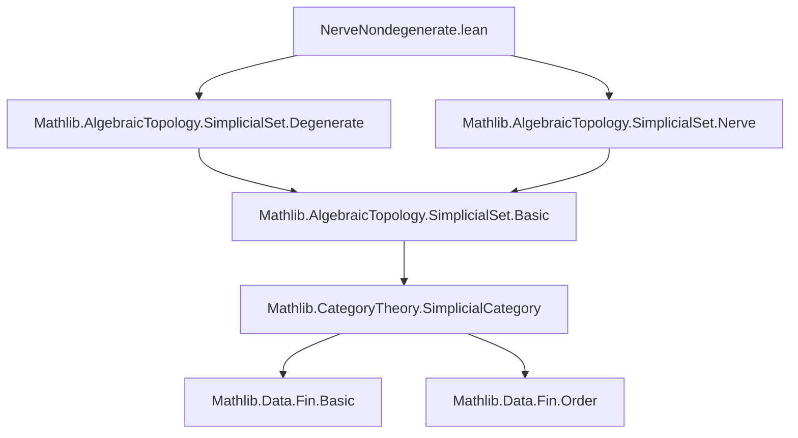

**Technical Brief: `NerveNondegenerate.lean`**

---

### 1. KEY DEFINITIONS & THEOREMS

| Name | Type / Signature | Purpose |
|------|------------------|---------|
| `nerve X` | `SimplicialSet` | The nerve construction applied to a preordered type `X`; yields a simplicial set where `n`-simplices are monotone maps `Fin (n+1) → X`. |
| `σ i` | `nerve X ⦋n + 1⦌ → nerve X ⦋n⦌` | Degeneracy map induced by the surjection `i : Fin (n+1) → Fin n` collapsing `i` and `i+1`. |
| `δ i` | `nerve X ⦋n⦌ → nerve X ⦋n + 1⦌` | Face map induced by the injection `Fin n → Fin (n+1)` skipping `i`. |
| `nerve.degenerate (n+1)` | `Set (nerve X ⦋n + 1⦌)` | Set of degenerate `(n+1)`-simplices: union over `i` of `range (σ i)`. |
| `nerve.nonDegenerate n` | `Set (nerve X ⦋n⦌)` | Complement of degenerate simplices in degree `n`. |
| `mem_range_nerve_σ_iff` | `s ∈ range (σ i) ↔ s.obj (i.castSucc) = s.obj i.succ` | Characterizes membership in the image of a degeneracy map via equality of adjacent vertices. |
| `mem_nerve_degenerate_of_eq` | `s.obj i.castSucc = s.obj i.succ ⇒ s ∈ degenerate (n+1)` | If two adjacent vertices of an `(n+1)`-simplex coincide, then the simplex is degenerate. |
| `mem_nerve_nonDegenerate_iff_strictMono` | `s ∈ nonDegenerate n ↔ StrictMono s.obj` | Main theorem: nondegeneracy of an `n`-simplex in `nerve X` is equivalent to strict monotonicity of its underlying map `Fin n → X`. |
| `mem_nerve_nonDegenerate_iff_injective` | `s ∈ nonDegenerate n ↔ Function.Injective s.obj` | Equivalent formulation: nondegeneracy ↔ injectivity (since for monotone maps on a poset, injective ⇔ strictly monotone). |

---

### 2. NAMING CONVENTIONS

- **Prefixes**:
  - `mem_..._iff`: Logical equivalence between membership in a set and a property.
  - `nerve_σ_obj`, `nerve_δ_obj`: Definitions of degeneracy/face maps on objects (i.e., on monotone maps).
- **Suffixes**:
  - `_iff`: Biconditional statements.
  - `_of_eq`: Implication from an equality condition (e.g., equality of adjacent vertices ⇒ degeneracy).
- **Variables**:
  - `s`: A simplex (i.e., a monotone map `Fin k → X`).
  - `i`: An index in `Fin (n+1)` or `Fin n`.
  - `castSucc`, `succ`: Standard `Fin` operations for embedding and successor.

---

### 3. TACTIC STACK

- `simp`: Heavily used to simplify using definitions (`nerve.σ_obj`, `nerve.δ_obj`, `SSet.degenerate_eq_iUnion_range_σ`, etc.).
- `rw`: Rewriting with lemmas like `mem_range_nerve_σ_iff`, `Fin.strictMono_iff_lt_succ`, etc.
- `intro`, `intro h`, `intro ⟨s, rfl⟩`: Standard introduction for implications and equalities.
- `refine ⟨..., ?_⟩`: Constructing witnesses for existential statements (e.g., showing `s ∈ range σ i`).
- `by_cases`: Case analysis on inequalities (`i.castSucc < j`).
- `obtain ⟨j, rfl⟩`: Decomposing `Fin` elements using `Fin.eq_succ_of_ne_zero`.
- `grind`: Custom tactic (likely from Mathlib’s `grind` module) for automated simplification over `Fin` arithmetic and order-theoretic identities.
- `apply exists_congr`, `apply and_congr`, etc.: Structural proof manipulation for logical equivalences.

---

### 4. PROOF LOGIC

- **Structure**:
  - Proofs proceed by structural induction on `n` (via `obtain _ | n := n`).
  - For `n = 0`, use `Subsingleton.strictMono` (any map from `Fin 1` is strictly monotone).
  - For `n > 0`, reduce nondegeneracy to the negation of degeneracy:
    - Use `← not_iff_not` and `← SSet.mem_degenerate_iff_notMem_nonDegenerate`.
    - Expand degeneracy as a union over `i` of `range (σ i)`.
    - Apply `mem_range_nerve_σ_iff` to translate membership in `range σ i` to equality of adjacent values.
    - Use monotonicity of `s.obj` to analyze cases (`lt` vs `eq`) and eliminate contradictions.

- **Key logical flow**:
  1. Show degeneracy ⇔ existence of `i` with `s.obj i.castSucc = s.obj i.succ`.
  2. Show nondegeneracy ⇔ no such `i` exists ⇔ strict monotonicity.
  3. Use monotonicity + injectivity equivalence for poset-valued maps.

---

### 5. IMPORTS

- `Mathlib.AlgebraicTopology.SimplicialSet.Degenerate`: Provides definitions and basic lemmas about degenerate simplices, including `SSet.degenerate_eq_iUnion_range_σ`.
- `Mathlib.AlgebraicTopology.SimplicialSet.Nerve`: Defines the nerve of a category/preorder, including `nerve.obj`, `nerve.σ`, `nerve.δ`.

---

### 6. MERMAID DIAGRAMS

#### Dependency Graph (Module-Level)



#### Overview of Theory Flow

```mermaid
flowchart LR
  P[PartialOrder X] --> N[Nerve X : SSet]
  N --> D[Degenerate simplices: ⋃ᵢ range σᵢ]
  N --> ND[Nondegenerate simplices: complement of D]
  P --> SM[Strictly monotone maps Fin n → X]
  P --> INJ[Injective monotone maps]
  ND <-- mem_nerve_nonDegenerate_iff_strictMono --> SM
  ND <-- mem_nerve_nonDegenerate_iff_injective --> INJ
  D <-- mem_range_nerve_σ_iff ↔ equality of adjacent vertices -->
```

---

### 7. SUMMARY

This file establishes a clean correspondence between *nondegenerate simplices* in the nerve of a poset and *strictly monotone* (equivalently, injective) maps from `Fin n` into the poset. It leverages the combinatorics of `Fin` and the order-theoretic properties of monotone maps to translate between simplicial degeneracy and order-theoretic injectivity/strictness. The proofs are highly structured, using case analysis on indices and order-theoretic dichotomies (`lt` vs `eq`), and rely on `grind` for routine simplifications over finite types.
