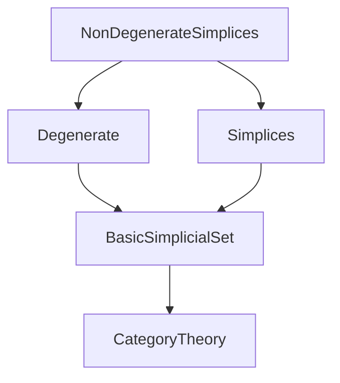
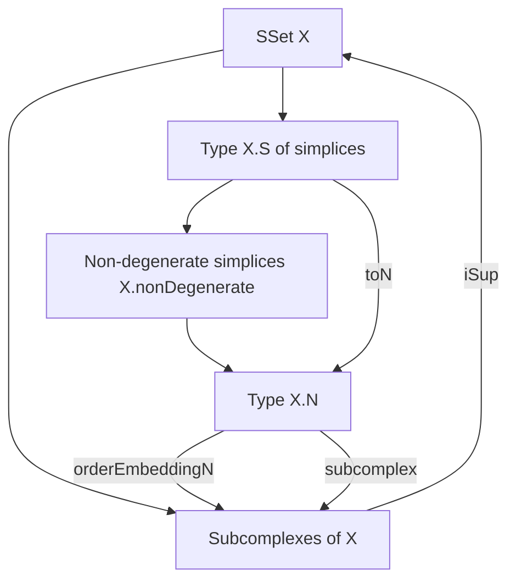

**Technical Brief: `NonDegenerateSimplices.lean`**

---

### 1. **Key Definitions & Theorems**

| Name | Type / Signature | Purpose |
|------|------------------|---------|
| `X.N` | `Type u` (structure) | Type of *non-degenerate simplices* of a simplicial set `X`. Extends `X.S` with a proof of non-degeneracy. |
| `N.mk` | `∀ {n}, X _⦋n⦌ → x ∈ X.nonDegenerate n → X.N` | Constructor for `X.N`, packaging a simplex with a proof of non-degeneracy. |
| `N.cast` | `s : X.N → s.dim = d → X.N` | Adjusts the dimension of a non-degenerate simplex definitionally to a given `d`. |
| `N.orderEmbeddingN` | `X.N ↪o X.Subcomplex` | Order embedding sending a non-degenerate simplex to the subcomplex it generates. |
| `S.toN` | `X.S → X.N` | For any simplex `x`, the *unique* non-degenerate simplex generating the same subcomplex as `x`. |
| `N.le_iff_exists_mono` | `x ≤ y ↔ ∃ f : [m] → [n], Mono f ∧ X.map f.op y.simplex = x.simplex` | Characterizes the partial order on `X.N` via monomorphisms in the simplex category. |
| `N.subcomplex_injective` | `x.subcomplex = y.subcomplex → x = y` | Injectivity of the map `x ↦ x.subcomplex` on `X.N`. |
| `N.iSup_subcomplex_eq_top` | `⨆ s : X.N, s.subcomplex = ⊤` | The join (iSup) of all subcomplexes generated by non-degenerate simplices is the whole simplicial set. |
| `S.existsUnique_n` | `∃! y : X.N, y.subcomplex = x.subcomplex` | Uniqueness of non-degenerate representative for any simplex’s generated subcomplex. |

---

### 2. **Naming Conventions**

- **Prefixes**:
  - `N.`: for definitions/lemmas about the type `X.N`.
  - `S.`: for definitions/lemmas about the map `toN` (from arbitrary simplices to non-degenerate ones).
  - `mk`, `cast`, `toN`: standard constructors/adjustment/selection functions.
- **Suffixes**:
  - `_iff`: for equivalences (`↔`).
  - `_injective`, `_surjective`: for injectivity/surjectivity lemmas.
  - `_le`, `_lt`: for order-theoretic properties.
  - `ofSimplex`, `ofSection`: for subcomplexes defined from sections/simplices.

---

### 3. **Tactic Stack**

Frequently used tactics in proofs:
- `grind`, `aesop`, `simp`, `rw`, `exact`, `refine`, `obtain`, `subst`, `dsimp`, `infer_instance`, `tauto`, `rfl`, `simp only`, `simp_rw`.

Notably:
- `grind` is used for automatic equality reasoning (e.g., `ext_iff`).
- `aesop` handles propositional logic + structure reasoning (e.g., `PartialOrder` instance).
- `simp only` + `Subcomplex.mem_ofSimplex_obj_iff` for subcomplex membership reasoning.

---

### 4. **Proof Logic**

The logical flow is highly structured around:
- **Uniqueness + existence** via `existsUnique_of_exists_of_unique`.
- **Order-theoretic reasoning** using:
  - `Preorder.lift` to define `≤` on `X.N` via `toS`.
  - `le_antisymm` + `dim_le_of_le` + `dim_lt_of_lt` to control dimension.
- **Factorization through non-degenerate simplices**:
  - Every simplex `x` factors as `X.map f.op y` with `y` non-degenerate (`X.exists_nonDegenerate`).
  - Uniqueness of `y` up to equality in `X.N` follows from injectivity of `subcomplex`.

Typical proof pattern:
1. Reduce to normal form using `mk_surjective` or `mk'_surjective`.
2. Use `le_iff_exists_mono` to translate order to morphism existence.
3. Apply `SimplexCategory.eq_id_of_mono` to force identity when dimensions match.
4. Use `Subcomplex.ofSimplex_le_iff` to relate subcomplex inclusion to morphism existence.

---

### 5. **Imports**

- `Mathlib.AlgebraicTopology.SimplicialSet.Degenerate`: for `X.nonDegenerate`, degeneracy theory.
- `Mathlib.AlgebraicTopology.SimplicialSet.Simplices`: for `X.S`, simplices, subcomplexes, `Subcomplex`, `ofSimplex`.

These imports define the ambient simplicial set machinery.

---

### 6. **Mermaid Diagrams**

#### **Dependency Graph (Module Level)**



#### **Overview of Theory Flow**



#### **Key Logical Dependencies**

```mermaid
graph LR
  X.S -->|existsUnique_n| X.N
  X.N -->|orderEmbeddingN| X.Subcomplex
  X.N -->|subcomplex_injective| X.N × X.N → Prop
  X.S -->|toN| X.N
  X.N -->|le_iff_exists_mono| SimplexCategory
```

---

### 7. **Summary**

This file formalizes the foundational fact that *every simplex in a simplicial set factors uniquely through a non-degenerate one*, and that the collection of non-degenerate simplices carries a natural partial order (via inclusion of generated subcomplexes), embedding order-theoretically into the lattice of subcomplexes. It sets up the machinery needed for barycentric subdivision, nerve theorems, and homological algebra in simplicial contexts.

--- 

Let me know if you'd like a formalization roadmap or a plan for downstream developments (e.g., barycentric subdivision, simplicial approximation).
