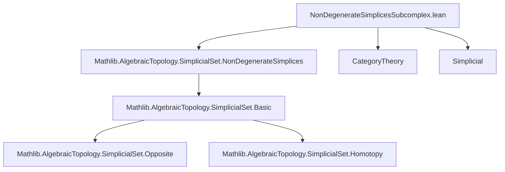
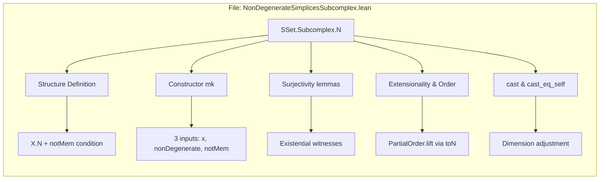
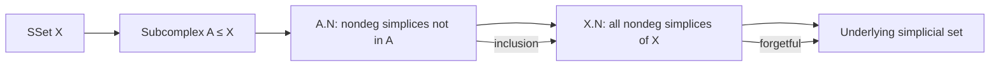

**Technical Brief: `NonDegenerateSimplicesSubcomplex.lean`**

---

### 1. **Key Definitions & Theorems**

| Name | Type / Signature | Purpose |
|------|------------------|---------|
| `N` | `structure N extends X.N where mk' :: notMem : simplex ∉ A.obj _` | Defines the type of nondegenerate simplices of `X` *not* in subcomplex `A`. |
| `mk` | `{n : ℕ} → X _⦋n⦌ → x ∈ X.nonDegenerate n → x ∉ A.obj _ → A.N` | Constructor for `A.N`: builds a nondegenerate simplex of `X` outside `A`. |
| `mk'_surjective` | `∀ s : A.N, ∃ t, ht, s = mk' t ht` | Shows every element of `A.N` arises via `mk'`. |
| `mk_surjective` | `∀ s : A.N, ∃ n, x, hx, hx', s = mk x hx hx'` | Stronger surjectivity: every element of `A.N` is `mk x hx hx'` for some `x`. |
| `ext_iff` | `∀ x y : A.N, x = y ↔ x.toN = y.toN` | Extensionality: equality in `A.N` is determined by underlying `X.N`. |
| `cast` | `s.dim = d → A.N` | Adjusts dimension definitionally to `d` while preserving nondegeneracy and non-membership. |
| `cast_eq_self` | `s.cast hd = s` | `cast` does not change the element. |
| `instance : PartialOrder A.N` | `PartialOrder A.N` | Lifts the partial order from `X.N` to `A.N` via `toN`. |
| `le_iff` | `x ≤ y ↔ x.toN ≤ y.toN` | Order comparison in `A.N` mirrors that in `X.N`. |

---

### 2. **Naming Conventions**

- **Prefixes**:
  - `notMem`: indicates membership negation in the subcomplex.
  - `mk` / `mk'`: constructors (with/without extra structure).
  - `cast`: dimension adjustment (type-theoretic coercion).
- **Suffixes**:
  - `_surjective`: asserts surjectivity of a constructor.
  - `_iff`: characterizes equivalence of propositions (↔).
- **Structure field naming**:
  - `simplex`, `nonDegenerate`, `notMem`: descriptive, aligned with mathematical meaning.

---

### 3. **Tactic Stack**

- `grind`: used in `ext_iff` to apply extensionality and simplify.
- `subst`, `rfl`: basic reflexivity/rewriting.
- `simp [ext_iff]`: simplification using extensionality.
- `by simp`: used in `le_iff` to reduce to definition.
- `by aesop` or `by linarith` *not present* — this file is mostly definitional/structural.

---

### 4. **Proof Logic**

- **Definitional reasoning dominates**:
  - Proofs are mostly *reflexivity* (`rfl`) or *extensionality* (`ext_iff`) + `simp`.
  - Surjectivity lemmas (`mk'_surjective`, `mk_surjective`) are immediate by unpacking structure fields.
  - `cast_eq_self` uses `subst` on definitional equality `hd : s.dim = d`.
- **No induction or case analysis** on naturals or simplices — the structure is rigid and extensional.

---

### 5. **Imports**

- `Mathlib.AlgebraicTopology.SimplicialSet.NonDegenerateSimplices`: core theory of nondegenerate simplices (`X.N`).
- `CategoryTheory`, `Simplicial`: for `SSet`, `Subcomplex`, and categorical structure.

---

### 8. **Mermaid Diagrams**

#### **Dependency Graph (Module-Level)**

#### **Overview of File Structure**

#### **Theoretical Context**

---

**Summary**: This file formalizes the *relative* nondegenerate simplices of a subcomplex inclusion $A \hookrightarrow X$, forming a type `A.N` equipped with a natural partial order and dimension-aware structure. It is foundational for relative homotopy theory and cellular approximation in simplicial sets.
