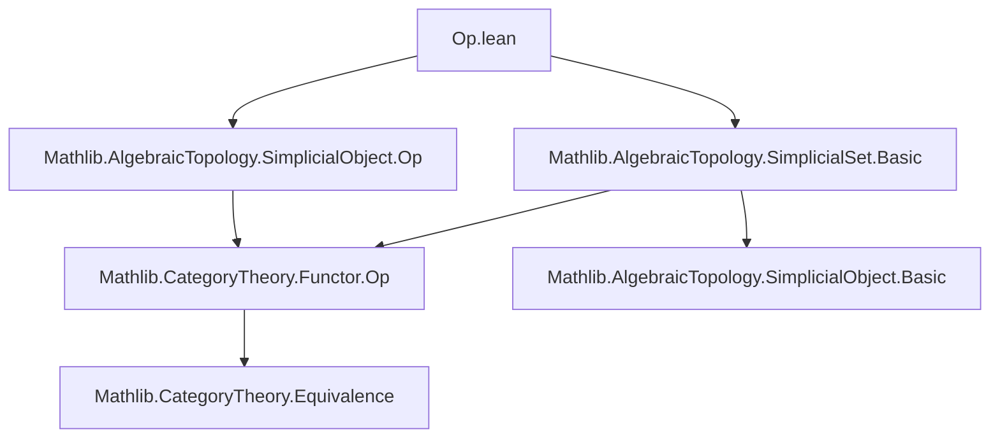

### Technical Brief: `Op.lean` — Covariant Involution on Simplicial Sets

---

#### **1. Key Definitions & Theorems**

| Name | Type | Purpose |
|------|------|---------|
| `opFunctor` | `SSet.{u} ⥤ SSet.{u}` | Covariant involution on `SSet`, induced by `SimplexCategory.rev : SimplexCategory ⥤ SimplexCategory`. Defined as `SimplicialObject.opFunctor`. |
| `X.op` | `SSet.{u}` | Abbreviation for `opFunctor.obj X`, i.e., the image of a simplicial set under the involution. |
| `opObjEquiv` | `X.op.obj n ≃ X.obj n` | Identity equivalence (via `Equiv.refl`) identifying $n$-simplices of $X^{\mathrm{op}}$ with those of $X$. |
| `opFunctor_map` | `(opFunctor.map f).app n x = opObjEquiv.symm (f.app _ (opObjEquiv x))` | Describes action of `opFunctor` on morphisms. |
| `op_map` | `X.op.map f x = opObjEquiv.symm (X.map (SimplexCategory.rev.map f.unop).op (opObjEquiv x))` | Explicit formula for face and degeneracy maps in $X^{\mathrm{op}}$. |
| `op_δ` | `X.op.δ i x = opObjEquiv.symm (X.δ i.rev (opObjEquiv x))` | Face maps in $X^{\mathrm{op}}$ correspond to face maps in $X$ precomposed with reversal $i \mapsto i.\mathrm{rev}$. |
| `op_σ` | `X.op.σ i x = opObjEquiv.symm (X.σ i.rev (opObjEquiv x))` | Degeneracy maps similarly twist by reversal. |
| `opFunctorCompOpFunctorIso` | `opFunctor ⋙ opFunctor ≅ 𝟭 _` | Natural isomorphism witnessing that applying `opFunctor` twice is naturally isomorphic to identity — i.e., it's an *involution*. |
| `opEquivalence` | `SSet.{u} ≌ SSet.{u}` | Equivalence of categories induced by the involution; both directions are `opFunctor`. |

---

#### **2. Naming Conventions**

- **Prefixes**:
  - `op_`: for lemmas about the `op` operation on simplicial sets (e.g., `op_map`, `op_δ`, `op_σ`).
  - `opFunctor_`: for constructions involving the functor `opFunctor` (e.g., `opFunctorCompOpFunctorIso`).
- **Suffixes**:
  - `Iso`: for natural isomorphisms (`opFunctorCompOpFunctorIso`).
  - `Equiv`: for equivalences of types (`opObjEquiv`).
- **Abbreviations**:
  - `X.op`: shorthand for `opFunctor.obj X`.
  - `n : SimplexCategoryᵒᵖ`: objects in the opposite simplex category; used to index simplices in $X^{\mathrm{op}}$.

---

#### **3. Tactic Stack**

- `rfl`: used in definitions and lemmas where equality is definitional (e.g., `op_map`, `opFunctor_map`).
- `simp`: heavily used in proofs (`op_δ`, `op_σ`) to reduce using `op_map`, `SimplicialObject.δ`, `SimplicialObject.σ`.
- `simp_rw`: not explicitly used, but `simp` suffices due to `@[simp]` attributes.
- `congr'`, `ext`, `apply_fun`, etc., are not needed — structure is mostly definitional.
- `simps!`, `simps`: used in `opFunctorCompOpFunctorIso` and `opEquivalence` to automatically generate components.

---

#### **4. Proof Logic**

- **Definitional reasoning dominates**: Most lemmas are *definitional equalities* (`rfl`), because `opFunctor` is defined via `SimplicialObject.opFunctor`, and `opObjEquiv` is `Equiv.refl`.
- **Simplication + reversal**: For non-definitional lemmas (`op_δ`, `op_σ`), proofs:
  1. Expand definitions (`simp [SimplicialObject.δ, op_map]`).
  2. Use `i.rev` to account for the contravariance of `SimplexCategory.rev`.
- **Involution proof**:
  - Construct natural isomorphism `opFunctor² ≅ id` using `opObjEquiv.trans opObjEquiv`, which is definitionally equal to `Equiv.refl`.
  - Use `NatIso.ofComponents` twice to build the natural isomorphism.
- **Equivalence of categories**:
  - Use `opEquivalence` with `unitIso` and `counitIso` both given by the inverse of the involution isomorphism.

---

#### **5. Imports**

| Module | Role |
|--------|------|
| `Mathlib.AlgebraicTopology.SimplicialObject.Op` | Provides `SimplicialObject.opFunctor`, the base construction of the opposite functor on simplicial objects. |
| `Mathlib.AlgebraicTopology.SimplicialSet.Basic` | Defines `SSet := SimplicialObject.{u} SimplexCategoryᵒᵖ`, basic simplicial set theory, horns, standard simplices `Δ[n]`, etc. |

---

#### **6. Mermaid Diagrams**

##### **Dependency Graph (Module-Level)**



##### **Conceptual Overview (Theory Flow)**

```mermaid
graph LR
  SimplexCategory -- rev --> SimplexCategory
  SimplicialObject -- opFunctor induced by rev --> SimplicialObject
  SSet = SimplicialObject SimplexCategoryᵒᵖ
  SSet -- opFunctor --> SSet
  X : SSet -- op --> X.op : SSet
  X.op n ≃ X n via opObjEquiv
  opFunctor² ≅ id via opFunctorCompOpFunctorIso
  SSet ≌ SSet via opEquivalence
```

##### **Diagram of Face/Degeneracy Maps in $X^{\mathrm{op}}$**

```mermaid
graph LR
  X _⦋n+1⦌ -- X.δ i.rev --> X _⦋n+2⦌
  X.op _⦋n+1⦌ -- X.op.δ i --> X.op _⦋n+2⦌
  X _⦋n+1⦌ <-->|opObjEquiv| X.op _⦋n+1⦌
  X _⦋n+2⦌ <-->|opObjEquiv| X.op _⦋n+2⦌
  X.δ i.rev -.->|transport via opObjEquiv| X.op.δ i
```

---

#### **7. Summary**

This file formalizes the *covariant involution* on simplicial sets induced by reversing the direction of simplices (via `SimplexCategory.rev`). It leverages the general construction `SimplicialObject.opFunctor`, and specializes it to `SSet`. The key insight is that while $X^{\mathrm{op}}$ has the same underlying type of simplices as $X$, its face and degeneracy maps are twisted by the reversal map $i \mapsto i.\mathrm{rev}$ on indexing sets. The involution is strict up to natural isomorphism, making it an equivalence of categories (in fact, an autoequivalence of order 2). This sets the stage for future work on horns, nerves, and topological realization compatibility.
