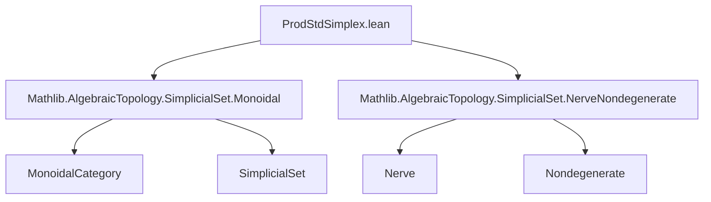

### Technical Brief: `ProdStdSimplex.lean`

---

#### **1. Key Definitions & Theorems**

| Name | Type / Signature | Purpose |
|------|------------------|---------|
| `objEquiv {n}` | `(Δ[p] ⊗ Δ[q]) _⦋n⦌ ≃ (Fin (n + 1) →o Fin (p + 1) × Fin (q + 1))` | Bijection between $n$-simplices of the tensor product and order-preserving maps into the product poset. |
| `isoNerve` | `Δ[p] ⊗ Δ[q] ≅ nerve (ULift (Fin (p + 1) × Fin (q + 1)))` | Shows the tensor product is isomorphic to the nerve of the poset `ULift (Fin (p+1) × Fin (q+1))`. |
| `nonDegenerate_iff_injective_objEquiv` | `z ∈ (Δ[p] ⊗ Δ[q]).nonDegenerate n ↔ Function.Injective (objEquiv z)` | Characterizes nondegenerate simplices via injectivity of the associated monotone map. |
| `nonDegenerate_iff_strictMono_objEquiv` | `z ∈ (Δ[p] ⊗ Δ[q]).nonDegenerate n ↔ StrictMono (objEquiv z)` | Equivalent characterization using strict monotonicity (since domain is a finite total order). |
| `orderHomOfSimplex` | `(Δ[p] ⊗ Δ[q]) _⦋n⦌ → (Fin (n + 1) →o Fin (p + q + 1))` | Maps a simplex to the sum of its two components, viewed as a monotone map into `Fin(p+q+1)`. |
| `strictMono_orderHomOfSimplex_iff` | `StrictMono (orderHomOfSimplex x) ↔ StrictMono (objEquiv x)` | Equivalence of strict monotonicity of the sum map and the original pair map. |
| `instance HasDimensionLE` | `(Δ[p] ⊗ Δ[q]).HasDimensionLE (p + q)` | Proves the tensor product has dimension ≤ $p + q$. |
| `instance Finite` | `(Δ[p] ⊗ Δ[q]).Finite` | Follows from finite dimensionality and bounded number of nondegenerate simplices. |

---

#### **2. Naming Conventions**

- **Prefixes**:
  - `objEquiv`: standard bijection for objects in a simplicial set.
  - `nonDegenerate_iff_*`: characterizations of nondegeneracy.
  - `orderHomOfSimplex`: construction from a simplex to an order homomorphism.
- **Suffixes**:
  - `_apply`: lemmas about evaluation of functions/maps.
  - `_iff`: logical equivalences (↔), especially for properties like injectivity/strict monotonicity.
  - `_naturality`, `_map_apply`, `_δ_apply`: naturality and simplicial map behavior.

---

#### **3. Tactic Stack**

- `simp` / `simp only`: heavily used for simplification with `objEquiv`, projections, and `Fin` arithmetic.
- `rfl`: many lemmas are definitional equalities (`rfl` suffices).
- `by` + `rw [...] at hx`: rewriting using equivalences and characterizations.
- `have` / `replace`: intermediate steps, especially in proofs involving inequalities.
- `lia`: linear integer arithmetic for inequalities over `Fin` and `ℕ`.
- `induction ... using SimplexCategory.rec`: structural induction on simplex category.
- `ext x`: extensionality for simplicial sets (pointwise equality).
- `exact`, `apply`, `convert`: standard proof scripting.

---

#### **4. Proof Logic**

- **Structure**:
  1. Define `objEquiv` as a bijection between simplices and monotone maps.
  2. Prove basic properties (`apply_fst`, `apply_snd`, naturality, etc.).
  3. Use `objEquiv` to build `isoNerve`, identifying the tensor product with a nerve.
  4. Transfer known characterizations of nondegenerate simplices in nerves (via injectivity/strict mono) back to `Δ[p] ⊗ Δ[q]`.
  5. Define `orderHomOfSimplex` to encode the sum map, and relate its strict monotonicity to that of `objEquiv`.
  6. Prove finite dimensionality:
     - Assume a nondegenerate $n$-simplex exists with $n > p + q$.
     - Use injectivity of `objEquiv` ⇒ injective map `Fin (n+1) → Fin (p+1) × Fin (q+1)`.
     - Cardinality bound: $n+1 ≤ (p+1)(q+1)$, but more sharply, via `orderHomOfSimplex`, injectivity implies $n+1 ≤ p+q+1$.
     - Contradiction if $n > p+q$.

- **Key Insight**: Nondegenerate simplices correspond to *strictly* monotone maps, which for finite total orders implies injectivity, and injectivity into a product of size $p+1$ and $q+1$ forces $n ≤ p+q$.

---

#### **5. Imports**

- `Mathlib.AlgebraicTopology.SimplicialSet.Monoidal`: tensor product of simplicial sets, monoidal structure.
- `Mathlib.AlgebraicTopology.SimplicialSet.NerveNondegenerate`: characterization of nondegenerate simplices in nerves.

These imports provide:
- `⊗`, `Δ[p]`, `nerve`, `nonDegenerate`, `HasDimensionLE`, `Finite`.
- Tools for working with `SimplexCategory`, `OrderHom`, `ULift`, etc.

---

#### **6. Mermaid Diagrams**

##### **Dependency Graph (Module-Level)**



##### **Overview of Theory Flow**

```mermaid
flowchart LR
  S[SSet] --> T[Δ[p] ⊗ Δ[q]]
  T --> U[objEquiv]
  U --> V[Fin(n+1) →o Fin(p+1) × Fin(q+1)]
  V --> W[nerve(ULift(Fin(p+1) × Fin(q+1)))]
  W --> X[isoNerve]
  V --> Y[orderHomOfSimplex]
  Y --> Z[Fin(n+1) →o Fin(p+q+1)]
  Z --> AA[Dimension ≤ p+q]
  V --> AB[Injective ⇔ StrictMono]
  AB --> AC[Nondegenerate ⇔ Injective]
  AC --> AD[Finite]
```

---

#### **7. Summary**

This file establishes a concrete combinatorial model for the tensor product of two standard simplices: it is the nerve of the poset of pairs $(i,j)$ with $i ≤ p$, $j ≤ q$, lifted to a universe. Nondegenerate simplices correspond to injective (equivalently, strictly monotone) maps into this product, and the maximal dimension is $p+q$. The proofs rely on:
- Explicit bijections (`objEquiv`) and naturality,
- Transfer of nerve-theoretic results via `isoNerve`,
- Cardinality and monotonicity arguments for dimension bounds.

This is foundational for constructing the Eilenberg–Zilber map and related homological algebra in simplicial contexts.
