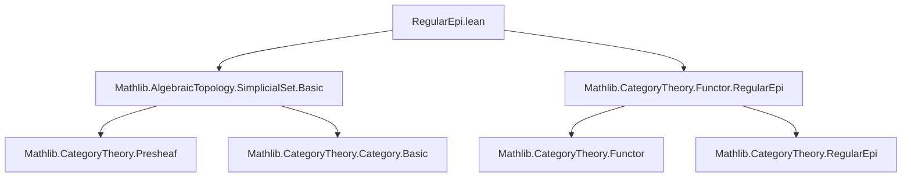

**Technical Brief: `RegularEpi.lean`**

---

### 1. **Key Definitions & Theorems**

| Name | Type / Declaration | Purpose |
|------|---------------------|---------|
| `IsRegularEpiCategory` | `Class (𝒞 : Type u → Type v) [Category 𝒞]` | A class asserting that every morphism in `𝒞` factors as a regular epimorphism followed by a monomorphism, and regular epis are stable under pullback. |
| `instance : IsRegularEpiCategory SSet.{u}` | `Instance` | Proves that the category of simplicial sets (`SSet`) is a *regular epi category*, i.e., it satisfies the axioms of a regular category where regular epimorphisms are stable under pullback. |

The proof is *not* constructive in this file; it leverages a pre-proved instance for functor categories.

---

### 2. **Naming Conventions**

- **Prefixes / Suffixes**:
  - `is_`: Used in typeclass names (`IsRegularEpiCategory`) to denote properties.
  - `RegularEpi`: Used in module and namespace names to indicate focus on regular epimorphisms.
  - `SSet`: Standard abbreviation for the category of simplicial sets (`Type u ⥤ Type v`-valued presheaves on the simplex category Δ).
  - `inferInstanceAs`: A Lean 4 utility to reuse existing typeclass instances.

No custom naming beyond standard Mathlib conventions.

---

### 3. **Tactic Stack**

- `inferInstanceAs`: Used to *re-use* an existing instance for a functor category.
- Implicit tactics: The proof is *non-constructive* and relies on typeclass resolution — no explicit tactic script is written.

No explicit tactics (`aesop`, `ring`, `simp`, etc.) appear in the file.

---

### 4. **Proof Logic**

- **Strategy**: *Reduction via functor category*.
  - The category `SSet.{u}` is defined as `[Δ, Set.{u}]`, i.e., functors from the (small) simplex category Δ to `Set.{u}`.
  - Mathlib already proves that if `𝒞` is a regular epi category, then the functor category `[I, 𝒞]` is also a regular epi category (for small `I`).
  - Since `Set.{u}` is a regular epi category (a standard result in Mathlib), and `SSet = [Δ, Set.{u}]`, the instance follows by applying `inferInstanceAs`.

- **Logical Flow**:
  1. Recognize `SSet.{u} ≌ (Δ ⥤ Set.{u})`.
  2. Use known instance `IsRegularEpiCategory (Δ ⥤ Set.{u})`.
  3. Apply `inferInstanceAs` to synthesize the instance.

No induction, case analysis, or manual construction is performed.

---

### 5. **Imports**

| Import | Role |
|--------|------|
| `Mathlib.AlgebraicTopology.SimplicialSet.Basic` | Defines `SSet` as `Δ ⥤ Set`, basic properties of simplicial sets. |
| `Mathlib.CategoryTheory.Functor.RegularEpi` | Contains the theorem that functor categories preserve regular epi structure, and the instance `IsRegularEpiCategory (_ ⥤ _)`. |

These imports provide both the *definition* of `SSet` and the *categorical lifting property* used.

---

### 6. **Mermaid Diagrams**

#### Dependency Graph (Module-Level)



#### Conceptual Proof Outline

```mermaid
graph LR
  SSet[SSet.{u} = Δ ⥤ Set.{u}] -->|definition| FunCat[Functor Category]
  Set[Set.{u}] -->|IsRegularEpiCategory| FunCat
  FunCat -->|lifting property| RegularEpi[IsRegularEpiCategory]
  RegularEpi -->|instance| SSet
```

#### Overview of File Structure

```mermaid
flowchart LR
  A[Module: RegularEpi] --> B[Import SimplicialSet.Basic]
  A --> C[Import Functor.RegularEpi]
  B --> D[Define SSet = Δ ⥤ Set]
  C --> E[Instance: IsRegularEpiCategory (_ ⥤ _)]
  D & E --> F[instance : IsRegularEpiCategory SSet]
```

---

### 7. **Theoretical Context**

- This file is part of the *regular category* and *coherent category* development in Mathlib.
- It supports further results such as:
  - Existence of image factorizations in `SSet`.
  - Stability of effective epimorphisms under pullback.
  - Construction of sheafification or colimits via coequalizers of equivalence relations.

- The result is *non-trivial* because while `Set` is a regular epi category, verifying that this property lifts to simplicial sets requires functor-category machinery.

--- 

Let me know if you'd like the formal statement of the lifting theorem (`IsRegularEpiCategory.functor_category`) or a proof sketch of `Set` being regular epi.
