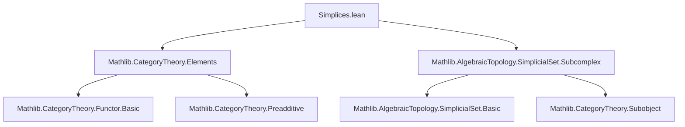
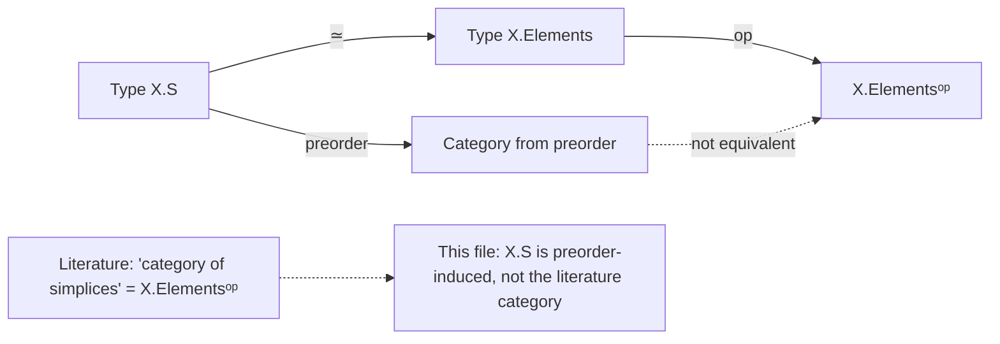

Here is a structured technical brief extracted from `Simplices.lean`, focusing on formalization metadata relevant for building a domain-specific AI agent in Lean 4.

---

### **1. Key Definitions & Theorems**

| Name | Type / Signature | Purpose |
|------|------------------|---------|
| `SSet.S` | `structure S where dim : ℕ; simplex : X _⦋dim⦌` | Defines the type of simplices of a simplicial set `X`, with dimension and component. |
| `SSet.S.mk` | `Π {n : ℕ}, X _⦋n⦌ → X.S` | Constructor for simplices; `mk x` is the simplex of dimension `n` with component `x`. |
| `SSet.S.map` | `(f : X ⟶ Y) → X.S → Y.S` | Maps a simplex along a morphism of simplicial sets. |
| `SSet.S.cast` | `s : X.S → (hd : s.dim = d) → X.S` | Reinterprets a simplex `s` with definitional dimension `d`. |
| `SSet.S.subcomplex` | `X.S → X.Subcomplex` | Sends a simplex to the subcomplex it generates (`Subcomplex.ofSimplex`). |
| `SSet.S.instance Preorder` | `Preorder X.S` | Induces a preorder on `X.S` via `s ≤ t ↔ s.subcomplex ≤ t.subcomplex`. |
| `SSet.S.le_def` | `s ≤ t ↔ s.subcomplex ≤ t.subcomplex` | Unfolds the preorder definition. |
| `SSet.S.le_iff` | `s ≤ t ↔ ∃ f : [s.dim] ⟶ [t.dim], X.map f.op t.simplex = s.simplex` | Characterizes the preorder in terms of morphisms in the simplex category. |
| `SSet.S.mk_map_le` | `S.mk (X.map f.op x) ≤ S.mk x` | A simplex obtained by restriction along `f` lies below the original. |
| `SSet.S.mk_map_eq_iff_of_mono` | `S.mk (X.map f.op x) = S.mk x ↔ IsIso f` (for mono `f`) | Equality of simplices under restriction iff `f` is iso (for monos). |
| `SSet.S.equivElements` | `X.S ≃ X.Elements` | Bijection between simplices and elements of `X` as a presheaf. |
| `SSet.S.le_iff_nonempty_hom` | `x ≤ y ↔ Nonempty (equivElements y ⟶ equivElements x)` | Relates the preorder on `X.S` to morphisms in `X.Elements`. |
| `SSet.S.ext_iff'` | Equality criterion for simplices via dimension and cast. | Enables extensionality reasoning. |
| `SSet.S.ext_iff` | `S.mk x = S.mk y ↔ x = y` | Injectivity of `mk`. |

---

### **2. Naming Conventions**

- **Prefixes**:
  - `mk_`: constructors or introduction rules (`mk_surjective`, `mk_map_le`, `mk_map_eq_iff_of_mono`).
  - `cast_`: operations reinterpreting terms with definitional equalities (`cast`, `cast_eq_self`, `cast_simplex_rfl`).
  - `dim_`: dimension-related lemmas (`dim_eq_of_eq`, `dim_eq_of_mk_eq`).
  - `le_`: preorder-related lemmas (`le_def`, `le_iff`, `le_iff_nonempty_hom`).
  - `equiv_`: equivalence/bijection names (`equivElements`).
- **Suffixes**:
  - `_rfl`: lemmas where `rfl` suffices (`cast_simplex_rfl`).
  - `_iff`: biconditional characterizations (`le_iff`, `ext_iff'`, `ext_iff`, `le_iff_nonempty_hom`).
  - `_eq`: equality lemmas (`cast_eq_self`, `dim_eq_of_eq`, `dim_eq_of_mk_eq`).

---

### **3. Tactic Stack**

Frequently used tactics in proofs:
- `simp only [...]` — for targeted simplification (e.g., in `cast_eq_self`, `ext_iff`).
- `aesop` — for automated reasoning in extensionality and surjectivity proofs.
- `tauto` — for propositional logic in `le_iff`, `mk_map_le`, `le_iff_nonempty_hom`.
- `obtain rfl := ...` — pattern matching on equalities.
- `induction ... using ...` — structural induction on `SimplexCategory`.
- `infer_instance` — to discharge typeclass goals (e.g., `IsIso`).
- `rw [le_def, Subcomplex.ofSimplex_le_iff, ...]` — rewriting using definitions and lemmas.

---

### **4. Proof Logic**

- **Structure**: Most proofs follow a pattern of:
  1. Unfolding definitions (`rw [le_def]`, `simp`).
  2. Reducing to known lemmas (`Subcomplex.ofSimplex_le_iff`, `Set.mem_setOf_eq`).
  3. Applying categorical reasoning (`SimplexCategory.eq_id_of_mono`, `Mono f`).
  4. Using `tauto` or `aesop` to finish propositional reasoning.
- **Induction**: Used in `equivElements.right_inv` and `equivElements.left_inv`, leveraging `SimplexCategory.rec`.
- **Extensionality**: Proofs of equality (`ext_iff`, `ext_iff'`) rely on surjectivity of `mk_surjective` and case analysis.

---

### **5. Imports**

- `Mathlib.CategoryTheory.Elements` — for `X.Elements`, representing elements of a presheaf.
- `Mathlib.AlgebraicTopology.SimplicialSet.Subcomplex` — for `Subcomplex.ofSimplex`, subcomplex generation.

---

### **6. Mermaid Diagrams**

#### **Dependency Graph (Module-Level)**



#### **Overview of `X.S` Structure**

```mermaid
graph LR
  X[SSet X] --> S[Type X.S]
  S --> dim[ℕ]
  S --> simplex[X _⦋dim⦌]
  S --> preorder[Preorder X.S]
  preorder --> le[s ≤ t ↔ subcomplex s ≤ subcomplex t]
  le --> equivElements[equivElements : X.S ≃ X.Elements]
  equivElements --> hom[Nonempty (y ⟶ x) ↔ x ≤ y]
```

#### **Relationship to Literature “Category of Simplices”**



---

### **7. Notes for AI Agent**

- **Terminology caution**: `X.S` is *not* the “category of simplices” in the literature — clarify this distinction in any natural language explanation.
- **Key insight**: The preorder on `X.S` is *contravariant* in nature: `s ≤ t` corresponds to a map `t → s` in `X.Elements`, hence `equivElements y → equivElements x`.
- **Future work**: The `TODO` section suggests extending `S` to nondegenerate simplices and relative nondegenerate simplices — likely via `Subtype` or `Subobject` constructions.

--- 

Let me know if you'd like a formalization plan for the `TODO` items or a tactic-level trace of a representative proof (e.g., `le_iff_nonempty_hom`).
