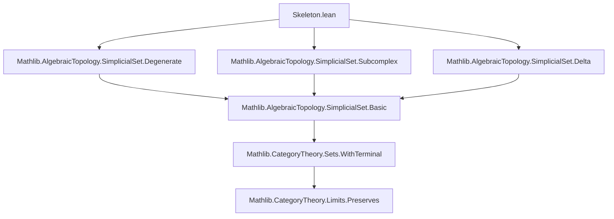
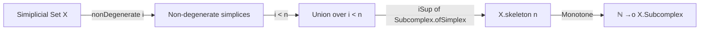
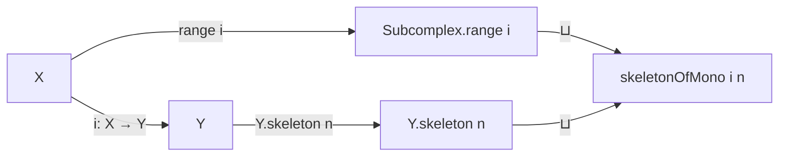

**Technical Brief: `Skeleton.lean` — Formalization of Skeleta in Simplicial Sets**

---

### 1. KEY DEFINITIONS & THEOREMS

| Name | Type / Signature | Purpose |
|------|------------------|---------|
| `skeleton` | `X : SSet → ℕ →o X.Subcomplex` | Constructs the *skeleton filtration* of a simplicial set: for each $n$, `X.skeleton n` is the smallest subcomplex containing all non-degenerate simplices of dimension `< n`. |
| `mem_skeleton` | `x ∈ X.i → i < n → x ∈ (X.skeleton n).obj (op ⦋i⦌)` | Membership criterion: any simplex of dimension `< n` lies in `X.skeleton n`. |
| `skeleton_obj_eq_top` | `i < n → (X.skeleton n).obj (op ⦋i⦌) = ⊤` | At level $i < n$, the $i$-th object of `X.skeleton n` is maximal (i.e., contains all $i$-simplices). |
| `ofSimplex_le_skeleton` | `i < n → Subcomplex.ofSimplex x ≤ X.skeleton n` | Every non-degenerate $i$-simplex with $i < n$ generates a subcomplex contained in `X.skeleton n`. |
| `mem_skeleton_obj_iff_of_nonDegenerate` | `x : X.nonDegenerate d → x.1 ∈ (X.skeleton n).obj _ ↔ d < n` | Characterization of when a *non-degenerate* simplex lies in `X.skeleton n`. |
| `skeleton_zero` | `X.skeleton 0 = ⊥` | The 0-skeleton is empty (initial subcomplex). |
| `iSup_skeleton` | `⨆ n, X.skeleton n = ⊤` | The union of all skeleta recovers the whole simplicial set. |
| `skeleton_succ` | `X.skeleton (n+1) = X.skeleton n ⊔ ⨆_{x : X.nonDegenerate n}, Subcomplex.ofSimplex x.1` | Recursive description: attaching all non-degenerate $n$-simplices to the $n$-skeleton. |
| `skeletonOfMono` | `[Mono i] → ℕ →o Y.Subcomplex` | Generalizes `skeleton` to monomorphisms: `skeletonOfMono i n = range i ⊔ Y.skeleton n`. |
| `skeleton_le_skeletonOfMono` | `Y.skeleton n ≤ skeletonOfMono i n` | The skeleton of `Y` is dominated by the skeleton of the monomorphism. |
| `skeletonOfMono_zero` | `skeletonOfMono i 0 = range i` | At $n=0$, the skeleton of a mono is just the image subcomplex. |
| `iSup_skeletonOfMono` | `⨆ n, skeletonOfMono i n = ⊤` | Union of skeleta of a mono covers the target. |
| `mem_skeletonOfMono_obj_iff_of_nonDegenerate` | `x.1 ∈ (skeletonOfMono i n).obj _ ↔ x.1 ∈ range (i.app _) ∨ d < n` | Membership criterion for non-degenerate simplices in the relative skeleton. |
| `skeletonOfMono_succ` | Recursive description of `skeletonOfMono i (n+1)` | Relative version of `skeleton_succ`, attaching *new* non-degenerate simplices not already in `range i`. |

---

### 2. NAMING CONVENTIONS

- **Prefixes**:
  - `skeleton` / `skeletonOfMono`: core definitions.
  - `mem_`: membership lemmas (e.g., `mem_skeleton`, `mem_skeletonOfMono_obj_iff_of_nonDegenerate`).
  - `ofSimplex_`: lemmas involving `Subcomplex.ofSimplex`.
  - `skeleton_obj_`: lemmas about objects of the subcomplex functor.
- **Suffixes**:
  - `_zero`, `_succ`: base case and inductive step.
  - `_iff_of_nonDegenerate`: biconditional for non-degenerate simplices.
  - `_eq_top`: maximality statements.
- **No `is_` or `dist_` prefixes** — this file focuses on *constructive* definitions rather than predicates.

---

### 3. TACTIC STACK

| Tactic | Frequency | Role |
|--------|-----------|------|
| `simp` / `simp only` | Very high | Simplify using definitions (`skeleton`, `Subcomplex.range`, `iSup`, etc.), especially with `@[simp]` lemmas. |
| `rw` | High | Rewrite using equalities (e.g., `← top_le_iff`, `Nat.lt_succ_iff`). |
| `exact` / `refine` | High | Construct proofs term-by-term, often after `obtain` or `have`. |
| `apply` / `le_antisymm` | Medium | Prove inequalities between subcomplexes (common in posetal homs). |
| `conv_lhs` | Low | Used in `skeleton_succ` to unfold and simplify left-hand side. |
| `by_cases` | Medium | Split on membership in `range i` (e.g., `skeletonOfMono_succ`). |
| `lia` | Medium | Linear arithmetic for inequalities like $i < n$, $d ≤ i$, etc. |
| `dsimp` | Low | Delta-reduction to unfold definitions before simplification. |

---

### 4. PROOF LOGIC

The proofs follow a **structured, lattice-theoretic style**, leveraging:
- **Induction on natural numbers** (especially in `skeleton_succ`, `skeletonOfMono_succ`).
- **Case analysis on inequalities** (e.g., `lt_succ_iff` → `hd.lt_or_eq`).
- **Decomposition via non-degenerate simplices** (using `X.exists_nonDegenerate`).
- **Suprema over indexing types** (`Fin n`, `X.nonDegenerate d`) to build subcomplexes.
- **Monotonicity and universal properties** of `iSup` and `⊔` in the subcomplex lattice.

Typical proof flow:
1. Unfold definitions (`skeleton`, `skeletonOfMono`).
2. Reduce goal to membership or inclusion statements about simplices.
3. Use `X.exists_nonDegenerate` to write any simplex as image of a non-degenerate one.
4. Apply lemmas like `mem_skeleton_obj_iff_of_nonDegenerate` or `ofSimplex_le_skeleton`.
5. Conclude via `le_antisymm` for equality of subcomplexes.

---

### 5. IMPORTS & DEPENDENCIES

| Module | Role |
|--------|------|
| `Mathlib.AlgebraicTopology.SimplicialSet.Degenerate` | Provides `X.nonDegenerate`, `X.exists_nonDegenerate`, `Subcomplex.ofSimplex`, and foundational facts about degeneracies. |
| `Mathlib.CategoryTheory` | For `CategoryTheory`, `Opposite`, `Limits`, `OrderHom`, `iSup`, `⊔`, `le_antisymm`, etc. |
| `Mathlib.AlgebraicTopology.SimplicialSet` (implicit) | `SSet`, `SimplexCategory`, `Subcomplex`, `Subfunctor`, `app`, etc. |

> **Note**: The file assumes `SSet` is a *Grothendieck topos* with a well-behaved subobject classifier and enough non-degenerate simplices.

---

### 6. MERMAID DIAGRAMS

#### Dependency Graph (Top-Level)

#### Overview of `skeleton` Construction

#### Relative Skeleton (`skeletonOfMono`)

---

### 7. THEORY CONTEXT

This file sits in the **homotopical algebra** branch of `Mathlib`, specifically:
- **Simplicial sets** as models for homotopy types.
- **Subcomplex filtrations** used to build CW-structures and prove cellular approximation.
- **Relative skeleta** (`skeletonOfMono`) prepare for proofs about *relative homotopy groups*, *Postnikov towers*, or *cellular approximations of maps*.

The TODO items indicate future work toward:
- A **cellular description** of skeleta (attaching $\partial \Delta[n] \to \Delta[n]$).
- A connection to the **truncation functor** `SSet.sk n` (likely `sk n X ≅ X.skeleton (n+1)`).

---

### 8. SUMMARY

This file formalizes the **skeleton filtration** of simplicial sets and its relative version for monomorphisms. It establishes foundational properties (monotonicity, recursive structure, maximality in low degrees, union = whole object) using lattice-theoretic reasoning in the subcomplex poset. The naming and proof style reflect Lean’s emphasis on *explicit constructions* and *computational content* (e.g., via `nonDegenerate` witnesses).
